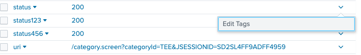
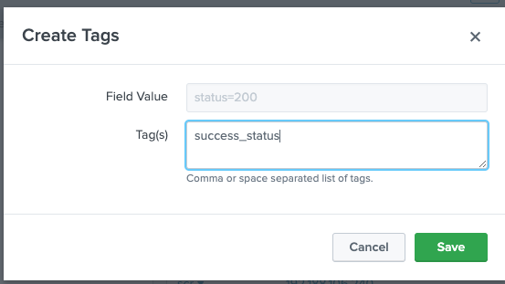
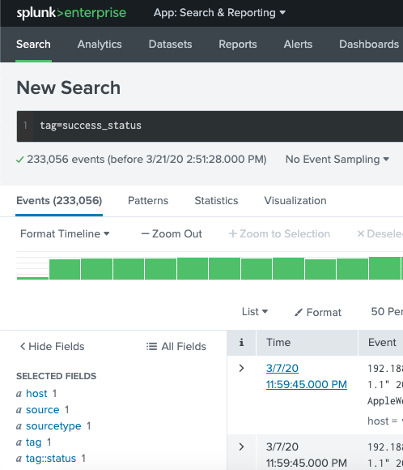
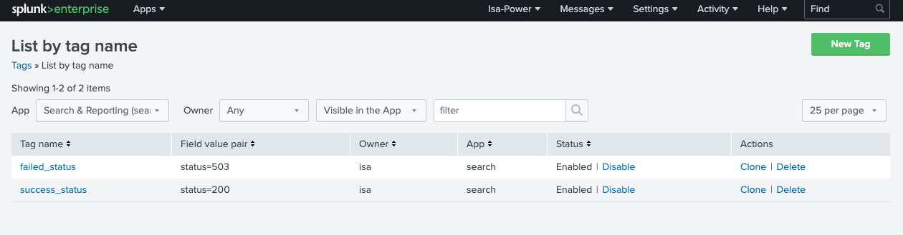
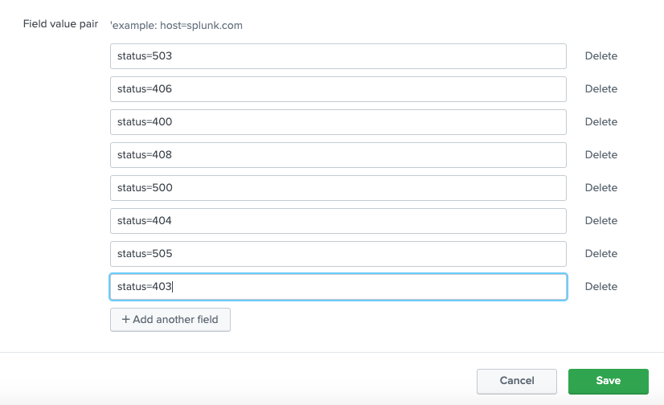
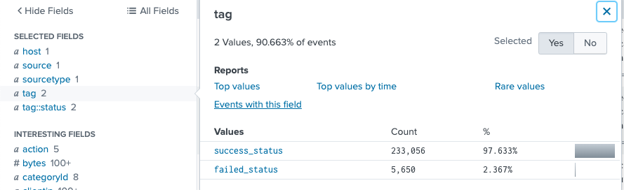
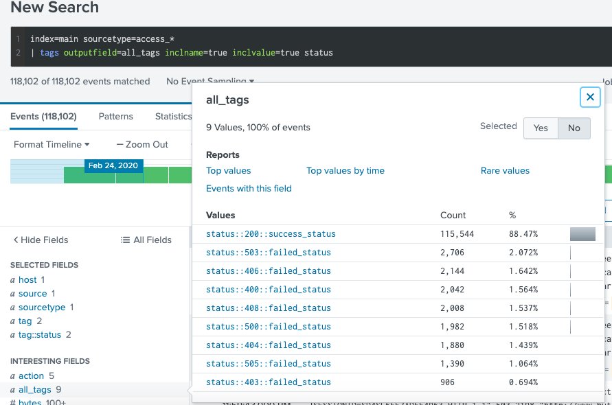
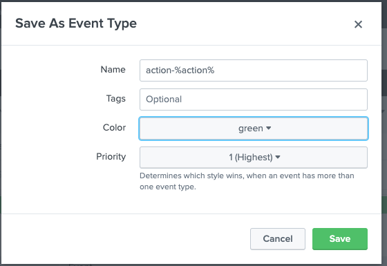
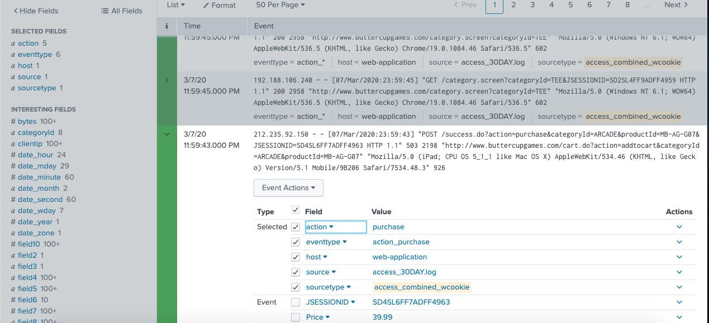

# I.Tags 
# Describe tags and their uses
Grouping event based on field value. non technical user can easy search by tag
1. Tags are case sensitive 

2. Tags are descriptive names for key value pairs

3. One or more tags per field/value combination
	
# Create and use tag

Example: create two tags, suceess status and failed status based on status field in the access_combined_wcookies
* tag = success_status for status = 200

* tag = failed_status for all others status= 400,500...

* search tags by SPL

Quiz: 
Which search would limit an "alert" tag to the "host" field?  tag::host=alert tag=alert tag=al*

Tags are descriptive names for key value pairs

You can only add one tag per field value pair. False

# II.Event Types:
# Describe event types and their uses
A method of categorizing events based on a search. There are 3 ways to create event type from Splunk web and one from eventype.conf
See video [even types from Splunk](https://www.youtube.com/watch?v=KhdMgT9VbHs)
Restrictions:
1. Search strings that define vent types cannot reference tags

2. Search strong can not include pipe operator, sub search

3. Should not defined an event type by a simple search that uses the saved search command to reference a report name 

# Create an event type

Example: Create an even type which are dynamic to all action values

SPL : index=main sourcetype=access_*

* Conclusion: Tags and eventypes can be good to non technical user to easily search the data. However more tags/eventypes, more cost in search engine.
* Note: search time operation order: inline field extraction(no field transform > field extraction (use field transform) > automatic key-value field extraction > Field aliases > Calculated fields > Lookup > Event types > Tags
