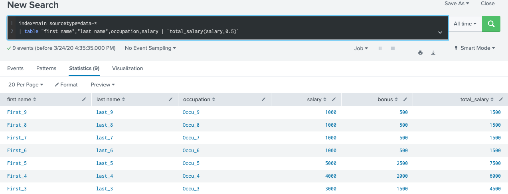

# Describe macros
1. Useful when you frequently run searches/report (dont need rewrite search syntax)
2. Eval based macro, non-eval based macro, macro within a macro
# Create and use a basic macro
* Select Settings > Advanced Search > Search macros.
* Click New to create a search macro.
* (Optional) Check the Destination app and verify that it is set to the app that you want to restrict your search macro to. Select a different app from the Destination app list if you want to restrict your search macro to a different app.
* Enter a unique Name for the search macro.
* If your search macro includes an argument, append the number of arguments to the name. For example, if your search macro mymacro includes two arguments, name it mymacro(2).
In Definition, enter the search string that the macro expands to when you reference it in another search.
* (Optional) Click Use eval-based definition? to indicate that the Definition value is an eval expression that returns a string that the search macro expands to.
* (Optional) Enter any Arguments for your search macro. This is a comma-delimited string of argument names. Argument names may only contain alphanumeric characters (a-Z, A-Z, 0-9), underscores, and dashes. The string cannot contain repetitions of argument names.
* (Optional) Enter a Validation expression that verifies whether the argument values used to invoke the search macro are acceptable. The validation expression is an eval expression that evaluates to a Boolean or string value.
* (Optional) Enter a Validation error message if you defined a validation expression. This message appears when the argument values that invoke the search macro fail the validation expression.
* Click Save to save your search macro.
# Define arguments and variables for a macro + Add and use arguments with a macro

Example 1: transaction in macro so we can re-use our macro anywhere

At module6. we have learnt how to make a transaction in a search. We will try to re create the same results wih macro.

Step1 : define in macro as below

Step2: test it by searching as below in a search

Example 2: macro with args(bonus) and macro within a macro (total_salary)

We will try to achieve the same thing with macro, but it s how we can have bonus and total_salary with eval expression

Step1: create a bonus macro with 2 arguments

Step2: Call bonus macro in a search

Step3: Create a total salary macro, in which we call a bonus macro

Step4: Call a total salary in a search

