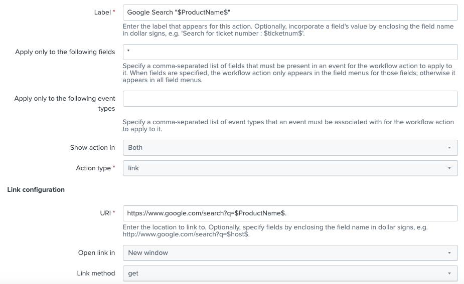
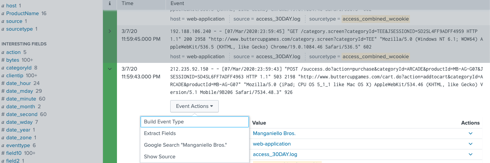
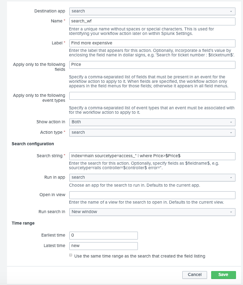
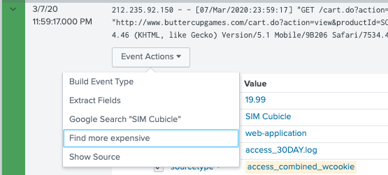
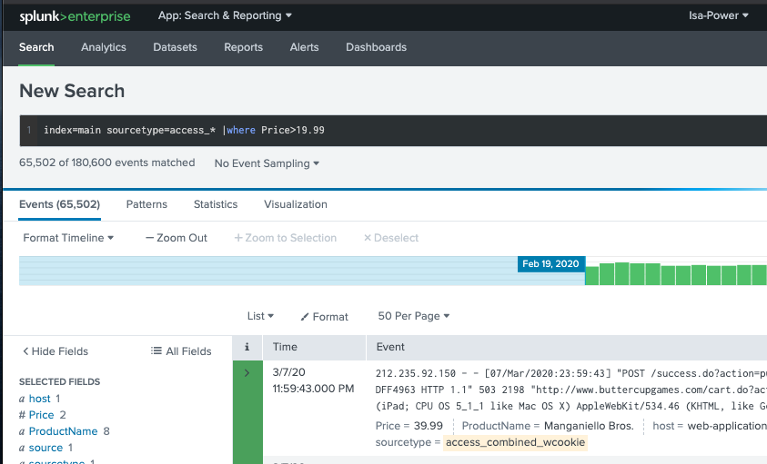

# Describe the function of Get, Post and Search workflow actions
* Execute workflow action from an event in your search results to interact with external resources or run another search.

GET: pass information to an external web resource

POST: send field values to an external resource

Search: use field values to perform an secondary search

* Settings > Fields > Workflow actions > New Workflow actions > fill in your information

# Create a GET workflow action : Google search field values
* [Optional] Destination app: choose as your case
* Name: give it a unique name
* Label: what you want user to see
* Apply only to the following fields: in list or * for all fields values
* [Optional] Apply only to the following event types: specific your requirement
* Show action in: 3 options (Event menu, action menu, both)
* Action type: 2 options (link or search)
* URI: as example
* Open link in : 2 options(new window, current window)
* Link method: 2 options (get or post)

Define a workflow as follow: It will search a ProductName values in google

Results as below

# Create a POST workflow action
# Create a Search workflow action : launch a secondary search
Similar as above example. It will running a pre-defined search. Show all products that more expensive than current product.

Define a workflow as follow 

Results as below

Click on link, it will open a new search in new window

