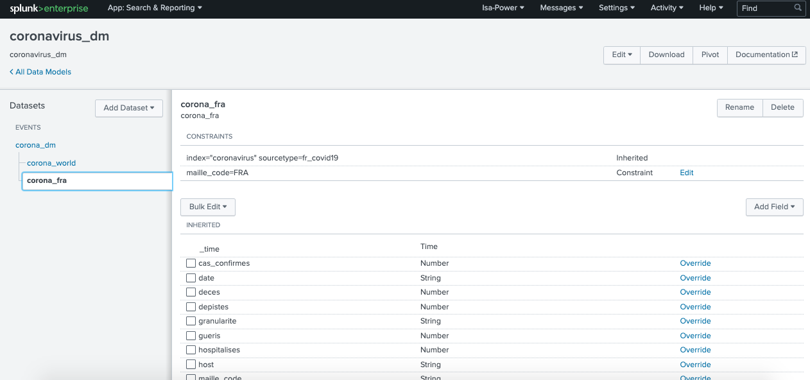

# Describe the relationship between data models and pivot
* pivot: used for creating reports and dashboards.
* data model:provide the datasets for pivot

# Identify data model attributes
* data model dataset types(3): events, searches, transactions
	* event datasets: contain constraints and fields(4 types)
	* search datasets: include transforming commands(pipe) and fields(4 types)
	* transaction datasets: include transactions and fields existed in event/ search
# Create a data model & Use a data model in pivot
Analyse covid-19 france data. Next step is prediction in ML section

* dataset: https://www.kaggle.com/mclikmb4/coronavirusdataset-france#contagioitalia.csv
* Objective: Make a dashboard with application from data model and pivot. It is still a ongoing project.  In the future, I want to transform it into realtime dashboard + time picker function, analyse china dataset and make prediction. 

Step 1: Create 3 data models (1 root and 2 childs)

Settings > Data models > New Data Model (constrains can defined as image)

Step 2: Create 7 pivots and having thing as image

Step 3: I could not achieved the table of regions confirmed cased by pivot( It wil be missing event (Île-de-France)So it is the reason why I create that table from search command as follow: 

index="coronavirus" sourcetype=fr_covid19 maille_code != FRA AND  maille_code != WORLD
|rename maille_nom as Regions
|stats max(cas_confirmes) as "Total infected patients" by Regions 
|sort 10 -"Total infected patients"
|table Regions, "Total infected patients"

