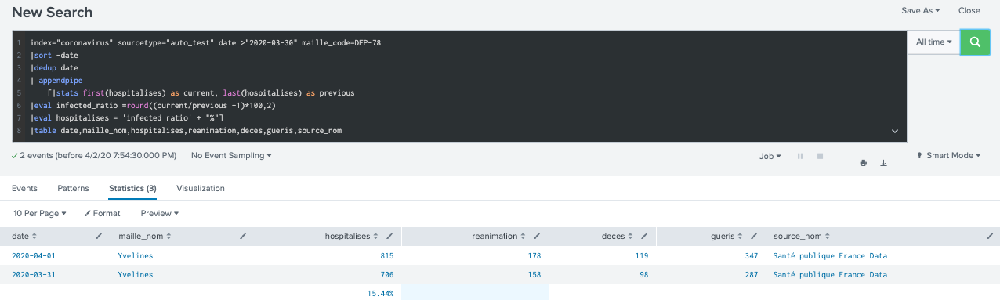

# 14. Exploring Statistical Commands

## Performing statistical analysis with functions of the stat command
* Return : Provides statistics, grouped optionally by fields.

* Syntax : stats (stats-function(field) [AS field])... [BY field-list]

stats-function(field)

 
[AS field] [BY field-list]: optional

* 

* Example : index=coronavirus sourcetype=auto_test granularite = departement
|stats max(hospitalises), max(deces) by maille_nom
|sort- max(hospitalises)

## Using fieldsummary
* Return : statistic table of dataset: count/distinct_count, is_exact, max, min, mean, numeric_count, stdev, values of each and every fields 

* Syntax : fieldsummary [maxvals=int] [wc-field-list]

[maxvals]: Optional args. Specifies the maximum distinct values to return for each field. Default is 100

[wc-field-list]: Optional args. Wildcard excepted: cas_confirmes or cas_*

* 

* Example : index=coronavirus sourcetype=auto_test |fieldsummary

## Using appendpipe
* Return : Appends the result of the subpipeline applied to the current result set to results. Subpipeline is not a proper search (can not run individually)

* Syntax : appendpipe [run_in_preview= bool] [ subpipeline ]

[run_in_preview= bool]: Optional arg. Default=true. When it is false, the appendpipe is inactivate.

[subpipeline]: Optional arg. A list of commands that are applied to the current search results.

* 

* Example : index=coronavirus sourcetype="auto_test"  granularite = departement 
| stats max(date) by maille_nom, hospitalises,deces, reanimation
| sort 101 -max(date)
| appendpipe run_in_preview=true
    [|stats max(reanimation) by maille_nom, hospitalises,deces]

index="coronavirus" sourcetype="auto_test" date >"2020-03-30" maille_code=DEP-78
|sort -date 
|dedup date 
| appendpipe
    [|stats first(hospitalises) as current, last(hospitalises) as previous
|eval infected_ratio =round((current/previous -1)*100,2)
|eval hospitalises = 'infected_ratio' + "%"]
|table date,maille_nom,hospitalises,reanimation,deces,gueris,source_nom

## Using eventstats
* Return :  new fields of summary statistics (All STATS funcs)

* Syntax : eventstats [allnum=bool] stats-agg-term ...[by-clause]

[allnum=bool]: Default is false.  If set to true, computes numerical statistics on each field, if and only if ,all of the values of that field are numerical. If you have a BY clause, the allnum argument applies to each group independently.
 
* 

* Example : New field(today_h) of nb of hospitalises today( last = newest data)

index="coronavirus" sourcetype="auto_test" 
| where in  (maille_code,"DEP-75","DEP-77","DEP-78","DEP-91","DEP-92","DEP-93","DEP-94","DEP-95")
|sort 16 -date 
|table date,maille_nom,hospitalises,reanimation,deces,gueris
|sort date
|streamstats first(hospitalises) as yesterday_h by maille_nom
|eventstats last(hospitalises) as today_h by maille_nom

## Using streamstats

* Return : new fields of summary statistics in a streaming manner. (All STATS funcs)

* Syntax : streamstats stats-agg-term... [by-clause]

Optional args: [reset_on_change=bool] 
		[reset_before="("eval-expression")"] 
		[reset_after="("eval-expression")"] 
		[current=bool] 
		[window=int] 
		[time_window=span-length] 
		[global=bool] 
		[allnum=bool]

[reset_on_change=bool]: Default is false. If true, reset(donot consider) the accumulated statistics

[time_window=span-length] : specific time for calculations

[current=bool] : Default is true. If true, it uses value from the previous event.

[window=int] : specific number of events to use when computing the statistics.

[global=bool] : Default is true. Only work with window=int. If true,

* 

* Example : 

1.Use streamsstats to create a new col that show the prev values of hospitalises, in order to calculate infection_ratio

index="coronavirus" sourcetype="auto_test" 
| where in  (maille_code,"DEP-75","DEP-77","DEP-78","DEP-91","DEP-92","DEP-93","DEP-94","DEP-95")
|sort 16 -date 
|table date,maille_nom,hospitalises,taux_infection,reanimation,deces,gueris,taux_infection
|sort date
|streamstats first(hospitalises) as prev_h by maille_nom
|eval taux_infection = round(((hospitalises/prev_h -1)*100),2)
|eval taux_infection = 'taux_infection'  +"%"
|sort 8 -date
|sort -hospitalises
|fields - prev_h

2. 3 difs results (1) reset=f >> remember all previous results (2) reset=t >> reset all results after each by group (3) current=t >> its values from the previous value.

index=main sourcetype="data-sensor"
| table _time,sensor1,sensor2,sensor3,sensor4
| sort _time
| streamstats  reset_on_change=false current=true  count as count_stream_default by sensor1
| streamstats  reset_on_change=true count as count_stream_reset_t by sensor1
| streamstats  reset_on_change=true current=f count as count_stream_current_f by sensor1
| table _time,sensor1,count_stream_default, count_stream_reset_t, count_stream_current_f

3. create alert if any sensor has record 4 consecutive time 0 >> found 1 and 4

index=main sourcetype="data-sensor"
| table _time,sensor1,sensor2,sensor3,sensor4
| sort _time
| streamstats count as count_sensor1 by sensor1 reset_on_change=true 
| streamstats count as count_sensor2 by sensor2 reset_on_change=true
| streamstats count as count_sensor3 by sensor3 reset_on_change=true
| streamstats count as count_sensor4 by sensor4 reset_on_change=true 
| streamstats count as count_sensor1_n by sensor1 reset_on_change=true time_window=4m window=5 
| where (sensor1=0 AND count_sensor1 >=4) OR (sensor2=0 AND count_sensor2 >=4)  OR (sensor3=0 AND count_sensor3 >=4)  OR (sensor4=0 AND count_sensor4 >=4) OR (sensor1=0 AND count_sensor1_n >=4)

4. global example with window=4

index=main sourcetype="data-sensor"
| table _time,sensor1,sensor2,sensor3,sensor4
| sort _time
| streamstats  window=4 global=false  count as count_sensor1 by sensor1
| table _time,sensor1,count_sensor1

# Note:
* [custom command video](https://www.youtube.com/watch?v=sJRTIyZZtbM)
* [command by category document] (https://docs.splunk.com/Documentation/Splunk/8.0.3/SearchReference/Commandsbycategory)
* append: Appends subsearch results to current results.

# 15. Exploring eval Command Functions

* Using conversion functions
* Using data and time functions
* Using string functions
* Using comparison and conditional functions 
* Using informational functions
* Using statistical functions
* Using mathematical functions
* Using cryptographic functions
