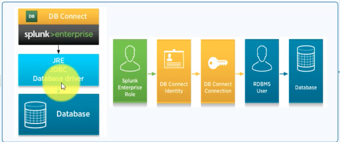

# About lookups
*  What: According to your lookups based ( csv, python script...) with logical of look up definitions( commond fields). Its out put is more fields to your event. Basically, lookups enrichs your event data (by adding more fields)

* Types:

| Types             | Data source       | Comment                    | Look up table files|Look up definitions|
|-------------------|-------------------|----------------------------|--------------------|-------------------|
| CSV               |a CSV file         |  small/static data         | required           |required           |
| External          |an external source |  easy to maintain    		 | python script      |required           | 
| KV Store          |KS Store collection|  large/value updated often | in collection.conf |required           | 
| Geospatial        |a KMZ or KML       |featureId, featureCollection| required           |required           |
| Database          |BD connect         |Happen on DB connect app    |Happen on DB connect app|Happen on DB connect app|

* [Automatic lookups](https://docs.splunk.com/Documentation/Splunk/8.0.2/Knowledge/DefineanautomaticlookupinSplunkWeb)
* [lookup command](https://docs.splunk.com/Documentation/Splunk/8.0.2/SearchReference/Lookup)

   Syntax: lookup lookup-table-name ( lookup-field [AS event-field] )... [OUTPUT | OUTPUTNEW (lookup-destfield [AS event-destfield])]

   not required lookup commands if set up automatic lookups

* [inputlookup command](https://docs.splunk.com/Documentation/Splunk/8.0.2/SearchReference/Inputlookup)
* [outputlookup command](https://docs.splunk.com/Documentation/Splunk/8.0.2/SearchReference/Outputlookup)

[Look up fundamental document](https://docs.splunk.com/Documentation/Splunk/8.0.2/Knowledge/Aboutlookupsandfieldactions)

# CSV lookups
* Best pratice: csv file-based lookups, best for not often change and small set of data

* How : 

Step1: CVS file = define your csv

		* (1). at least two cols, one cols contrains a set of field values that in your events 
		* (2). UTF-8 characters
    
Step2: Lookup table files = upload it (verify by inputlookup command)

		* Settings > Lookups > Lookup table files > New Lookup table list > filling > Save
    
Step3: Lookup definitions = built logic

		* Settings > Lookups > Lookup definitions > New Lookup definitions > filling > Save
    
Step4: Automatic lookups (optional) = set it automatic

		* Settings > Lookups > Automatic lookups  > New automatics lookups > filling > Save

* [Document](https://docs.splunk.com/Documentation/Splunk/8.0.2/Knowledge/Usefieldlookupstoaddinformationtoyourevents)

# KV Store lookups
* Best pratice: key/value pairs, able to updated
* How : 

Step 1 : Define a KV Store collection in collections.conf.

		* [sample_name] 
		* enforceTypes = false
		* field.id = string (optional)
		* field.name = string (optional)
		* accelerated_fields.my_accl = {"id" : 1} (optional)

Step 2 : Look up definitions from Splunk Web OR Create a KV Store lookup stanza in transforms.conf ($SPLUNK_HOME/etc/system/local/ or  $SPLUNK_HOME/etc/apps/app_name/local/.)

		* [kvstore_lookup_name]
		* collection = sample_name
		* external_type = kvstore
		* fields_list = _key,id, name (* all your fields want to view in search)

Step 3: Restart Splunk

Collection input can comes from search results in index or via REST API. Details can be review form this [video](https://www.youtube.com/watch?v=1IYezUcNGPY)

* 

# External Lookup
* Best pratice: script based, behind Splunk will create a CSV file of your input lookup and try to fill it output values. No need to use OUTPUT or OUTPUTNEW arg (Splunk use it by default)
 
sample python script is avaiable at : $SPLUNK_HOME/etc/system/bin/ called external_lookup.py

* How : 

Step 1 : Add the script for the lookup to your Splunk deployment.
		* The script must be located in one of two places:
		* $SPLUNK_HOME/etc/searchscripts
		* $SPLUNK_HOME/etc/apps/<app_name>/bin

Step 2 : Look up definitions from Splunk Web OR Create a external lookup stanza in transforms.conf 

Step 3: Restart Splunk

Details can be review form this [video](https://www.youtube.com/watch?v=DXb5p_EQb_E)

* 

# Geospatial lookups
* Best pratice: need featureID and featureCollection to pull geom polygon for visualization

* How : 

Step 1 : Look up table files via upload

		* kmz file (kml > zip > rename .kmz)
		* Settings > Lookups > Lookup table files > New Lookup table list > filling > Save

Step 2 : Look up definitions via Splunk Web or via tranforms.conf

		* Settings > Lookups > Lookup definitions > New Lookup definitions > filling > Save
		* Be correct about the featureId Xpath

Step 3: Restart Splunk 

Details can be review form this [video](https://www.youtube.com/watch?v=qj3z7TrBDG0)

* 

# Database lookups

* Splunk DB Connect

	* 1. import table from relational DB directly into SE
	* 2. output data from SE to your relational DB
	* 3. enrich events via lookup

* Best pratice: Splunk DB Connect includes functionality for you to enrich and extend the usefulness of your Splunk Enterprise data through interactions with your external database. Database lookups give you real-time contextual information from a database during ad hoc explorations of data in Splunk.

* How : Happend on DB connect app or dbxlookup command in search app

Details can be review form this [video](https://www.youtube.com/watch?v=ipi3wJThDic&list=PLSr58-DJdRyZewSrYTUdDF8KpcsJTLn11&index=10)

* 

