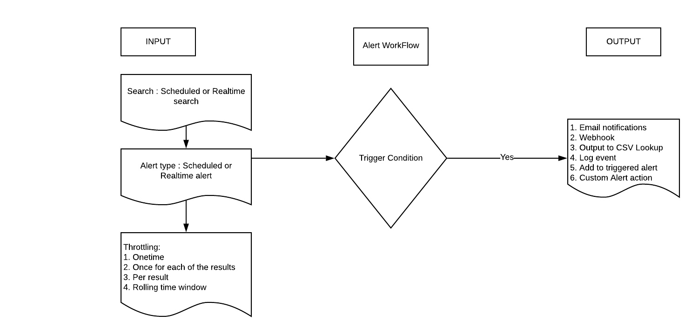

# Alert Workflow
* What is this? Alerts trigger when search results meet specific conditions. You can use alert actions to respond when alerts trigger.

* Alert workflow :

* [Document](https://docs.splunk.com/Documentation/Splunk/8.0.2/Alert/AlertWorkflowOverview)
* [Cron syntax](https://crontab.guru/)

# Scheduled alert:
* [Example](https://docs.splunk.com/Documentation/Splunk/8.0.2/Alert/Alertexamples)
* [video](https://www.youtube.com/watch?v=fXrva45eYFk)
* How: Set up an alert to trigger when the new today data coming in. New daily update data of covid 19 from Sante Public France will come avaiable everyday about 19:00 - 20:30. We dont know it exactly so we create an allert to trigger that. 

		* Step 1: Create a search
		* Step 2: Save as > Alert > filling in > Save
		* Step 3: Setting > searchs,reports, alerts > to see all statistical  
Once vs Per result:
	* Once: send 1 time of n event
	* Per result: send n time, each 1 event

# Realtime alert:
* [Example](https://docs.splunk.com/Documentation/Splunk/8.0.2/Alert/Alertexamples)
* [video](https://www.youtube.com/watch?v=bcVfgaZLHjk)

#Webhook alert:
* [Webhook test](https://webhook.site/#!/416320f6-0fe9-423d-a8bc-fe5f1f6577fc)
* [Example](https://docs.splunk.com/Documentation/Splunk/8.0.2/Alert/Webhooks)
* [video](https://www.youtube.com/watch?v=IBgwfJMsXhw)

# CSV alert:
* [Example](https://docs.splunk.com/Documentation/Splunk/8.0.2/Alert/OutputToCSVLookup)
* [video](https://www.youtube.com/watch?v=r8g9kRFKvio)

# Email alert: only admin can do it(required list_settings role) +server setting/ email setting
* [Example](https://docs.splunk.com/Documentation/Splunk/8.0.2/Alert/EmailNotificationTokens)
* [video](https://www.youtube.com/watch?v=y1wTWjkUvJk)

# Custom alert: is Splunk App
* [Example](https://docs.splunk.com/Documentation/Splunk/8.0.2/Alert/CreateCustomAlerts)
* [video1](https://www.youtube.com/watch?v=UqJAc7rpFmQ)
* [video2](https://www.youtube.com/watch?v=OT11XMB8Bu0)
* [video3](https://www.youtube.com/watch?v=ZvzTowF9v9I)

