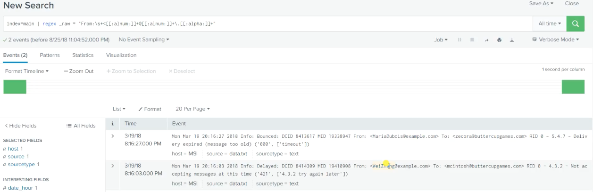
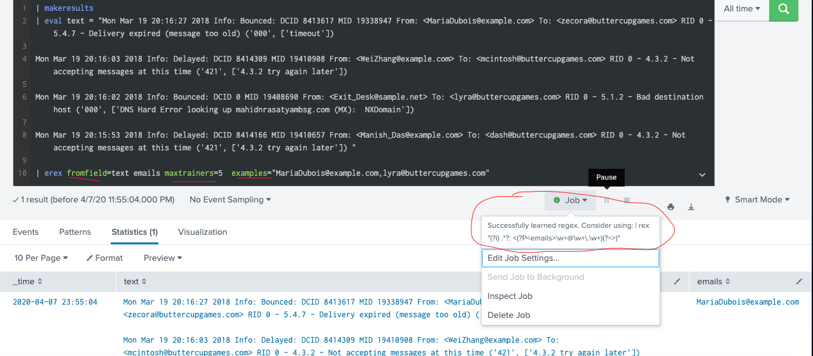
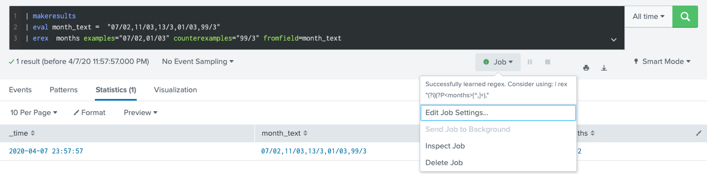
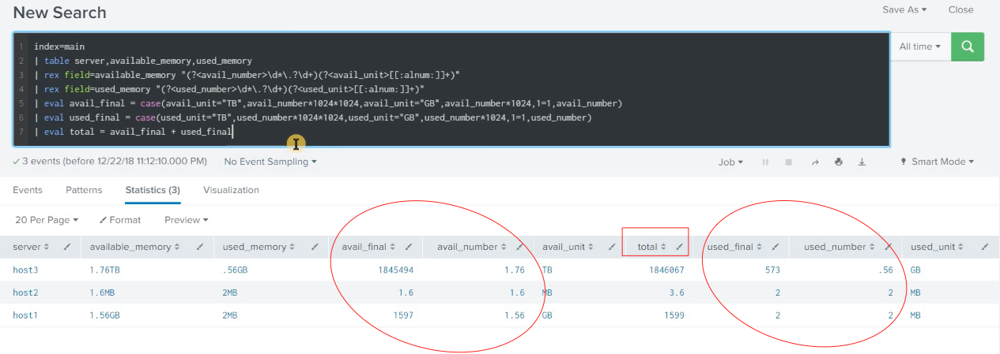

# Regular expression 
## What is this? Pattern matching from a text. 
## Best pratice in Splunk: extract new field  or filter out a group of events

* [PCRE regular expression cheatsheet](https://www.debuggex.com/cheatsheet/regex/pcre)
* [online regex test](https://regex101.com/)
* [optional](https://docs.splunk.com/Documentation/Splunk/8.0.2/Knowledge/AboutSplunkregularexpressions)

# regex:
## Return :  like search, returns only results match with your given regular expression 
## Syntax : regex (\<field>=\<regex-expression> | \<field>!=\<regex-expression> | \<regex-expression>)

* [Document](https://docs.splunk.com/Documentation/Splunk/8.0.2/SearchReference/Regex)
## Example: filter only 2 events match by regular expression (in total 4 events)

index=main | regex _raw = "From:\s+<[[:alnum:]]+@[[:alnum:]]+\.[[:alpha:]]+>"

# erex:
## Return :  regular expression from training example you gave to Splunk
## Syntax : erex [\<field>] examples=\<string> [counterexamples=\<string\>] [fromfield=\<field\>] [maxtrainers=\<int>]

		[counterexamples=\<string\>] : tell Splunk false example look like.
		[fromfield=\<field\>] : field name.
		[maxtrainers=\<int>] : tell Splunk how many training number.
		
* [Document](https://docs.splunk.com/Documentation/Splunk/8.0.2/SearchReference/Erex)
## Example: 
1. Use erex to generate regular expression for email

| makeresults 
| eval text = "Mon Mar 19 20:16:27 2018 Info: Bounced: DCID 8413617 MID 19338947 From: <MariaDubois@example.com> To: <zecora@buttercupgames.com> RID 0 - 5.4.7 - Delivery expired (message too old) ('000', ['timeout']) 

Mon Mar 19 20:16:03 2018 Info: Delayed: DCID 8414309 MID 19410908 From: <WeiZhang@example.com> To: <mcintosh@buttercupgames.com> RID 0 - 4.3.2 - Not accepting messages at this time ('421', ['4.3.2 try again later']) 

Mon Mar 19 20:16:02 2018 Info: Bounced: DCID 0 MID 19408690 From: <Exit_Desk@sample.net> To: <lyra@buttercupgames.com> RID 0 - 5.1.2 - Bad destination host ('000', ['DNS Hard Error looking up mahidnrasatyambsg.com (MX):  NXDomain']) 

Mon Mar 19 20:15:53 2018 Info: Delayed: DCID 8414166 MID 19410657 From: <Manish_Das@example.com> To: <dash@buttercupgames.com> RID 0 - 4.3.2 - Not accepting messages at this time ('421', ['4.3.2 try again later']) "

| erex fromfield=text emails maxtrainers=5  examples="MariaDubois@example.com,lyra@buttercupgames.com"

2. Use erex with counterexamples

| makeresults
| eval month_text =  "07/02,11/03,13/3,01/03,99/3"
| erex  months examples="07/02,01/03" counterexamples="99/3" fromfield=month_text

# rex: required name group (?\<name\>)
## Return :  Extracted fields(regular expression), replace or substitute characters (sed expressions)
## Syntax : rex [field=field_name]("regex-expression" [max_match=int] [offset_field=string] ) | (mode=sed "sed-expression")

[max_match=int] : Default is 1. Use 0 to unlimited matches. 

[offset_field=string] : returns position of matches characters.

sed_expression: 

	 "s/regex/replacement/flags"  -- replacement
	 "y/string1/string2/"         -- substitute
    
* [Document](https://docs.splunk.com/Documentation/Splunk/8.0.2/SearchReference/Rex)
## Example: 

1. Extracted new fields from text.

| makeresults 
| eval text = "Mon Mar 19 20:16:27 2018 Info: Bounced: DCID 8413617 MID 19338947 From: <MariaDubois@example.com> To: <zecora@buttercupgames.com> RID 0 - 5.4.7 - Delivery expired (message too old) ('000', ['timeout'])"
| rex field=text "From:\s+<(?<from>.*)>\s+To:\s+<(?<to>.*)>\s+"

2. Extracted field : use max_match and offset_field

| makeresults 
| eval credit_card_number = "1234-5678-9101-1213" 
| rex field=credit_card_number max_match=0  offset_field="new_field" "(?<digits>\d{4})"

3. Replace character: sed mode

| makeresults
| eval credit_card_number = "1234-5678-9101-1213" 
| rex field=credit_card_number mode=sed "s/(\d{4})/XXXX/4"

4. Substitute character: sed mode

| makeresults
| eval credit_card_number = "1234-5678-9101-1213" 
| rex field=credit_card_number mode=sed "y/1234/XXXX/"

## best practice REX example:

index=main 
|  table host,available_memory,used_memory
|  rex field=available_memory "(?<avail>\d*\.?\d+)(?<avail_unit>[[:alpha:]]+)"
|  rex field=used_memory "(?<used>\d*\.?\d+)(?<used_unit>[[:alpha:]]+)"
|  eval avail_M = case(avail_unit="GB",avail * 1024,avail_unit="TB",avail * 1024 * 1024,1=1,avail)
|  eval used_M = case(used_unit="GB",used * 1024,used_unit="TB",used * 1024 * 1024,1=1,used)
|  eval total_M = round(avail_M,2) + round(used_M,2)
|  eval total = total_M."MB"
| table available_memory,used_memory,total
	

