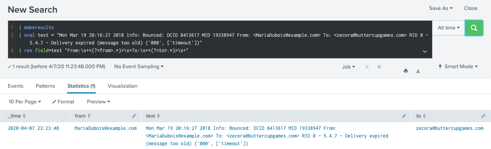
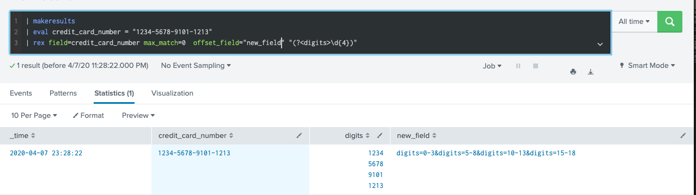
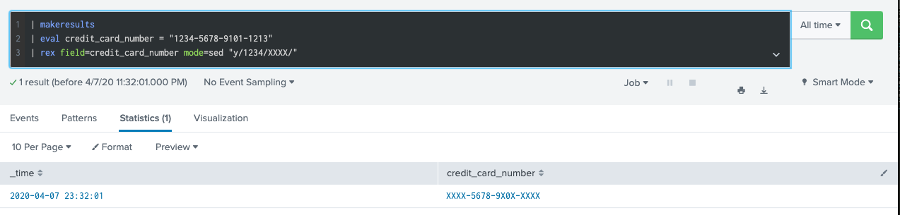

# Regular expression 
## What is this? Pattern matching from a text. 
## Best pratice in Splunk: extract new field  or filter out a group of events

* [PCRE regular expression cheatsheet](https://www.debuggex.com/cheatsheet/regex/pcre)
* [online regex test](https://regex101.com/)
* [optional](https://docs.splunk.com/Documentation/Splunk/8.0.2/Knowledge/AboutSplunkregularexpressions)

# regex:
## Return :  
## Syntax: 
* [Document](https://docs.splunk.com/Documentation/Splunk/8.0.2/SearchReference/Regex)
## Example: 

# erex:
## Return :  
## Syntax: 
* [Document](https://docs.splunk.com/Documentation/Splunk/8.0.2/SearchReference/Erex)
## Example: 

# rex: required name group (?<name>)
## Return :  Extracted fields(regular expression), replace or substitute characters (sed expressions)
## Syntax : rex [field=field_name]("regex-expression" [max_match=int] [offset_field=string] ) | (mode=sed "sed-expression")

[max_match=int] : Default is 1. Use 0 to unlimited matches. 

[offset_field=string] : returns position of matches characters.

sed_expression: 

		* "s/regex/replacement/flags"  -- replacement
		* "y/string1/string2/"         -- substitute
    
* [Document](https://docs.splunk.com/Documentation/Splunk/8.0.2/SearchReference/Rex)
## Example: 

1. Extracted new fields from text.

| makeresults 
| eval text = "Mon Mar 19 20:16:27 2018 Info: Bounced: DCID 8413617 MID 19338947 From: <MariaDubois@example.com> To: <zecora@buttercupgames.com> RID 0 - 5.4.7 - Delivery expired (message too old) ('000', ['timeout'])"
| rex field=text "From:\s+<(?<from>.*)>\s+To:\s+<(?<to>.*)>\s+"

2. Extracted field : use max_match and offset_field

| makeresults 
| eval credit_card_number = "1234-5678-9101-1213" 
| rex field=credit_card_number max_match=0  offset_field="new_field" "(?<digits>\d{4})"

3. Replace character: sed mode

| makeresults
| eval credit_card_number = "1234-5678-9101-1213" 
| rex field=credit_card_number mode=sed "s/(\d{4})/XXXX/4"

4. Substitute character: sed mode

| makeresults
| eval credit_card_number = "1234-5678-9101-1213" 
| rex field=credit_card_number mode=sed "y/1234/XXXX/"

