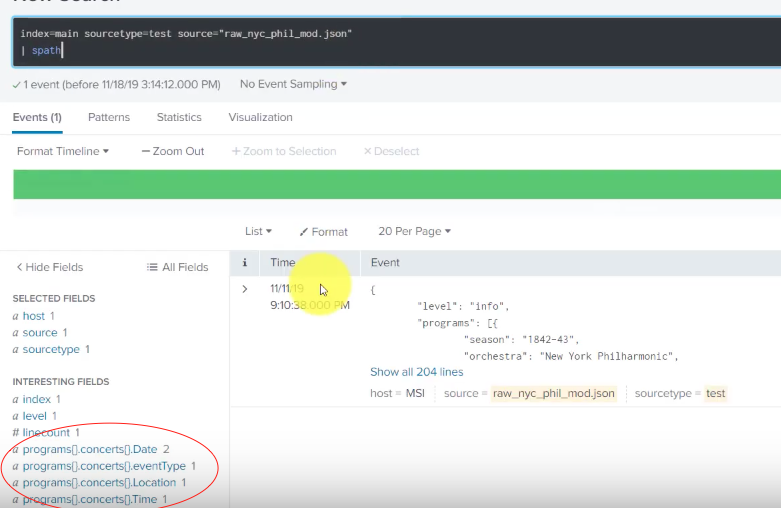
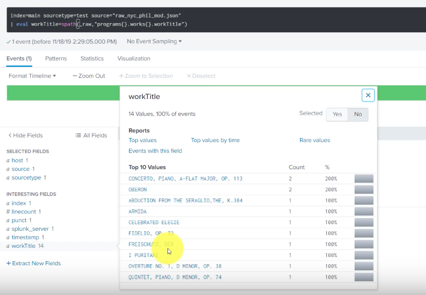
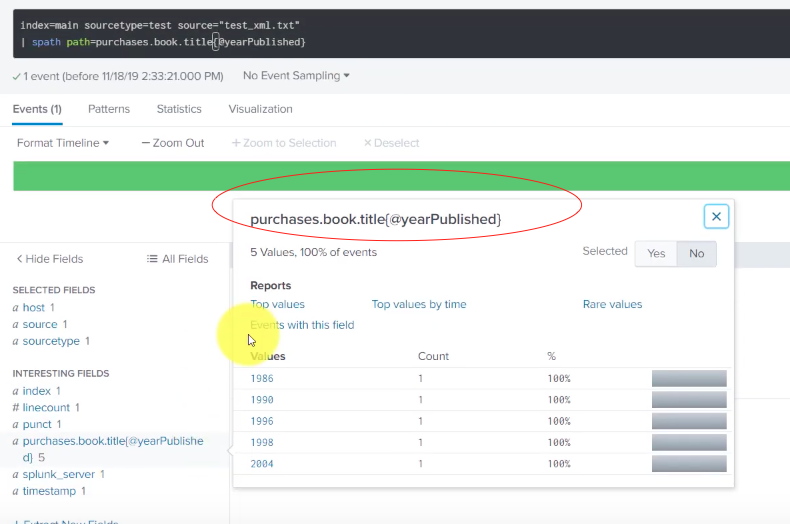
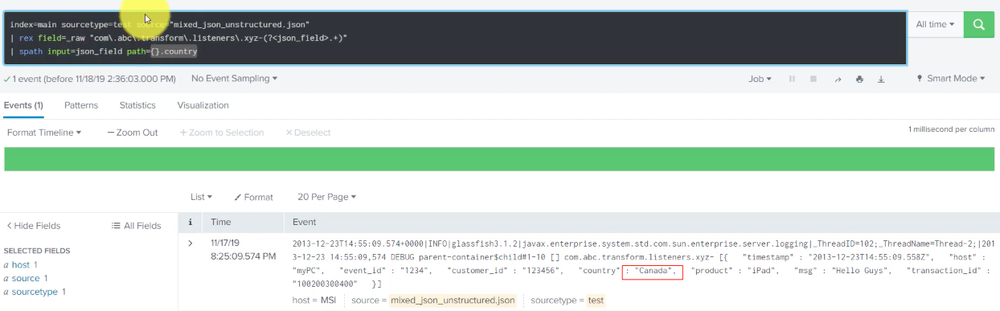
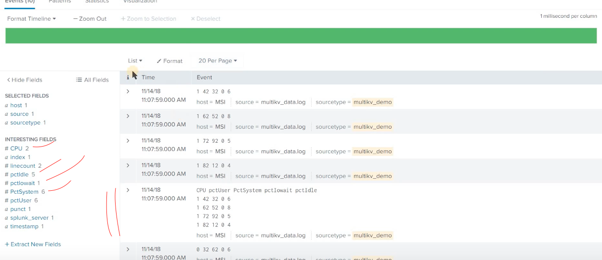

# Spath command: helping to extract info from XML, JSON data formats (other way around is specify kv_mode)
## Output: data in structure format as your code
## Syntax: spath [input=\<field>] [output=\<field>] [path=<datapath> | <datapath>]

		[input=\<field name>] : field name to apply spath
		[output=\<field name>]: give output a name
		[path=<datapath> | <datapath>] : path to access

[Document](https://docs.splunk.com/Documentation/SplunkCloud/8.0.2001/SearchReference/Spath)
[Video](https://www.youtube.com/watch?v=C3k_v0lzmaM&list=PLSr58-DJdRyZewSrYTUdDF8KpcsJTLn11&index=15)

## Example:
1. automatic : spath can identify JSON automatic
  
index=main source="raw_nyc_phil_mod.json"
| spath

2. JSON : with eval 

index=main source="raw_nyc_phil_mod.json"
| eval workTitle=spath(\_raw,"programs{}.work{}.workTitle")

3. XML

index=main source="test_xml.txt"
| spath output=yearpublished path=purchases.book.title{@yearPublished}

4. Mix

source="mixed_json_unstructured.json" host="MSI" sourcetype="test"
| rex field=\_raw "com\.abc\.transform\.listeners\.xyz-(?<json_field>.+)"
| spath input=json_field path={}.timestamp

# multikv command: extracting fields from table-formatted events
## Output: Extracts field-values from table-formatted events
## Syntax: multikv [conf=\<stanza_name>] [<multikv-option>...]

	copyattrs=\<bool> : default true. If false, all event has no _time fields > can not extracted new value
	fields \<field-list> : limit fields to apply
	filter \<term-list> : filter fields value.
	forceheader=\<int> : specific tell Splunk where is the header
	multitable=\<bool> : default true. If false, Controls whether or not there can be multiple tables in a single _raw in the original events.
	noheader=\<bool> : specific tell Splunk you dont have header
	rmorig=<bool> : default true. If false, events = new extracted event + original events
[Document](https://docs.splunk.com/Documentation/SplunkCloud/8.0.2001/SearchReference/Multikv)
[Video](https://www.youtube.com/watch?v=8kWgDVZZ0GQ)
## Example: extract table formated index events 

index=main | multikv rmorig=false

