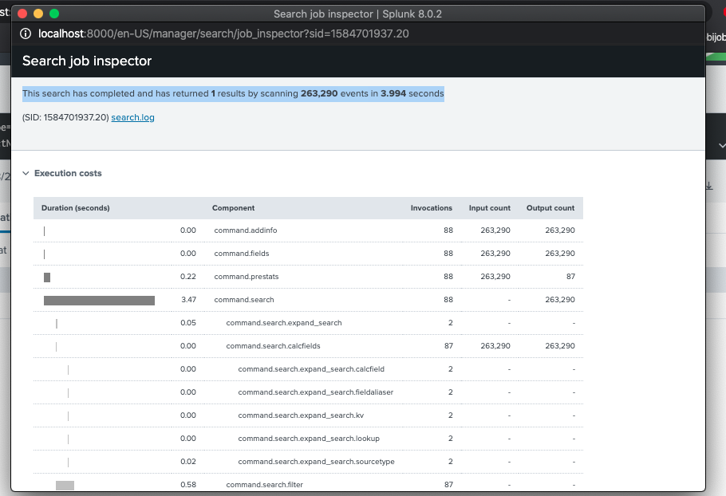

document: PDF from page 11 to page 32. I will not rewrite all the PDF learning but only brief summary and additional learning
Key takeaway:
# 1. General search pratice to optimize your search (7 aspects)
You want your search run fast, try this step :

* Time filter 
* Host/source/sourcetype
* fields command to extract only field you need 
* wilcards fail* (NOT f*il or *fail)
* inclusion is better than exclusion
* filter as many as possible
* search mode (chose one in Smart, Fast, Verbose)

# 2. Tranforming command (output is a table)
Ex: top, rare, chart, time chart, stats, geostats...

Both Smart and Fast will only return a statistic results. Except Verbose mode return all 3 (Event, Patterns, Statistics). However, it is slow your search.

* Revise transforming command vs non-transforming command( look at PDF)

# 3. Job inspector pratice (addition)
Job inspector shows you how long a given search took to run. 

* command.search.index : time to search the index for the location to read the raw data
* command.search.filter: time to filter our events that do not match
* command.search. rawdata: time to read vents from the rawdata files.

* good performance is 10K to 20K EPS where EPS = event/seconds

# 4. Subsearch [subsearch syntax] (addition)
when to use:
* [your subsearch] will run first in the primary search.
* Instead of doing 2 searchs, you can do 1 search with subsearch or nested subsearch. 
* Example: 
* 1. without subsearch (find the mist frequent client)
* index=main sourcetype=access_* status=200 action=purchase |top limit=1 clientip
* index=main sourcetype=access_* status=200 action=purchase clientip = xx.xxx.xxx.xx|stats count, dc(productId),values(productId) by clientip

* 2. better with subsearch
* index=main sourcetype=access_* status=200 action=purchase [search index=main sourcetype=access_* status=200 action=purchase |top limit=1 clientip |table clientip] |stats count, dc(productId), values(productId) by clientip
