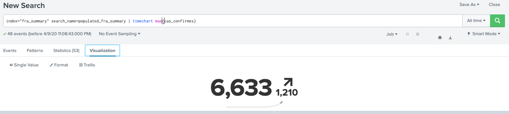
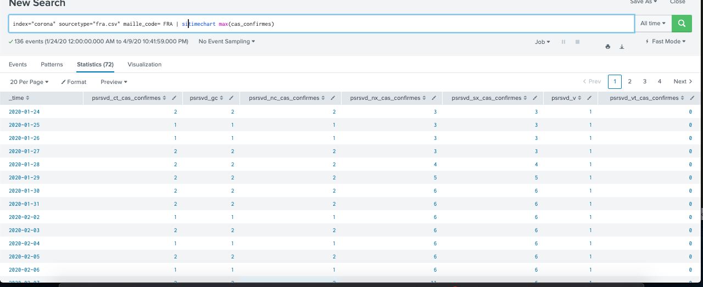
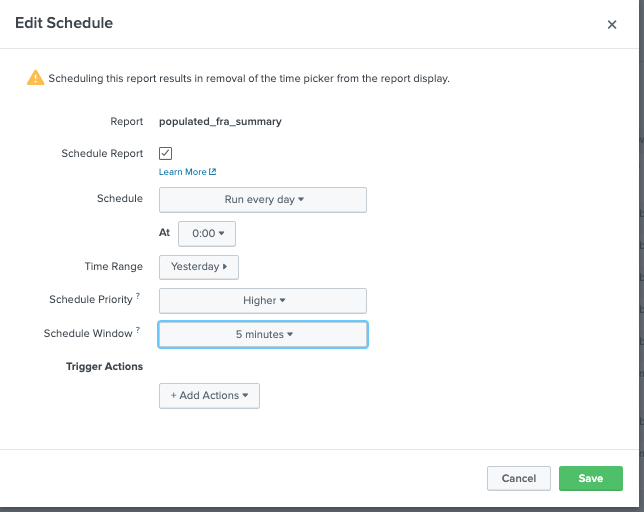
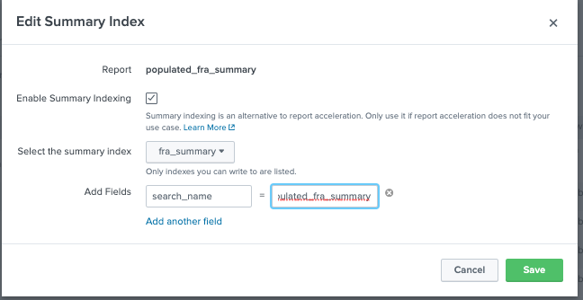
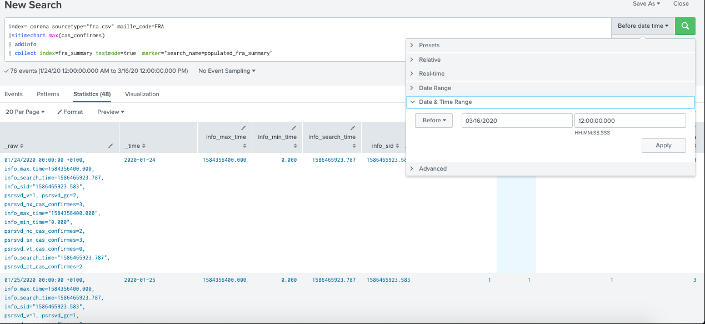

# Using datamodel acceleration : transforming search 
## Output: 
Report acceleration is the easiest way to speed up transforming searches and reports that take a long time to complete because they have to cover a large volume of data. 

[Document](https://docs.splunk.com/Documentation/Splunk/8.0.2/Knowledge/Manageacceleratedsearchsummaries)

# Using datamodel acceleration : pivot
## Output: 
Build a data summary based on the results returned by the report >Faster with acceleration. Limitation is you create it through pivot.

[Document](https://docs.splunk.com/Documentation/Splunk/8.0.3/Knowledge/Acceleratedatamodels)

[Video at last 5 mins](https://www.youtube.com/watch?v=N3FL6rawDLQ)

# Using dashboard acceleration  : by apply based search  
## Output : 
one time execution of based search in a dashboard and re-usable for other viz within that dashboard + easy for maintainance after.

[video](https://www.youtube.com/watch?v=KJKiW2hAQ5w)

# Using summary indexing: 
## Output: efficiently (statistically accurate) report on large volumes of data

[video](https://www.youtube.com/watch?v=joZ3jokt9qs&list=PLSr58-DJdRyZewSrYTUdDF8KpcsJTLn11&index=16)

[Document](https://docs.splunk.com/Documentation/Splunk/8.0.2/Knowledge/Usesummaryindexing)

## How : Set up a frequently running search, saved into a summary index that we designate. We can run search, reports on  this significantly smaller summary index.

	* statistically accurate (example no.)
	* Bulding rolling report (summary index best pratice day + weekly report)

Step 1: Create summary index
Settings > Indexes > New Index

Step 2: Populate data to summary index (3 ways)

  * By schedule report (see example)
  * collect command (see example)
  * by python script (see example)

Step 3: Test/how to access summary index

		index="fra_summary" search_name=populated_fra_summary | timechart max(cas_confirmes)
		index name = "fra_summary"
		search_name=populated_fra_summary

		index=fra_summary |overlap
    
* Final results look like this
 

## Example:
### Put data by schedule report 
1. Settings > Searches, Reports... > New Report > put your search with summary indexing reporting commands (sichart, sitimechart, sistats, sitop, and sirare)

 

2. Edit schedule

 

3. Edit summary index: enable, choose destination and add annotation

 

### Put data by collect command: 

put all data before france lockdown, before 16/03/2020

 

### By python script : Splunk>bin>fill_summary_index.py

* Run this in terminal : splunk cmd python fill_summary_index.py -app search -name populate_fra_summary -et -2d -lt -1d -j 8 -owner admin -auth admin:$plunkEntr3prise -dedup true

* If it fail, go check apps > search> log
