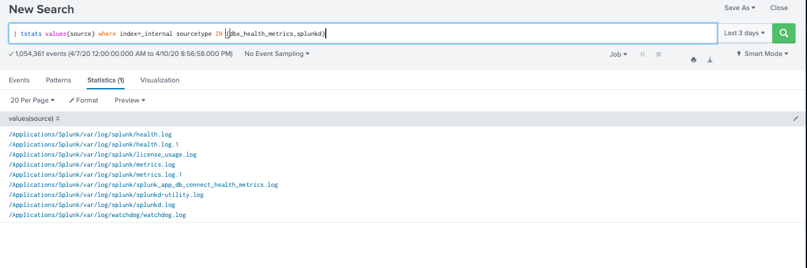
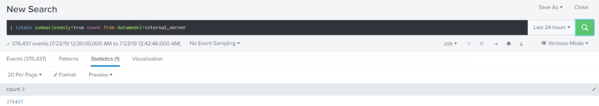
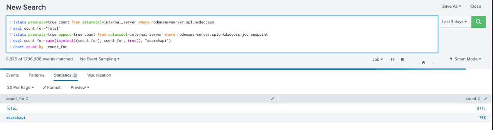

# Working with tsidx files using the tstats command

## tsidx : time series index file (or index file). 
## tstats: 
	* Perfromance : faster than stats command but more expensive (use more disk space)(because it work only to index metedata, search fields is not working)
### Returns: 
	statistical queries on indexed fields in tsidx file ( normal index data, tscollect data or accelerated data models)
### Syntax : 
| tstats [prestats=\<bool>] [local=\<bool>] [append=\<bool>] [summariesonly=\<bool>] [include_reduced_buckets=\<bool>] [allow_old_summaries=\<bool>] [chunk_size=\<unsigned int>] [fillnull_value=\<string>] \<stats-func>...
[FROM ( \<namespace> | sid=\<tscollect-job-id> | datamodel=\<data_model-name> )]
[WHERE \<search-query> | \<field> IN (\<value-list>)]
[BY (\<field-list> | (PREFIX(\<field>))) [span=\<timespan>] ]

Must have:| tstats  \<stats-func>... Other is optional 

[Document](https://docs.splunk.com/Documentation/SplunkCloud/8.0.2001/SearchReference/Tstats)

[video](https://www.youtube.com/watch?v=NLPlIiHS1OU&list=PLSr58-DJdRyZewSrYTUdDF8KpcsJTLn11&index=17)

### Example :
#### 1.  where clause > for index
| tstats values(source) where index=\_internal sourcetype IN (dbx_health_metrics,splunkd)

| tstats count where index=\_internal by group (will not work as group is not an indexed field)
#### 2. from clause > for datamodel (only work if turn on acceleration)
| tstats summariesonly=true count from datamodel=internal_server where nodename=server.scheduler

#### 3. use prestats and append 
| tstats prestats=true count from datamodel=internal_server where nodename=server.splunkdaccess
| eval count_for="Total"
| tstats prestats=true append=true count from datamodel=internal_server where nodename=server.splunkdaccess.job_endpoint
| eval count_for=case(isnotnull(count_for), count_for, true(), "searchapi")
| chart count by  count_for

