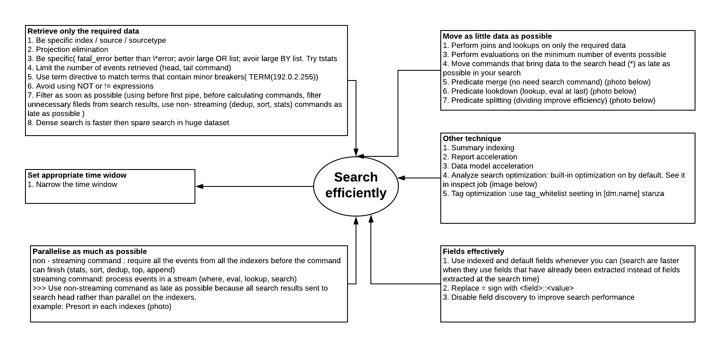
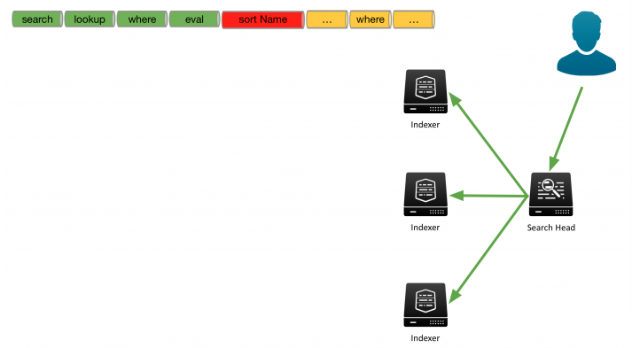
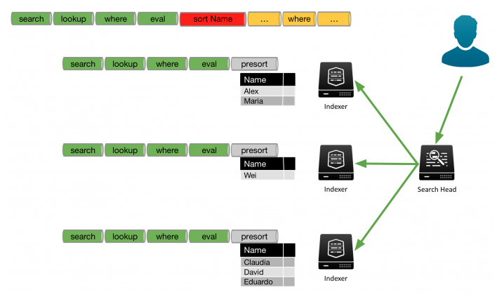
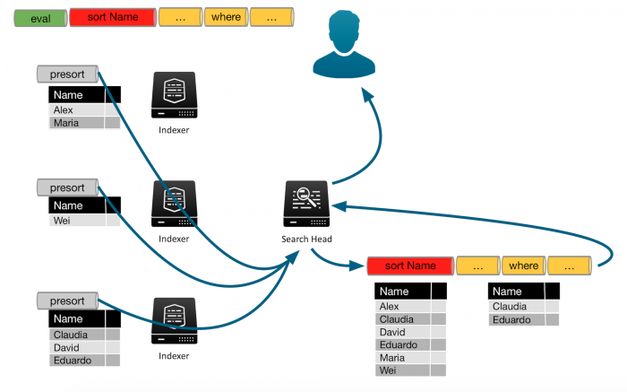
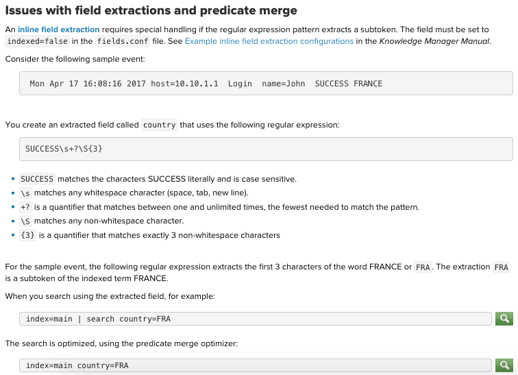
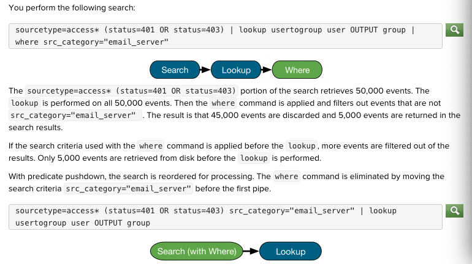
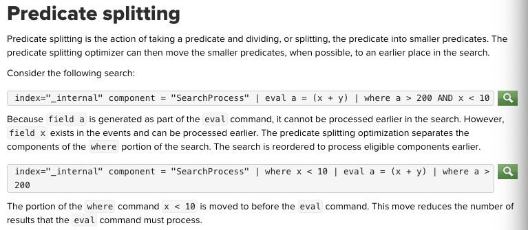

# Output: efficiently search as possible
# What should be consider?

* Parallel processing example:

Example 1: sort Name as last

Example 2: presort at each indexer

* Predicate merge (no need to use search)

* Predicate pushdown (lookup, eval at last)

* Predicate splitting (dividing improve efficiency)

[Read more about search head](https://docs.splunk.com/Documentation/Splunk/8.0.3/DistSearch/Whatisdistributedsearch)

[Document](https://docs.splunk.com/Documentation/Splunk/latest/Search/Aboutoptimization)
