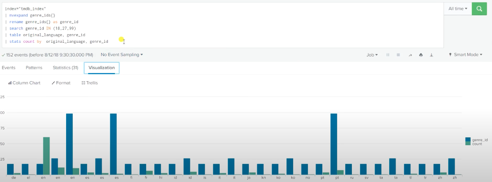
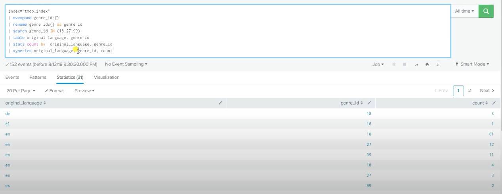
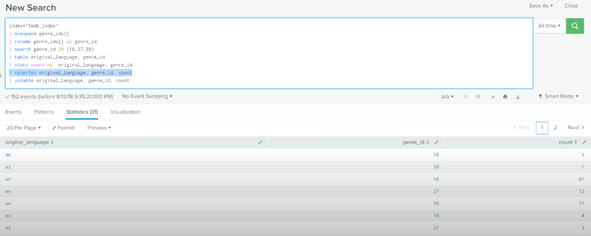
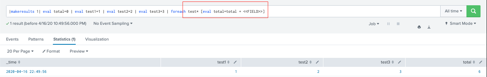
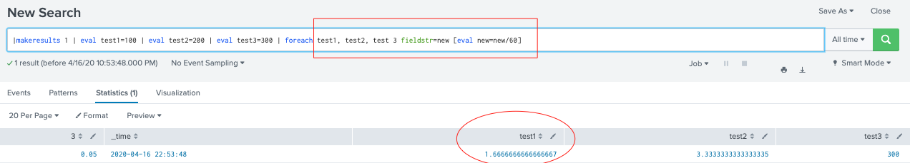
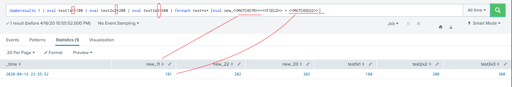

# Regroup fields for search results using untable and xyseries : untable >< xyseries (inverse command)

## xyseries
### returns: Converts results into a tabular format that is suitable for graphing.
### Syntax: xyseries [grouped=\<bool>] <x-field> <y-name-field> <y-data-field>... [sep=\<string>] [format=\<string>]

	required fields, refer to untable
	Optional fields:
		format=<string>: Used to construct output field names when multiple data series are used in conjunction with a split-by-field. format takes precedence over sep and lets you specify a parameterized expression with the stats aggregator and function ($AGG$) and the value of the split-by-field ($VALUE$).
		grouped='bool' : default is false. If true, indicates that the input is sorted by the value of the <x-field> and multifile input is allowed.
		sep=<string> : Used to construct output field names when multiple data series are used in conjunctions with a split-by field. This is equivalent to setting format to \$AGG$<sep>$VALUE$.

* [Document](https://docs.splunk.com/Documentation/SplunkCloud/8.0.2003/SearchReference/Xyseries)
### Example
* results after the stats command, not good viz beause of duplicate row values

* Remove all these duplicate, better viz

## untable
### returns: converts results from a tabular format to a format similar to stats output
### Syntax: untable \<x-field> <y-name-field> <y-data-field>

		<x-field> : Field to be used as the x-axis.
		<y-name-field>: (label) Field that contains the values to be used as labels for the data series.
		<y-data-field>:  Field that contains the data to be charted.

* [Document](https://docs.splunk.com/Documentation/Splunk/latest/SearchReference/Untable)
### Example
* undo xyseries, give bake stats result

# Create a template for performing additional processing on a set of related fields using foreach
## foreach
### returns: Runs a templated streaming subsearch for each field in a wildcarded field list.
### Syntax: foreach \<wc-field>... [fieldstr=\<string>] [matchstr=\<string>] [matchseg1=\<string>] [matchseg2=\<string>] [matchseg3=\<string>] <subsearch>

	Required arguments
		<wc-field> : A list of field names (wild card = ok)
		 [ subsearch ]: A subsearch that includes a template for replacing the values of the wildcarded fields.
	Optional arguments
		fieldstr=<string> : Replaces the <<FIELD>> token with the whole field name.
		matchstr=<string> : Replaces <<MATCHSTR>> with part of the field name that matches wildcard(s) in the specifier.
		matchseg1=<string> : Replaces <<MATCHSEG1>> with part of the field name that matches the first wildcard.

* [Document](https://docs.splunk.com/Documentation/SplunkCloud/8.0.2003/SearchReference/Foreach)
### Example
* 1. total sum and right to row

* 2. update values at each row value

* 3. Create new row based on row title +value

