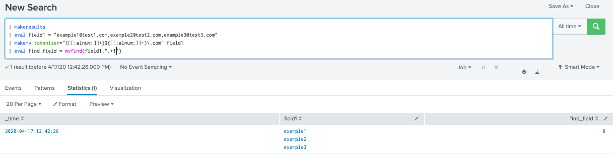

# Multivalue eval functions:
|Multivalue eval function             |Input                              | Returns                                       |
|-------------------------------------|-----------------------------------|-----------------------------------------------|
|mvappend(X,...)                      |nb of arguments:string, fields,... |a multivalues fields                           |
|mvcount(MVFIELD)                     |multivalue field, single field     |a count of the value in fields(n, 1 or null)   |
|mvdedup(X)                           |mutivalue field                    |remove its duplicate values                    |
|mvfilter(X,...)                      |mutivalue field, boolean expression|s subset of multi fields values                |
|mvfind(MVFIELD,"REGEX")              |regex in a mutivalue field         |its index possition in a mvfield               |
|mvindex(MVFIELD,STARTINDEX, ENDINDEX)|multivalue, start, end(optional)   |a subset of multi fields values                |
|mvjoin(MVFIELD,STR)                  |multivalue, string                 |concatenates                                   |
|mvrange(X,Y,Z)                       |X=start, Y=end, Z= increment step  |a range of number                              |
|mvsort(X)                            |multivalue field                   |values sorted lexicographically                |
|mvzip(X,Y,"Z")                       |2 multivalue X,Y, Z= delimiter(opt)|join each row value                            |
|split(X,"Y")                         |X= field, Y= delimiter             |X= multivalue fieds as newfield same as makemv |                                              |

## returns: manipulate multivalue fields OR return a multivalue fields.
## Syntax: ... |eval new_field = func() 
	func = any multivalue function

* [Document](https://docs.splunk.com/Documentation/Splunk/8.0.3/SearchReference/MultivalueEvalFunctions)

### mvappend(X,...)
index="main" sourcetype="data-eval"
| table "first name","last name",occupation,salary 
| eval mv_append = mvappend("first name","last name",occupation,salary)

### mvcount(MVFIELD)
index="main" sourcetype="data-eval"
| table "first name","last name",occupation,salary 
| eval mv_expand = mvappend("first name","last name",occupation,salary)
|eval n=mvcount(mv_expand)
|evl count_normal =mvcount("first name")

### mvdedup(X)
| makeresults 
| eval field1 = "1,2,2,4,5"
| makemv delim="," field1
| eval dedup_field = mvdedup(field1)

### mvfilter(X)
| makeresults 
| eval field1 = "1,2,2,4,5"
| makemv delim="," field1
| eval filter_field = mvfilter(field1 IN (1,4))

### mvfind(MVFIELD,"REGEX")
| makeresults 
| eval field1 = "example1@test1.com,example2@test2.com,example3@test3.com"
| makemv tokenizer="([[:alnum:]]+)@([[:alnum:]]+)\.com" field1
| eval find_field = mvfind(field1,".+2")

### mvindex(MVFIELD,STARTINDEX, ENDINDEX) 
| makeresults 
| eval field1 = "example1@test1.com,example2@test2.com,example3@test3.com"
| makemv tokenizer="([[:alnum:]]+)@([[:alnum:]]+)\.com" field1
| eval index_field = mvindex(field1,-2,-1)

-1 is last

### mvjoin(MVFIELD,STR)
| makeresults 
| eval field1 = "example1@test1.com,example2@test2.com,example3@test3.com"
| makemv tokenizer="([[:alnum:]]+)@([[:alnum:]]+)\.com" field1
| eval join_field = mvjoin(field1," OR ")

### mvrange(X,Y,Z)
| makeresults 
| eval start_date = "09/01/2018", end_date = "09/11/2018"
| eval start_date_epoc = strptime(start_date,"%m/%d/%Y"), end_date_epoc = strptime(end_date,"%m/%d/%Y")
| eval date_range = mvrange(start_date_epoc,end_date_epoc,"1d")
| eval date_range_readable = strftime(date_range,"%m/%d/%Y")

### mvsort(X)
| makeresults 
| eval field1 = "C,B,A,D"
| makemv delim="," field1
| eval sorted_field1 = mvsort(field1)

### mvzip(X,Y,"Z")
| makeresults 
| eval field1 = "A,B,C,D"
| eval field2 = "1,2,3,4"
| eval field3 = "$,#,@,&"
| makemv delim="," field1
| makemv delim="," field2
| makemv delim="," field3
| eval zipped = mvzip(mvzip(field1,field2),field3)

### split(X,"Y")
| makeresults 
| eval field1 = "1,2,3,4,5"
| eval field2 = split(field1,",")
|makemv delim="," field1

# makemv() : Converts a single valued field into a multivalue field (accept regex)
## returns: Converts a single valued field into a multivalue field by splitting the values on a simple string delimiter. 
The delimiter can be a multicharacter delimiter. Alternatively, splits field by using a regex.
## Syntax: makemv [delim=\<string> | tokenizer=<string>] [allowempty=\<bool>] [setsv=\<bool>] <field>

	delim=<string> : A string value used as a delimiter. Default: A single space (" ").
	tokenizer=<string> : A regex, with a capturing group, that is repeat-matched against the text of field
	allowempty=<bool> :Defaut= false.
	setsv=<bool>: Default= false. 

* [Document](https://docs.splunk.com/Documentation/Splunk/8.0.3/SearchReference/Makemv)

## Example:
| makeresults 
| eval field1 = "example1@test1.com,example2@test2.com,example3@test3.com"
| makemv tokenizer="[[:alnum:]]+@([[:alnum:]]+)\.com" field1

# mvcombine() : create a specified field, to be multivalue fields (similiar command mvjoin())
## returns: Takes a group of events that are identical except for the specified field, which contains a single value, and combines those events into a single event. The specified field becomes a multivalue field that contains all of the single values from the combined events.
## Syntax: mvcombine [delim=\<string>] \<field>
* [Document mvcombine](https://docs.splunk.com/Documentation/Splunk/8.0.3/SearchReference/Mvcombine)
* [Document nomv](https://docs.splunk.com/Documentation/Splunk/8.0.3/SearchReference/Nomv)

## Example
| makeresults  count=5
| streamstats count as counter
| eval field1 = "col1", field2="col2"
| mvcombine delim=";" counter

With nomv()

# mvexpand(): expands the values of multivalues fields, one event for each value
## returns: Expands the values of a multivalue field into separate events, one event for each value in the multivalue field. For each result, the mvexpand command creates a new result for every multivalue field.
## Syntax: mvexpand <field> [limit=\<int>] * limit=0 is nolimit

* [Document](https://docs.splunk.com/Documentation/Splunk/8.0.3/SearchReference/Mvexpand)

## Example
| makeresults  count=5
| streamstats count as counter
| eval field1 = "col1", field2="col2"
| mvcombine delim="," counter
| mvexpand counter

