27. Combining Searches.md
# append : streaming command, subsearch, 
## returns: Appends the results of a subsearch to the current results

## Syntax : append [\<subsearch-options>...] \<subsearch>

	[subsearch] : a secondary search
	subsearch-options
		extendtimerange=\<boolean> | maxtime=\<int> | maxout=\<int> | timeout=\<int>
		extendtimerange=\<boolean> : defaut is false, if true, extends beyond the time range of the main search
		maxtime=\<int> : default is 60. The maximum time, in seconds, to spend on the subsearch before automatically finalizing.
		maxout=<int>: default 50000. The maximum number of result rows to output from the subsearch.
        timeout=<int> :defaut is 60. The maximum time, in seconds, to wait for subsearch to fully finish.

* [Document](https://docs.splunk.com/Documentation/Splunk/8.0.3/SearchReference/Append)

## Example
1. add total sum of hospitalises data in IDF

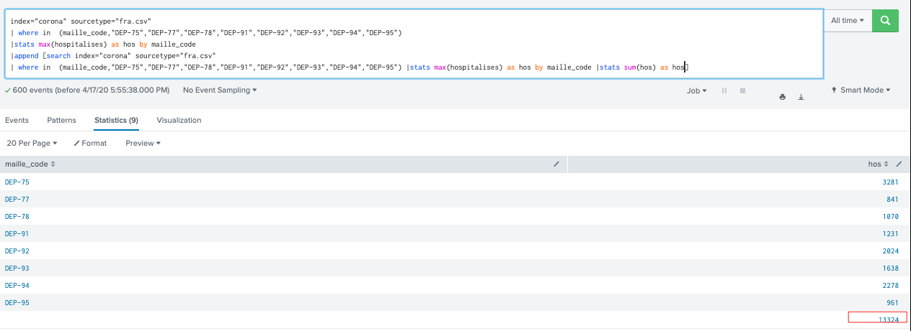

2. Count the number of different customers who purchased items. Append the top purchaser for each type of product.

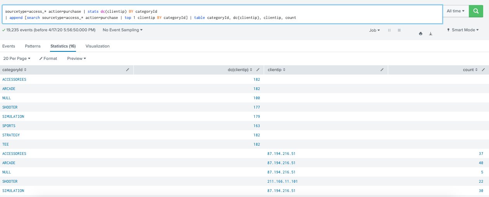

3. Use the append command to determine the number of unique IP addresses that accessed the Web server.

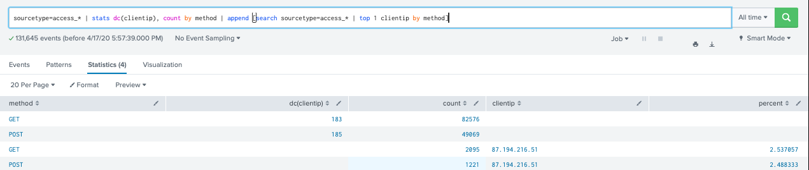

4. using extendtimerange=true

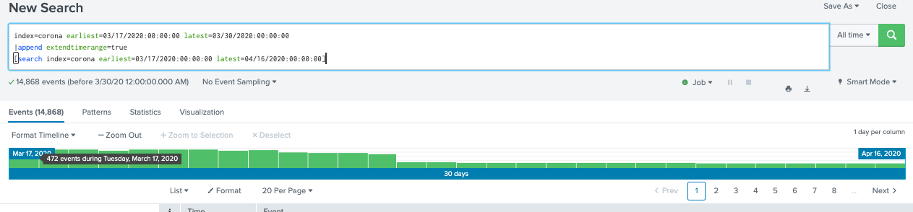

# appendcols : subsearch
## returns: Appends the fields of the subsearch results with the input search results. 
## Syntax : appendcols [override= \<bool> | <subsearch-options>...] \<subsearch>

* [Document](https://docs.splunk.com/Documentation/SplunkCloud/latest/SearchReference/Appendcols)

## Example
compute statistic results
index= corona maille_code=FRA date = "2020-04-16"|stats max(cas_confirmes) as current
|appendcols[search index= corona maille_code=FRA date = "2020-04-15"|stats max(cas_confirmes) as previous ]|eval new_cas_confirmes= current- previous
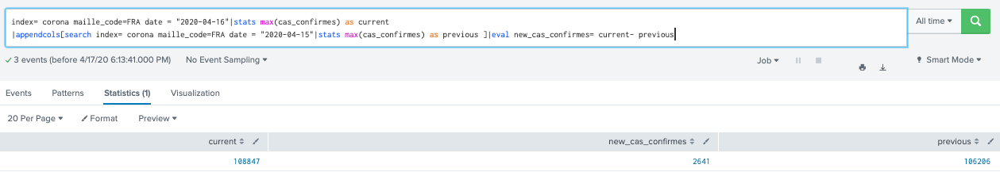
# know the differences
* Append is a streaming command : parallel manal
* appendcol :The first subsearch result is merged with the first main result,the second subsearch result is merged with the second main result, and so on.
* [video](https://www.youtube.com/watch?v=Vjg2UMDuvnA)

# Join, union
## JOIN : main search, subsearch
### returns: combine the results of a subsearch with the results of a main search. One or more of the fields must be common to each result set.
### Syntax: join [join-options...] \[field-list] subsearch

	[join-option] : type=inner | outer | left .dafault = inner left or outer is the same
	usetime=<bool> :default= false
	earlier=<bool> :default= true
	overwrite=<bool> :default= true 
	max=<int> :max=0, no limit

* [Join](https://docs.splunk.com/Documentation/Splunk/8.0.3/SearchReference/Join)

### Example:
1. Inner join 

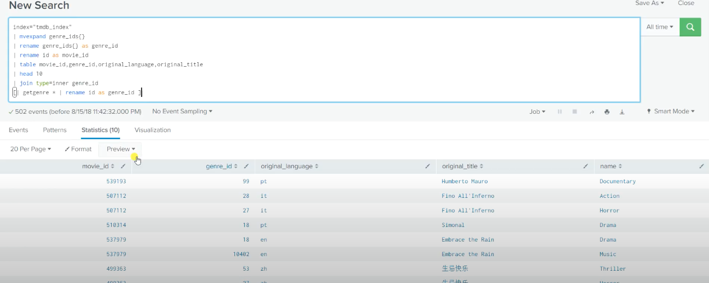

2. Outer join

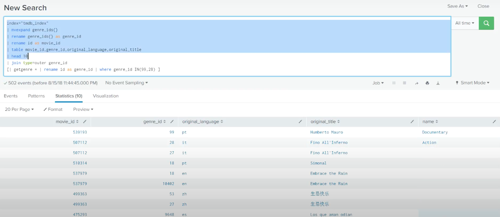

3. left join with max and overwrite

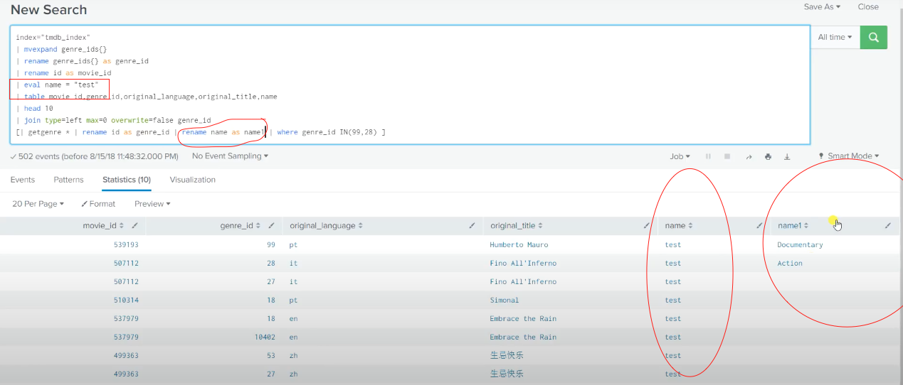

## UNION : 2 or more data set
### returns: Merges the results from two or more datasets into one dataset. 
### Syntax: union [\<subsearch-options>] \<dataset> [\<dataset>...]

	dataset syntax: <dataset-type>:<dataset-name> | <subsearch>
		A named dataset is comprised of <dataset-type>:<dataset-name>. 
		<dataset-type> you can specify a data model, a saved search, or an inputlookup. 
		For example datamodel:"internal_server.splunkdaccess".
		A subsearch is an unnamed dataset.
	subsearch-options maxtime=<int> maxout=<int> timeout=<int>

### Whether the datasets are streaming or non-streaming determines if the union command is run on the indexers or the search head(like append).
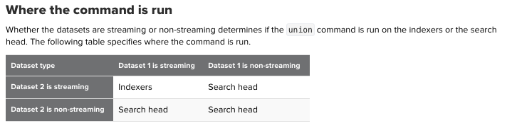

* [Union](https://docs.splunk.com/Documentation/Splunk/8.0.3/SearchReference/Union)

### Example: #TODO

# map, selfjoin

## MAP: slow
### returns: a looping operator that runs a search repeatedly for each input event or result
### Syntax: map (\<searchoption> | \<savedsplunkoption>) [maxsearches=int]
* [Map](https://docs.splunk.com/Documentation/Splunk/8.0.3/SearchReference/Map)

### Example: required a search or savesearch, can parse main search param to your map search

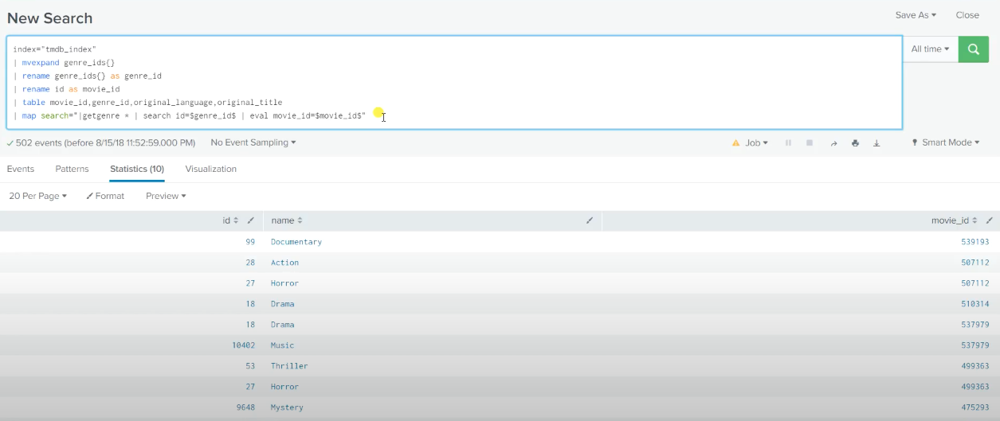

## SELFJOIN: same result set
### returns: Join search result rows with other search result rows in the same result set, based on one or more fields that you specify.
### Syntax:  selfjoin [\<selfjoin-options>...] \<field-list>

	keepsingle=<bool> default=false. if true keep all results even no match selfjoin
	max=<int> : max=0, no limit
	overwrite=<bool> : default true

* [selfjoin](https://docs.splunk.com/Documentation/Splunk/8.0.3/SearchReference/Selfjoin)

### Example: 
original
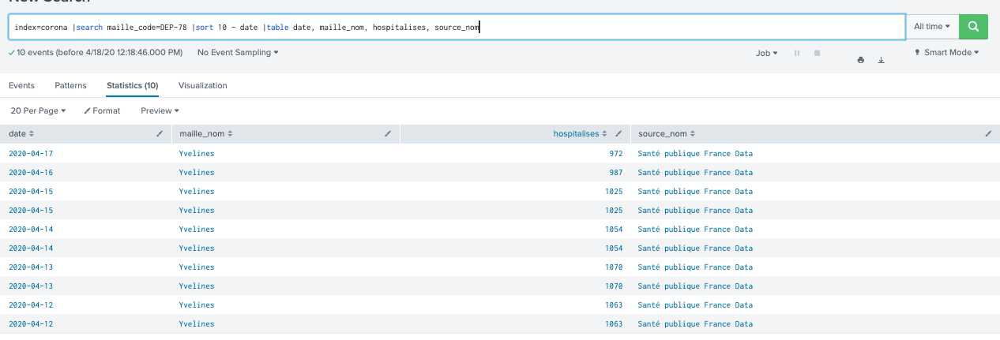

index=corona |search maille_code=DEP-78 |sort 10 - date |table date, maille_nom, hospitalises, source_nom |selfjoin hospitalises

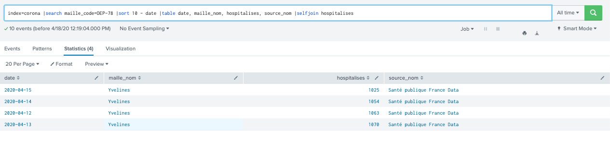

