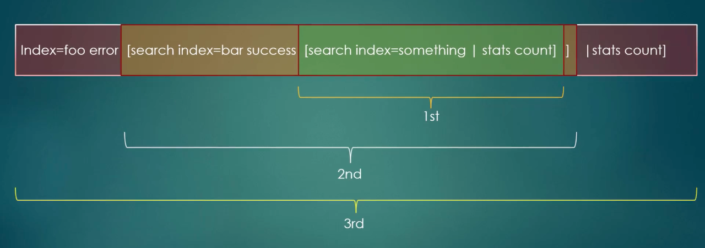
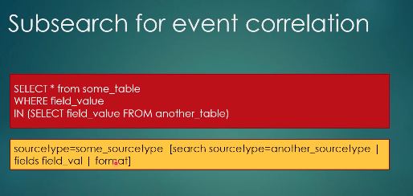
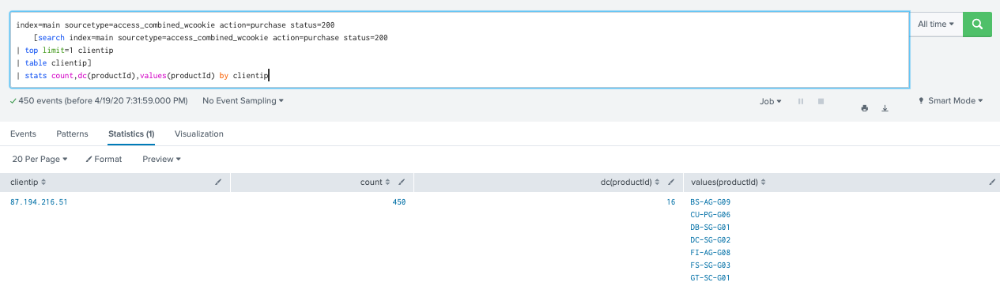
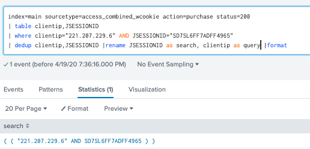

# What is subsearch?

	- A subsearch is a search in [] within a primary, or outer search.
	- A subsearch looks for a single piece of info (is dynamic), 
	then, added to the primary search
	- A subsearch is run first

* [subsearch](https://docs.splunk.com/Documentation/Splunk/8.0.3/SearchTutorial/Useasubsearch)

# How to construct subsearch>
	
	- in []
	- ? must have command after the pipe & before the subsear
	- The first command is generating command: search, eventcount,
	inputlookup, tstats...
	- time ranges specified in a subsear applies only to that subsearch
	- time ranges of outer search do not apply to subsearch
	- time picker is apply to both main search & subsearch

# When to use subsearch?
	
	- Parameterise one search, using the output of another search
	- Run a seperate search, add to main search by append, appendcols, foreach, join command
	- not a transformation of the data(multikv command)

# Multiple subsearch:
- Run in order ( most depth subsearch, from left to right)

- Subsearch for event correlation

# example:
## dynamic result example
### without subsearch
index=main sourcetype=access_combined_wcookie action=purchase status=200
| top limit=1 clientip

index=main sourcetype=access_combined_wcookie action=purchase status=200 clientip=87.194.216.51
| stats count,dc(productId),values(productId) by clientip

### With subsearch:
index=main sourcetype=access_combined_wcookie action=purchase status=200 
    [search index=main sourcetype=access_combined_wcookie action=purchase status=200
| top limit=1 clientip 
| table clientip]
| stats count,dc(productId),values(productId) by clientip

## format command example
index=main sourcetype=access_combined_wcookie action=purchase status=200
| table clientip,JSESSIONID
| where clientip="221.207.229.6" AND JSESSIONID="SD7SL6FF7ADFF4965"
| dedup clientip,JSESSIONID |rename JSESSIONID as search, clientip as query |format

index=main sourcetype=access_combined_wcookie action=purchase status=200
[search index=main sourcetype=access_combined_wcookie action=purchase status=200
| table clientip,JSESSIONID
| where clientip="221.207.229.6" AND JSESSIONID="SD7SL6FF7ADFF4965"
| dedup clientip,JSESSIONID |eval find ="3301" |rename JSESSIONID as search, clientip as query ]

# Limitation of a subsearch:
	
	- subsearch returns a large number of result > not good performance
	- by default max= 10000 results, runtime=60 seconds. larger than that, results will be cut off
	To control this:
	- rewrite query to limit nb of return events
	- use format command end of the subsearch
