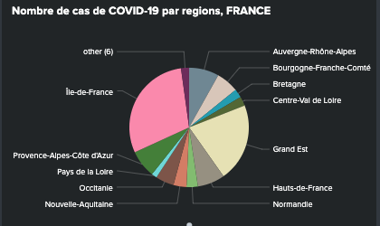
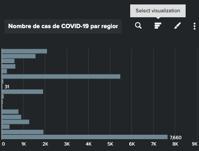
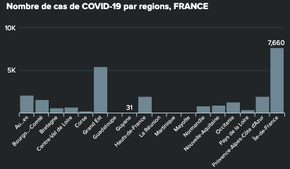
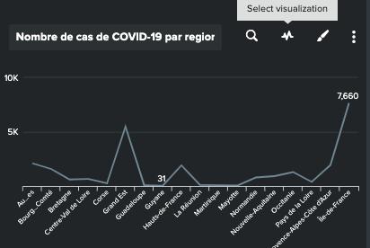
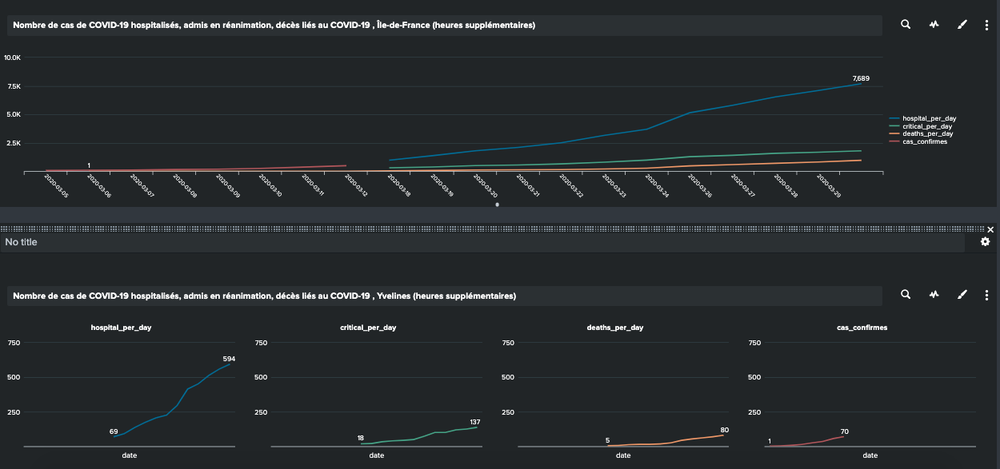
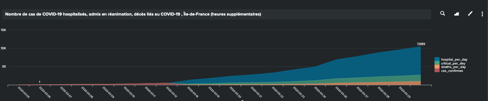
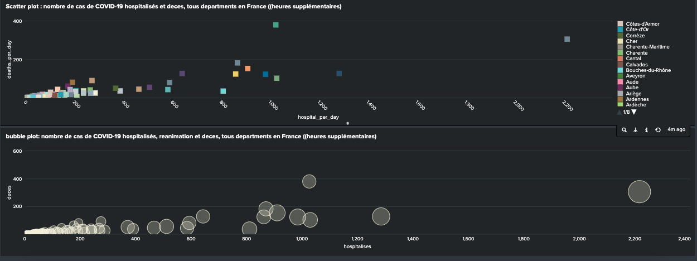

# What is transforming command?
Transforming command out put is a table structure data, which can be found in the "Statistics" and "Visualization" sections. Only verbose search mode can provide triple event/ statistics/visualization, but it is costly in computing resources. 

ViZ requires search results in specific data structure(format)
# 7 charts in this learning
| Chart name | Optimized for single series? | Optimized for multiple series? | Notes                                                |
| ----       | -----                        | ----                           | ----                                                 |
| Pie        | Yes                          | No                             | Pie charts can only render a single series.          |
| Bar        | Yes                          | Yes                            |                                                      |
| Column     | Yes                          | Yes                            |                                                      |
| Line       | Yes                          | Yes                            | Typically, line charts are used for multiple series. |
| Area       | No                           | Yes                            | Use an area chart to render multiple series.         |
| Scatter    | No                           | Yes                            | Scatter charts work best with two data series.       |
| Bubble     | No                           | Yes                            | Bubble charts work best with three data series.      |
* Use full command: useother=f ; usenull=f ; limit= int
* Mixing line and area chart by option chart overlay format

Example: data set covid-19 in france (look at model 13 to find dataset)

* Pie : index="coronavirus" sourcetype="auto_test" maille_code = REG*
|rename maille_nom as regions
|sort -date
|chart max(cas_confirmes) over regions

Personally I am not a fan of pie chart, it can be viz much better with bar chart( in every aspect).

* Bar : Same command 

* Column : Same command

* Line 

Single Line 

Multi Line (option trellis layout to display multiple chart based on one result set)

* Area : index=coronavirus sourcetype="auto_test" | where in  (maille_code,"DEP-75","DEP-77","DEP-78","DEP-91","DEP-92","DEP-93","DEP-94","DEP-95")
| chart sum(hospitalises)  as hospital_per_day, sum(reanimation) as critical_per_day, sum(deces) as deaths_per_day, sum(cas_confirmes) as cas_confirmes by date

* Scatter : ... | table <marker_name_field> <x-axis_field> <y-axis_field> 

index=coronavirus sourcetype="auto_test"  granularite = departement date = "2020-03-30"
| eval ville = maille_nom, hospital_per_day = max(hospitalises), deaths_per_day= max(deces)
| table ville, hospital_per_day ,deaths_per_day ,date

* Bubble : ... | <stats_command> <y-axis_field> <x-axis_field> <bubble_size_field>

index=coronavirus sourcetype="auto_test"  granularite = departement date = "2020-03-30"
| stats max(reanimation) by maille_nom, hospitalises,deces

