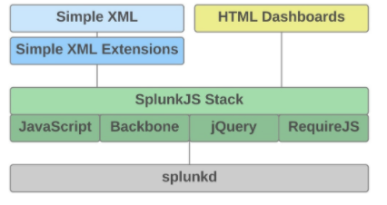
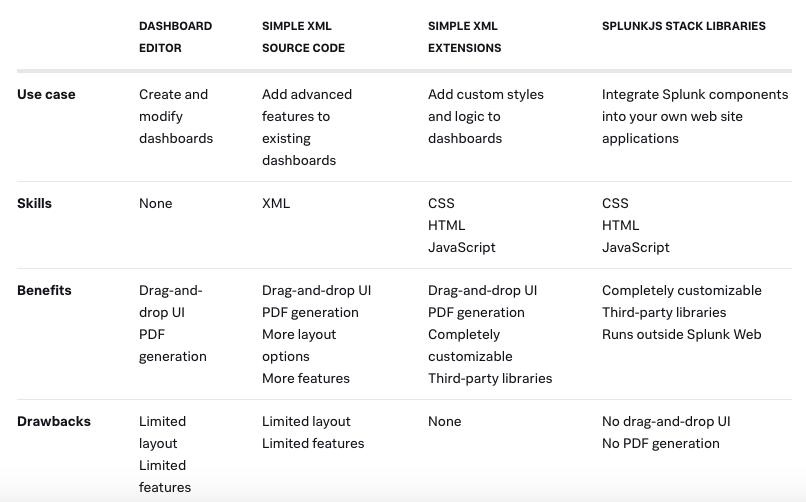

# Introduction
## Architect
- The Splunk Web Framework is an app framework for Splunk users who want to create custom dashboards and Splunk apps with tables, charts, forms searches, and other functionality. 

- The Splunk Web Framework provides a stack of features built on top of splunkd, the core Splunk server. You can build apps that run in Splunk Web alongside apps such as Splunk Search, but you can also build custom apps that interact with Splunk but run on your own web server.

## Dashboard editor (UI)
- The Dashboard Editor is a WYSIWYG click-and-drag interface that allows you to build dashboards within Splunk Web. You can add panels with views such as tables and charts, along with form controls such as dropdown lists, checkboxes, and radio buttons. The Dashboard Editor also provides editing tools that lets you modify the panels, views, and forms.

## Simple XML(Source)
- The Simple XML layer of the stack provides easy-to-use tools that don't require any programming knowledge and are available from the Splunk Web UI

- Splunk's extensible markup language, Simple XML, is the underlying source code for the dashboards created using the Dashboard Editor. Although you can work with the most common features using the Dashboard Editor, some features are only available by working in the Simple XML code.

[App to learn](https://splunkbase.splunk.com/app/1603/)

## Splunk view
- The Web Framework includes views for:

       - Visualizations (chart view, Splunkmap view,etc.)
       - Search controls (searchBar view, Timeline view, timeRange view,etc.)
       - Form inputs (checkbox view, dropdown view, text view,etc.)
       - Layout

## Edit Simple XML

### Required knowledge:
1. Dashboard and form structure and elements in [Dashboards and forms](https://docs.splunk.com/Documentation/Splunk/8.0.3/Viz/Overviewofdashboards)

2. Available options and elements in the [Simple XML Reference](https://docs.splunk.com/Documentation/Splunk/8.0.3/Viz/PanelreferenceforSimplifiedXML#Overview)

### Where to find:
Dashboard > Edit> Source > edit the code > Save

## Transforming command 

       - A transforming command orders the search results into a data table. These commands "transform" the specified cell values for each event into numerical values that Splunk software can use for statistical purposes. 
       - Transforming commands are not streaming.
       - Transforming commands are required to transform search result data into the data structures that are required for visualizations such as column, bar, line, area, and pie charts.
       - Transforming commands include: chart, timechart, stats, top, rare, and addtotals when it is used to calculate column totals (not row totals).

## Reference
[Document](https://dev.splunk.com/enterprise/docs/developapps/webframework)

[Simple XML refer](https://docs.splunk.com/Documentation/Splunk/8.0.3/Viz/PanelreferenceforSimplifiedXML#Overview)

