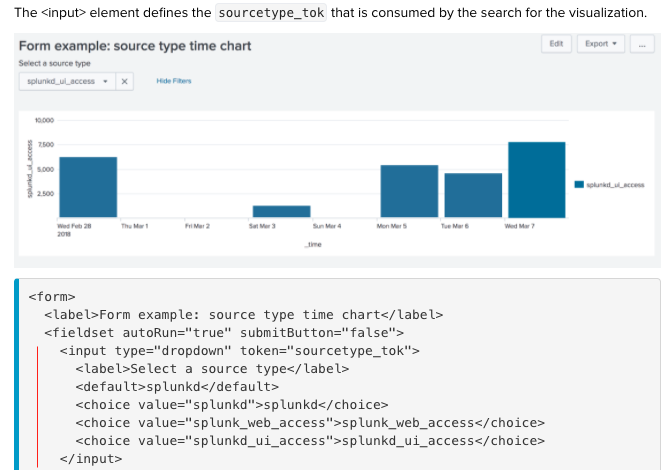
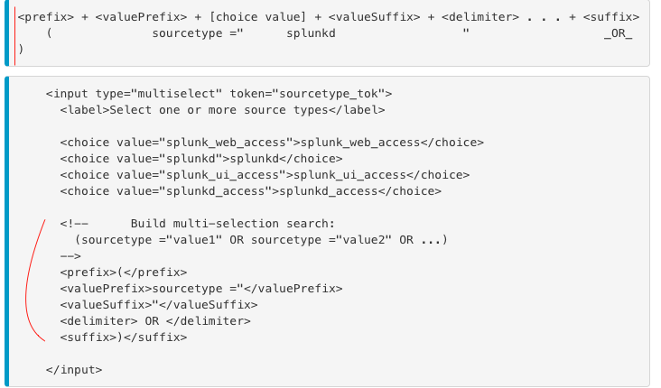
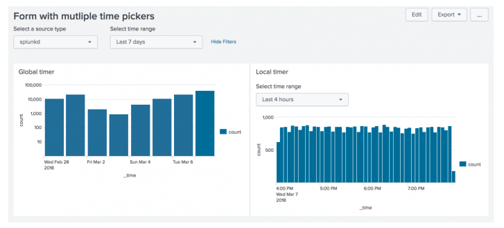
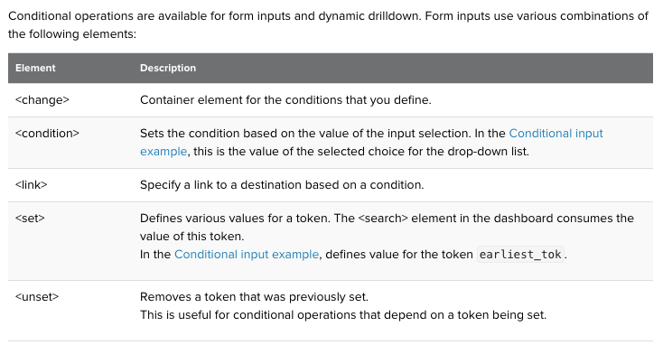
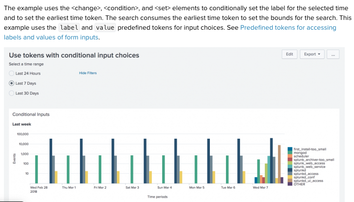
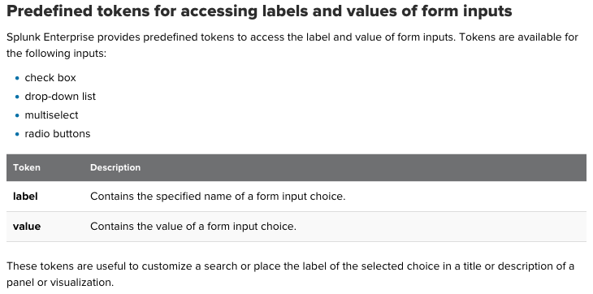
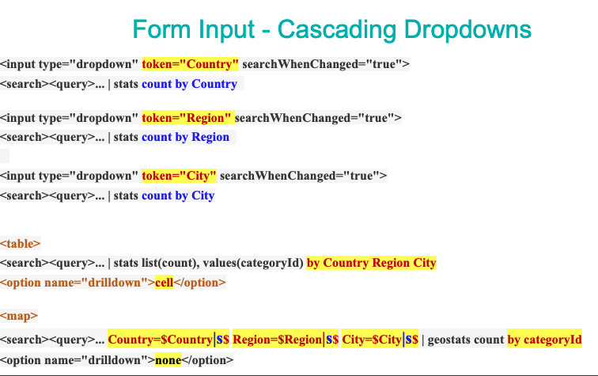
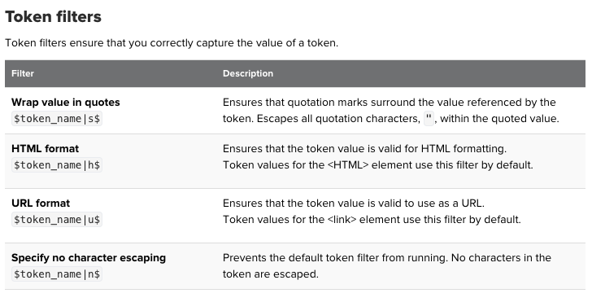

# Explain how tokens work
## Token:
	- Tokens are like pregramming variables.
	- Use token to access and pass these values to create more interactive dashboards.
	- Predefined token: user click event($click.value2$)
	- Custom token: 
## Use cases:
	1. Search string : when search run, it use a dynamic values from token
	2. Search event handlers : search state changes
	3. Form inputs : represent values that user select/type
	4. Set token on page load: customized initial content when a dashboard loads
	5. Drilldown : drilldown behavior, more interactive behavior
	6. Define chart pan and zoom areas: use predefined tokens to define pan and zoom areas for chart

We focus at use case nb.3. see [Token](https://docs.splunk.com/Documentation/Splunk/7.3.1/Viz/tokens) for other use cases details 

# Use tokens with form inputs
## Define token for form input example:

## Define token for multiselect inputs example:

## Define tokens for time inputs:
If you have a form with panels that use different time pickers, use tokens for the time input to indicate the time picker to use for each panel. To access the earliest and latest values from a time picker, use the following modifiers to the token:
	$timer_tok.earliest$
	$timer_tok.latest$
See [Time input example](https://docs.splunk.com/Documentation/Splunk/7.3.1/Viz/tokens#Time_input_example)

## Define tokens for conditional operations with form inputs:

See [conditional operations with form inputs](https://docs.splunk.com/Documentation/Splunk/7.3.1/Viz/tokens#Conditional_operations_with_form_inputs)
## Predefined tokens for accessing labels and values of form inputs:

See [accessing labels and values of form inputs](https://docs.splunk.com/Documentation/Splunk/7.3.1/Viz/tokens#Access_labels_and_values_of_form_inputs)

# Create cascading inputs

See [blog post](https://www.splunk.com/en_us/blog/tips-and-tricks/build-a-dashboard-with-dynamic-and-editable-inputs.html)

# Define types of token filters

# EXAMPLE (https://github.com/isabelle-le/Splunk-selflearning/blob/master/covid19_dashboard.xml)
## Radio token with condition from line 9-30
## Interactive title, line 34
## Interractive single value chart, line 36
