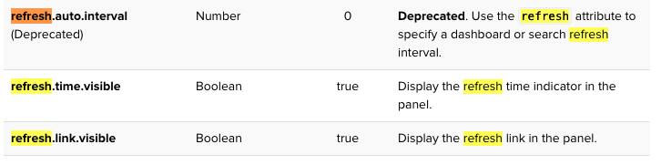
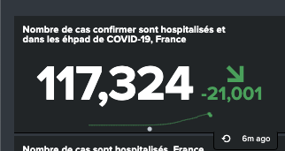
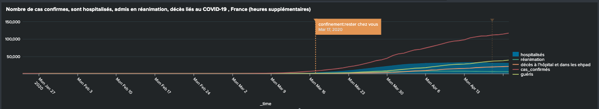

# Customize chart and panel properties 
A list of options(property and type) to customize the chart.

See [Panel visualization elements](https://docs.splunk.com/Documentation/Splunk/6.5.1/Viz/PanelreferenceforSimplifiedXML#search)

# Set panel refresh and delay times

# Disable search access features
Here is some examples. See [XML code line 37-39](https://github.com/isabelle-le/Splunk-selflearning/blob/master/covid19_dashboard.xml)

\<dashboard hideEdit="true"> # will hide on the dashboard: Edit, More Info, export PDF and Print

\<option name="link.openSearch.visible">false</option>   # will hide Open in Search from under the panel

\<option name="link.openPivot.visible">false</option>        # will hide Open in Pivot from under the panel

\<option name="link.inspectSearch.visible">false</option>   # will hide Inspect from under the panel

\<option name="link.exportResults.visible">false</option>     # will hide Export from under the panel

# Define event annotations : allow you to add context to the trends returned by your time charts
	
	- Event annotations are supported only for line charts, column charts, and area charts.
	- Ensure event annotation refresh same as your events (add earliest and lastest)

## How to create? by Simple XML

	 Need an secondary search 
	   annotation_label 
	   annotation_type
	   annotation_color (hex)
   
## Example:
1. Lock down begin and  Begin to accept death out side of hospital. See [code line 166-180](https://github.com/isabelle-le/Splunk-selflearning/blob/master/covid19_dashboard.xml)

