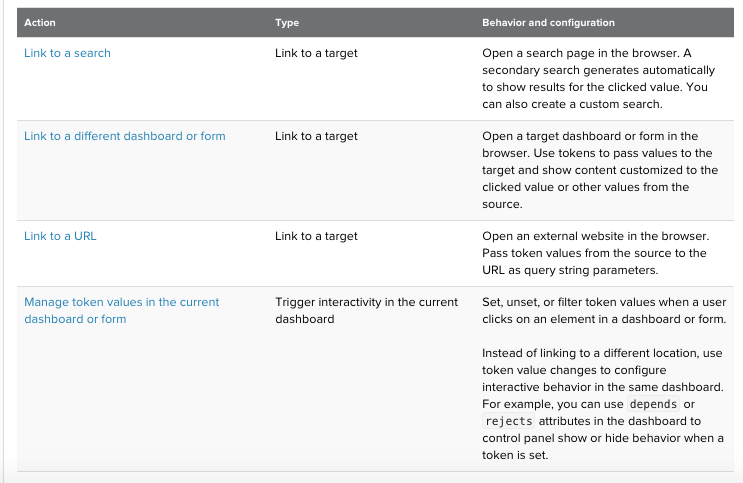
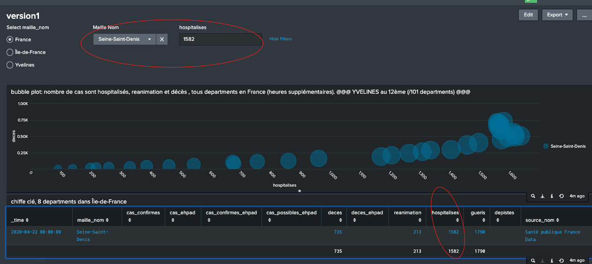

# Intro

  Input : users click on data points, table,etc. 
  
  Output: share additional data insights (interactivity dashboards)

# Drilldown actions:
	- Link to a target: 
		target = secondary search, another dashboard or form, or a website.
	- Using tokens to customize a drilldown

# Tokens available in drilldown
	- Form input change events (see Simple XML code for its token name)
	- Search event : Predefined tokens represent search progress and completion events.
	- Tokens set on page load : when a dashboard loads in the browse
	- Chart navigation and selection events :token values representing user pan and zoom or selection events in some chart types
	- [Predefined click event tokens] $click.value$,etc. (https://docs.splunk.com/Documentation/Splunk/8.0.3/Viz/PanelreferenceforSimplifiedXML#Predefined_drilldown_tokens)
	- Custom tokens

# Choose a drilldown action (4 actions)

# Access the drilldown editor
	Steps:
	1. Dashboard, click **Edit**
	2. Find panel where you are adding drilldown. Click three dot icons.Select **Edit Drilldown**
	3. Choose one actions

see [Spunk document](https://docs.splunk.com/Documentation/Splunk/8.0.3/Viz/DrilldownIntro#Choose_a_drilldown_action)
# Example:
Create an dropdown input, interactive dashboard with it
	
	<input type="dropdown" token="where">
      <label>Maille Nom</label>
      <search base="base_search">
        <query>|stats by maille_nom</query>
      </search>
      <fieldForLabel>maille_nom</fieldForLabel>
      <fieldForValue>maille_nom</fieldForValue>
      <choice value="*">All</choice>
      <default>*</default>
      <initialValue>*</initialValue>
    </input>

## Normal drilldown. See [XML code 90-92](https://github.com/isabelle-le/Splunk-selflearning/blob/master/Dashboard%20w%20drilldown.xml)
use predefined click event token $click.value$

	<drilldown>
		<set token="form.where">$click.value$</set>
	</drilldown>

update it to the search 

		index="corona" sourcetype="fra.csv" |search granularite = departement |search maille_nom="$form.where$"
		| stats max(_time) by maille_nom, hospitalises,deces, reanimation
		| sort 101 -max(_time)
		| appendpipe run_in_preview=true
		    [|stats max(reanimation) by maille_nom, hospitalises,deces]

## Conditional drilldown : limit to only 2 col name, maille_nom and \_time, turn off any click action to cas_confirmes. See [XML code 116-123 ](https://github.com/isabelle-le/Splunk-selflearning/blob/master/Dashboard%20w%20drilldown.xml)
Use predefined click event token $click.value2$ and $row.maille_nom$ for \_time col

			<drilldown>
	          <condition field="maille_nom">
	          <set token="form.where">$click.value2$</set>
	          </condition>
	          <condition field="_time">
	          <set token="form.where">$row.maille_nom$</set>
	          </condition>
	          <condition field="cas_confirmes">
	          </condition>
	        </drilldown>

update it to the base search 

	index="corona" sourcetype="fra.csv"|table _time,maille_nom,granularite,cas_confirmes,cas_ehpad,cas_confirmes_ehpad,cas_possibles_ehpad,deces,deces_ehpad,reanimation,hospitalises,gueris,depistes,source_nom |search maille_nom = "$form.where$"

## Dynamic drilldown : filter by an text input, clear button with html and js script. See [XML code 124-126](https://github.com/isabelle-le/Splunk-selflearning/blob/master/Dashboard%20w%20drilldown.xml)

		Create a text from 
		Use predefined click event token $click.value2$ for hospitalises col
		Update in base search
		Add html,Develope a js, add to app dir [see video from mins 30 to end](https://www.youtube.com/watch?v=iNXj1uWTQes)

## Drilldown to search : click on any col other than \_time, maille_nom

