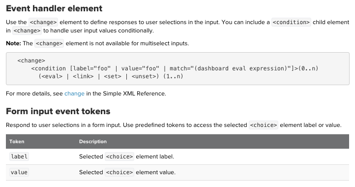

# Event handler in Simple XML: listen and define responses to state changes, click, etc.
[event handler document ](https://docs.splunk.com/Documentation/Splunk/8.0.3/Viz/EventHandlerReference#Condition_.28drilldown.29)
## Event handling context:
Use predefined or custom tokens to capture dynamic values or to help you implement responsive behavior. Depending on the context, available predefined tokens vary.

## FORM INPUTs : Respond to user input in any of the following form input elements.

### Example: Respond to user selections in a radio button

	<change></change>
	3 conditions for 3 values
	passing it to search 

## SEARCH STATES : Search event handlers allow you to enable event actions based on search results or search properties. Actions include linking to a page, setting or unsetting tokens, and executing an eval function.

See [search job properties](https://docs.splunk.com/Documentation/Splunk/7.2.1/Search/ViewsearchjobpropertieswiththeJobInspector#Search_job_properties)
### Example: hide a panel depends on its results

	<done></done>
	job.properties : job.resultCount with 2 conditions
	adding token to panel with rejects="$token$"

## DRILLDOWN : see [34.Using Drilldown.md](https://github.com/isabelle-le/Splunk-selflearning/blob/master/34.%20Using%20Drilldowns.md)
## DASHBOARD PAGE LOAD : passing value to a dashboard page load
	
	<init></init>
	set token = value as page load event it is diff to form default values

[Video](https://www.youtube.com/watch?v=wQvWEbv1LXg)
