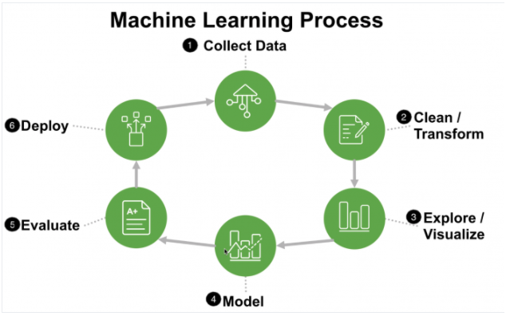
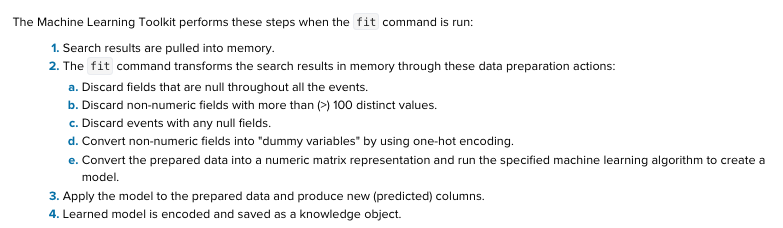

# Define some concepts and terms associated with machine learning
## Artificial intelligence: A function that maps feature to an output
## Machine learning: A function that learns patterns in your data without being explicitly programmed
## Deep learning: is designed to help customers leverage the power of more advanced math and parallel processing power.
# Type of machine learning:
### Supervised : labeled input and outputs, the goal is to learn a general rule that maps inputs to  outputs
	
	Regression: output is a function, predits a number.
	Classification: output is probability, predicts a class/category.
	Forcasting: output is a function, predicts the future of a single value moving through time.
### Unsupervised : No labels are given to the learning algr, leaving it on its own to find structure in its input

	Clustering: cluster groups similar points of data together.
	Anomaly detection:  finds outliers in your data 
	(by computing an expectation based on one of the MLg types)
### Reinforcement : A system interacts with a dynamic environment in which it must perform a certain goal (such as driving a vehicle or playing a game against an opponent). The system is provided feedback in terms of rewards and punishments as it navigates its problem space.

# Describe the machine learning workflow
## Splunk Apps for ML 
    IT Service Intelligence (ITSI),
    Splunk Enterprise Security,
    Splunk User Behavior Analytics offer managed machine learning options. 
    The Machine Learning Toolkit (MLTK) and 
    Deep Learning toolkit
App in the Splunkbase ecosystem that allows you to build custom machine learning solutions for any use case. 
DOWNLOAD [Splunk Machinelearning toolkit](https://splunkbase.splunk.com/app/2890/) required python installed

DOWNLOAD [Deep learning toolkit](https://splunkbase.splunk.com/app/4607/#/details) required ML and Docker

After installation images

## Machine learning Process

# Split data for training and testing models
We will keep most of our data in training set and a small portion to testing set, make sure that they are similiar. The common ratio is 70-30 or 80-20, you dont want to give test set an totally new category to predict which is not present in training set. The way to split it in Splunk is as image or SPL (see below example in fit section)

# Fit and apply models in Splunk
Look at[ Understanding fit and apply command](https://docs.splunk.com/Documentation/MLApp/4.2.0/User/Understandfitandapply). 
## Fit command : to train a ML algr to your data set

#### 1.Search results are pulled into memory, and parses them into Pandas DataFrame format. The originally ingested data is not changed.
#### 2.a Discard fields that are null throughout all the events: If you dont want, you must specify the fillnull command before the fit command
#### 2.b Discard events with any null fields: To include the results with null values in the model, you must replace the null values before using the fit command in your search. You can replace null values by using SPL commands such as fillnull, filldown, or eval.
#### 2.c Discard non-numeric fields with more than (>) 100 distinct values. Because ML algr can not perfrom well with high-cardinality fields
#### 2.d Convert non-numeric fields into "dummy variables" by using one-hot encoding : converts non-numeric fields using one-hot encoding, strings, characters, and other non-numeric values for each field are encoded as binary values (1 or 0). The value of 1 is placed in the search results where the value name appeared previously
#### 2.e Convert the prepared data into a numeric matrix representation and run the specified machine learning algorithm to create a model ( all created in memory)
#### 2.f Apply the model to the prepared data and produce new (predicted) columns : The name of the appended field starts with Predicted and includes the name of the <field_to_predict>
#### 3. Learned model is encoded and saved as a knowledge object

## Apply command: let you use that model to see your output

See [cheatsheet](https://docs.splunk.com/images/3/3f/Splunk-MLTK-QuickRefGuide-2019-web.pdf)

# Use Machine Learning Toolkit Showcases and Assistants
## Showcases: interactive examples from different domains like IoT and business analytics
## Experiments and Assistants : Assistants are a guided walk-through of the process for performing particular analytics with your own data. Experiments is one interface with automated model versioning

