# I. Classification
Classification refers to the task of giving a machine learning algorithm features, and having the algorithm put the instances/data points into one of many discrete classes. Classes are categorical in nature, it isn't possible for an instance to be classified as partially one class and partially another.
# II.Command : fit and apply
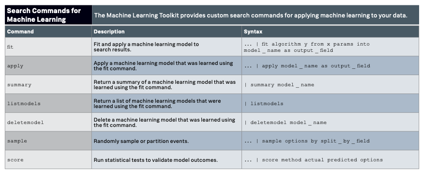
## FIT example : sample + fit on iris data set with 9 classifications algrs
	| inputlookup iris.csv
	 
	| sample partitions=100 seed=1234
	| search partition_number <= 70

	| fit BernoulliNB species from * into Ber_iris
	| fit DecisionTreeClassifier species from * into DT_iris
	| fit GaussianNB species from * into Gau_iris
	| fit GradientBoostingClassifier species from * into GB_iris
	| fit LogisticRegression species from * into LR_iris
	| fit MLPClassifier species from * into MLP_iris
	| fit RandomForestClassifier species from * into RF_iris
	| fit SGDClassifier species from * into SGD_iris
	| fit SVM species from *  probabilities=True into SVM_iris
## Apply example : sample + apply +score
	| inputlookup iris.csv
	 
	| sample partitions=100 seed=1234
	| search partition_number > 70
	 
	| apply Ber_iris as Ber_species 
	| apply DT_iris as DT_species
	| apply Gau_iris as Gau_species
	| apply GB_iris as GB_species
	| apply LR_iris as LR_species
	| apply MLP_iris as MLP_species
	| apply RF_iris as RF_species
	| apply SGD_iris as SGD_species
	| apply SVM_ris as SVM_species
	| score precision_recall_fscore_support species ~ Ber_species DT_species Gau_species
	GB_species LR_species MLP_species RF_species SGD_species SVM_species average=weighted
	
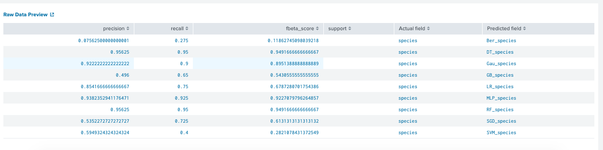

# III. 9 DIF Classifier algrs on Splunk

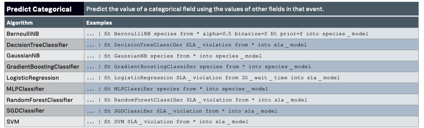

## 1. BernoulliNB : implementation of the Naive Bayes classification algorithms for data that is distributed according to multivariate Bernoulli distributions.
What is Burnoulli (Bern) distributions? 

any event with 1 trial, 2 possible outcomes. Example: coin flip, 1true/1false question, vote for democratic/Republican

What is Multivariate Bern distributions? 

There may be multiple features but each one is assumed to be a binary-valued boolean variable.
Therefore, this class requires samples to be represented as binary-valued feature vectors. If handed any other kind of data, a Bern instance may binarize its input(depending on the binarize parameter)
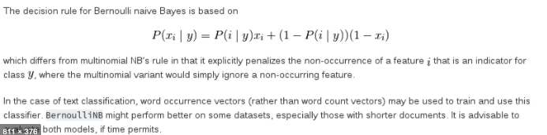
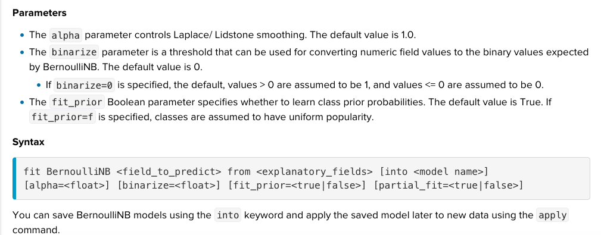

### Example : Diabetes dataset with target var = response has binary outcome(1 or 0)
	| inputlookup diabetes.csv
	| sample partitions=700 seed=1234
	| search partition_number <= 500
	| fit BernoulliNB response from * into BernNB_diabetes_default alpha=1 binarize=0 
	fit_prior=True partial_fit=true
	| fit BernoulliNB response from * into BernNB_diabetes alpha=0.5 binarize=0 fit_prior=f

	| inputlookup diabetes.csv
	| sample partitions=700 seed=1234
	| search partition_number > 500
	| apply BernNB_diabetes_default as pred_res_default
	| apply BernNB_diabetes as pred_response
	| score accuracy_score response ~ pred_res_default pred_response 

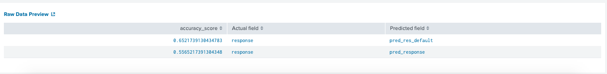
## 2. DecisionTreeClassifier: capable of performing multi-class classification on a dataset
Decisions tree learn from data to approximate a sine curve with a set of if-else decision rules. The deeper the tree, the more complex the decision rules and the fitter the model
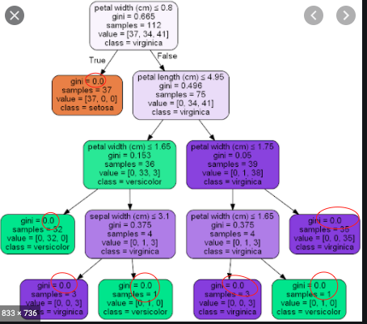
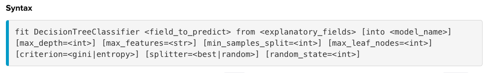

Parameters:

1. max_depth: None(default), keep expanding until all leaves are pure

2. max_feature: nb of features to consider when looking for the best split

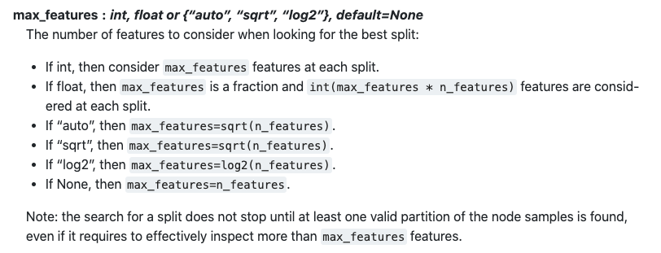

3. min_samples_split: int or float, default=1. The minimum number of samples required to be at a leaf node.

4. max_leaf_nodes: int, default=None. Grow a tree with max_leaf_nodes in best-first fashion. Best nodes are defined as relative reduction in impurity. If None then unlimited number of leaf nodes.

5. criterion: gini(default) = gini impurity / entropy = information gain

6. splitter: best(default)= best split at each node/ random= random split

7. random_state: generate the seed used by the random number generator.

### Example :iris dataset with 3 classes in target var(species)
	| inputlookup iris.csv 
	| sample partitions=100 seed=1234
	| search partition_number <= 70
	| fit DecisionTreeClassifier species from * into DT_iris_default max_features=auto 
	criterion=gini splitter=best random_state=1234
	| fit DecisionTreeClassifier species from * into DT_iris max_features=2 random_state=1234

	| inputlookup iris.csv
	| sample partitions=100 seed=1234
	| search partition_number > 70
	| apply DT_iris_default as DT_species_default
	| apply DT_iris as DT_species
	| score accuracy_score species ~ DT_species_default DT_species

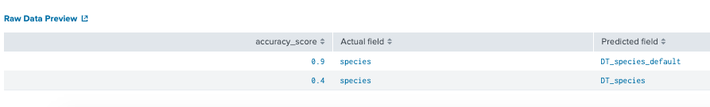
|summary DT_iris_default

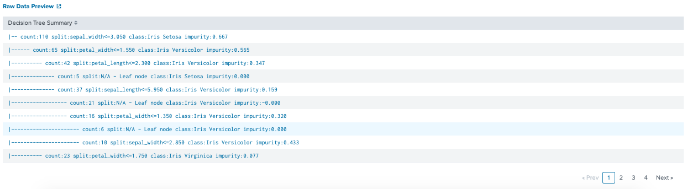
## 3. GaussianNB: Because of the assumption of the normal distribution, Gaussian Naive Bayes is best used in cases when all our features are continuous.
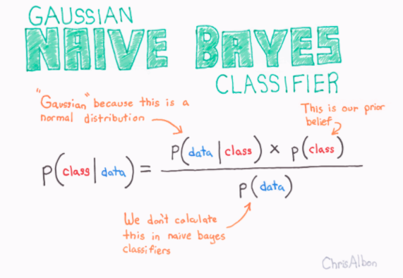
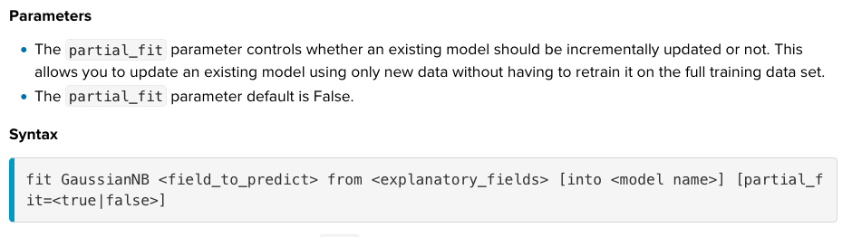
### Example: iris dataset
	| inputlookup iris.csv 
	| sample partitions=100 seed=1234
	| search partition_number <= 70
	| fit GaussianNB species from * into GauNB_iris_default partial_fit=false random_state=1234
	| fit GaussianNB species from * into GauNB_iris partial_fit=true random_state=1234

	| inputlookup iris.csv
	| sample partitions=100 seed=1234
	| search partition_number > 70
	| apply GauNB_iris_default as GauNB_species_default
	| apply GauNB_iris as GauNB_species
	| score accuracy_score species ~ GauNB_species_default GauNB_species
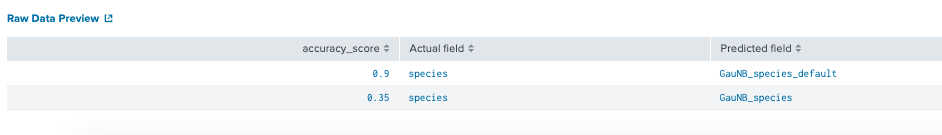

## 4. GradientBoostingClassifier: Gradient boosting classifiers are a group of machine learning algorithms that combine many weak learning models together to create a strong predictive model. Decision trees are usually used when doing gradient boosting.
### Adaboost:
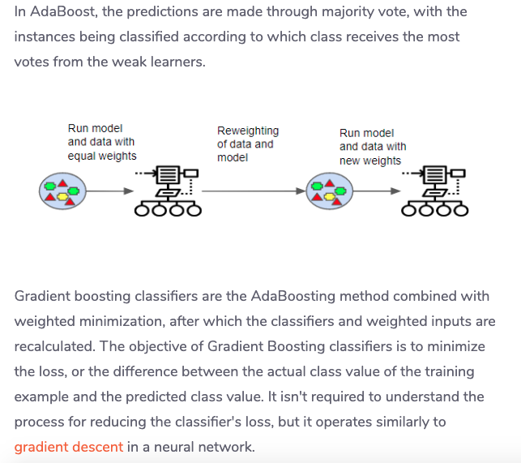
### How Gradient Boosting Works: Gradient boosting involves three elements:

	A loss function to be optimized.
	A weak learner to make predictions.
	An additive model to add weak learners to minimize the loss function.
### 1. Loss function:
	can be various. ex: regression uses squared error and classification uses logarithmic loss
### 2. Week Leaner:
	Decision trees are used as the weak learner in gradient boosting.
### 3. Additive Model:
	Trees are added one at a time, and existing trees in the model are not changed.
	A gradient descent procedure is used to minimize the loss when adding trees.
	Traditionally, gradient descent is used to minimize a set of parameters (the coefficients in a regression equation,
	 	weights in a neural network). After calculating error or loss, the weights are updated to minimize that error.
	The output for the new tree is then added to the output of the existing sequence of trees in an effort to correct or 
		improve the final output of the model.

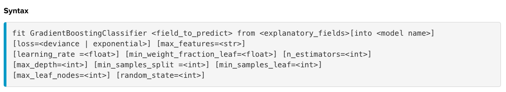
Paramater:
1.[loss=<deviance | exponential>]: loss function to be optimized.  ‘deviance’ refers to deviance (= logistic regression) for classification with probabilistic outputs. For loss ‘exponential’ gradient boosting recovers the AdaBoost algorithm.

2.[learning_rate =<float>]: learning rate shrinks the contribution of each tree by learning_rate. There is a trade-off between learning_rate and n_estimators.Default is 0.1

3.[max_features=<str>]: same as DT

4.[min_weight_fraction_leaf=<float>]: The minimum weighted fraction of the sum total of weights (of all the input samples) required to be at a leaf node. Samples have equal weight when sample_weight is not provided. Default = 0.1

5.[n_estimators=<int>] : The number of boosting stages to perform. Gradient boosting is fairly robust to over-fitting so a large number usually results in better performance. Default= 100

6.[max_depth=<int>]  : same as DT

7.[min_samples_split =<int>] : same as DT

8.[min_samples_leaf=<int>] : same as DT

9.[max_leaf_nodes=<int>] : same as DT

10.[random_state=<int>] 

### Example: iris data set
	| inputlookup iris.csv 
	| sample partitions=100 seed=1234
	| search partition_number <= 70
	| fit GradientBoostingClassifier species from * into GB_iris_default loss=deviance learning_rate=0.1 n_estimators=100 random_state=1234
	| fit GradientBoostingClassifier species from * into GB_iris n_estimators=500 random_state=1234

	| inputlookup iris.csv
	| sample partitions=100 seed=1234
	| search partition_number > 70
	| apply GB_iris_default as GB_species_default
	| apply GB_iris as GB_species
	| score accuracy_score species ~ GB_species_default GB_species
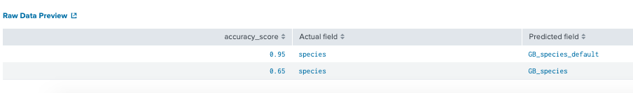

## 5. LogisticRegression: use logistic function(sigmoid function) to describe properties of population growth
It is an S shaped curve that can take any real-value number and map it into a value between [0,1]

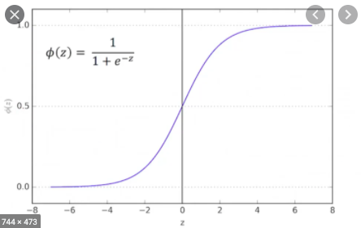

See [cheatsheet ML](https://ml-cheatsheet.readthedocs.io/en/latest/logistic_regression.html)

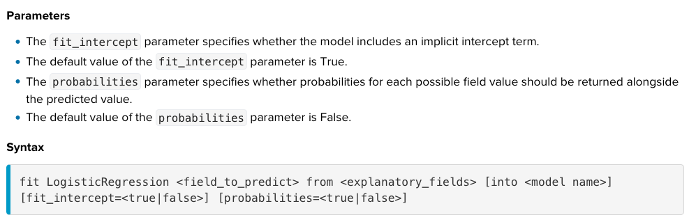
### Example: diabetes data set
	| inputlookup diabetes.csv
	| sample partitions=768 seed=1234
	| search partition_number <= 550
	| fit LogisticRegression response from * into LR_diabetes_default fit_intercept=true probabilities=true

	| inputlookup diabetes.csv
	| sample partitions=768 seed=1234
	| search partition_number > 550
	| apply LR_diabetes_default as LR_res_default
	| score accuracy_score response ~ LR_res_default
	
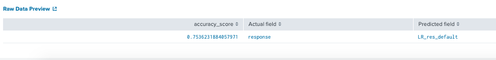

## 6. MLPClassifier:  Multi-layer Perceptron estimator for classification
A multilayer perceptron, is composed 1+ perceptron, are composed of an input layer(to receive the signal), an output layer(makes a decision), and in between those two, an arbitrary nb of hidden layers that are the true computational engine of the MLP.

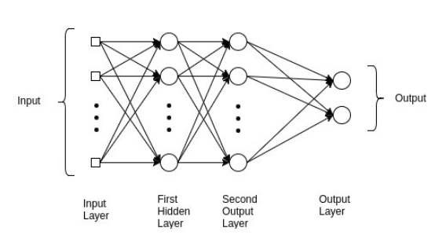
### Perceptrons/Artificial neurons: are simple computational units that have weighted input signals and produce an output signal using an activation funtion (Sigmoid, Relu, TanH,etc.).A neuron may have two inputs in which case it requires three weights. One for each input and one for the bias. Weights are often initialized to small random values, such as values in the range 0 to 0.3, although more complex initialization schemes can be used.

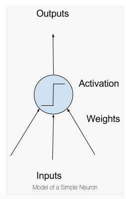

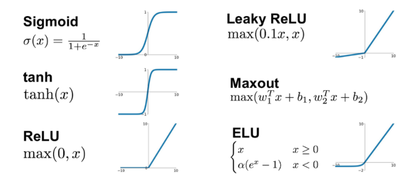

### Syntax Splunk
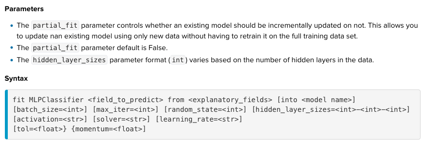

Pamameter:

1.[batch_size=<int>] :  When set to “auto”, batch_size=min(200, n_samples)

Size of minibatches for stochastic optimizers.
	
2.[max_iter=<int>] : Maximum number of iterations. default=200
	
3.[random_state=<int>] 
	
4.[hidden_layer_sizes=<int>-<int>-<int>]: tuple, length = n_layers - 2, default=(100,). 

The ith element represents the number of neurons in the ith hidden layer.
	
5.[activation=<str>] default 'relu'
	
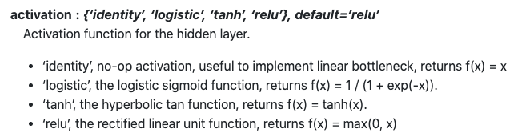

6.[solver=<str>] :default 'adam'
	
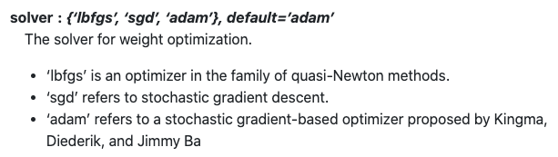

7.[learning_rate=<str>]: default"constant'
	
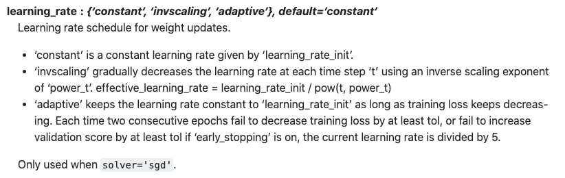

8.[tol=<float>] :float, default=1e-4
	
Tolerance for the optimization. When the loss or score is not improving by at least tol for n_iter_no_change consecutive iterations, unless learning_rate is set to ‘adaptive’, convergence is considered to be reached and training stops.
	
9.[momentum=<float>]: float, default=0.9
	
Momentum for gradient descent update. Should be between 0 and 1. Only used when solver=’sgd’.

[How many hidden layers + how many Neurons](https://machinelearningmastery.com/how-to-configure-the-number-of-layers-and-nodes-in-a-neural-network/)

### Example: diabetes

	| inputlookup diabetes.csv
	| sample partitions=768 seed=1234
	| search partition_number <= 550
	| fit MLPClassifier response from * into MLP_diabetes_default 
	| fit MLPClassifier response from * into MLP_diabetes batch_size =100 max_iter=100 random_state=1234
	hidden_layer_sizes=5 activation=relu solver=adam learning_rate='constant'

	|summary MLP_diabetes_default 

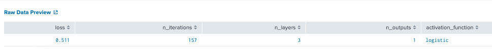

	|summary MLP_diabetes

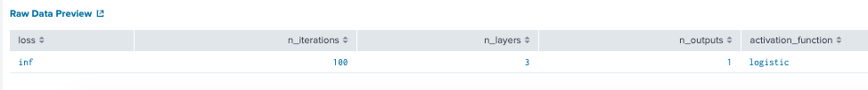

	| inputlookup diabetes.csv
	| sample partitions=768 seed=1234
	| search partition_number > 550
	| apply MLP_diabetes_default as MLP_res_default
	| apply MLP_diabetes as MLP_res
	| score accuracy_score response ~ MLP_res_defaut MLP_res

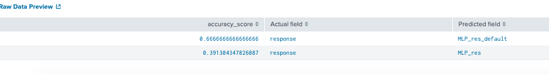

## 7. RandomForestClassifier: The random forest is a model made up of many decision trees.
This model uses two key concepts that gives it the name random:

	Random sampling of training data points when building trees
	Random subsets of features considered when splitting nodes

### 1. Random sampling of training observations (bagging)
When training, each tree in a random forest learns from a random sample of the data points. The samples are drawn with replacement, known as bootstrapping, which means that some samples will be used multiple times in a single tree. The idea is that by training each tree on different samples, although each tree might have high variance with respect to a particular set of the training data, overall, the entire forest will have lower variance but not at the cost of increasing the bias.

At test time, predictions are made by averaging the predictions of each decision tree. This procedure of training each individual learner on different bootstrapped subsets of the data and then averaging the predictions is known as bagging, short for bootstrap aggregating.

### 2. Random subsets of features for splitting nodes
The other main concept in the random forest is that only a subset of all the features are considered for splitting each node in each decision tree. Generally this is set to sqrt(n_features) for classification meaning that if there are 16 features, at each node in each tree, only 4 random features will be considered for splitting the node.
*The random forest combines hundreds or thousands of decision trees, trains each one on a slightly different set of the observations, splitting nodes in each tree considering a limited number of the features. The final predictions of the random forest are made by averaging the predictions of each individual tree.

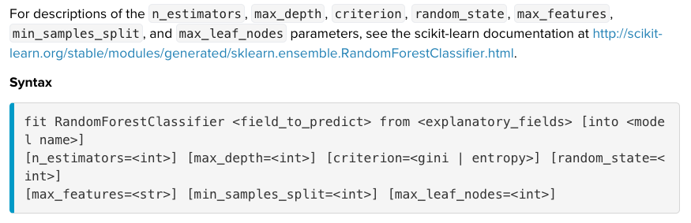
### Example: diabetes data set
	| inputlookup diabetes.csv
	| sample partitions=768 seed=1234
	| search partition_number <= 550
	| fit RandomForestClassifier response from * into RF_diabetes_default n_estimators=100  criterion=gini random_state=1234
	| fit RandomForestClassifier response from * into RF_diabetes n_estimators=150  criterion=entropy random_state=1234

	| inputlookup diabetes.csv
	| sample partitions=768 seed=1234
	| search partition_number > 550
	| apply RF_diabetes_default as RF_res_default
	| apply RF_diabetes as RF_res
	| score accuracy_score response ~ RF_res_default RF_res
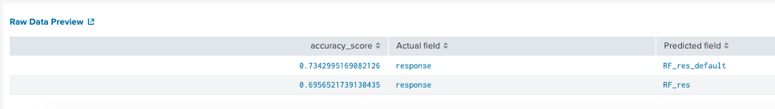

## 8. SGDClassifier: SGD Classifier implements regularised linear models with Stochastic Gradient Descent.

Gradient descent which considers the whole training data. Stochastic gradient descent considers only 1 random point while changing weights.As such stochastic gradient descent is much faster than gradient descent when dealing with large data sets.

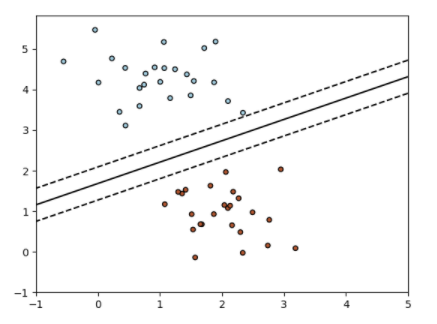
### How do we make SGD Classifier perform as well as Logistic Regression?

By default, the SGD Classifier does not perform as well as the Logistic Regression. It requires some hyper parameter tuning to be done.
Use partfit package on python [reading](https://towardsdatascience.com/how-to-make-sgd-classifier-perform-as-well-as-logistic-regression-using-parfit-cc10bca2d3c4)

### Syntax Splunk

### Example : diabetes data set
	| inputlookup diabetes.csv
	| sample partitions=768 seed=1234
	| search partition_number <= 550
	| fit SGDClassifier response from * into SGD_diabetes_default loss=hinge fit_intercept=true random_state=1234 n_iter=5 l1_ratio=0.15 alpha=0.0001 power_t=0.25 penalty=l2 learning_rate=invscaling
	| fit SGDClassifier response from * into SGD_diabetes_default2

	| inputlookup diabetes.csv
	| sample partitions=768 seed=1234
	| search partition_number > 550
	| apply SGD_diabetes_default as SGD_res_default
	| apply SGD_diabetes_default2 as SGD_res_default2
	| score accuracy_score response ~ SGD_res_default SGD_res_default2

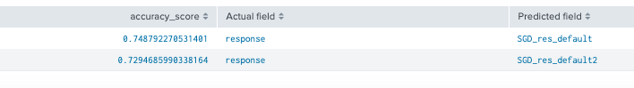

Remember that for this dataset, we got 75% of acc for LR. We obtain the same result with SGDClassifier.

## 9. SVM: Support Vector Machine for Classification

Support Vectors Classifier tries to find the best hyperplane in an N-dimensional space(N = the nb of features) to separate the different classes by maximizing the distance between sample points and the hyperplane.
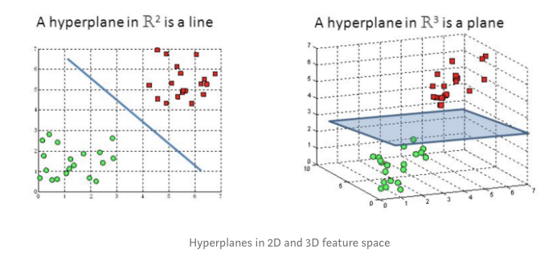
### Syntax Splunk

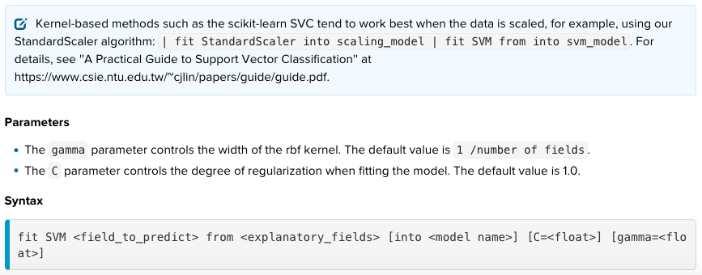

Gamma: gamma is a parameter for non linear hyperplanes. The higher the gamma value it tries to exactly fit the training data set

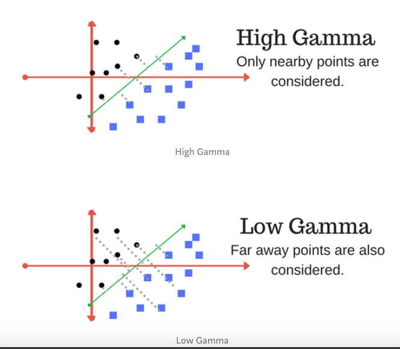

C is the penalty parameter of the error term. It controls the trade off between smooth decision boundary and classifying the training points correctly

### Example : diabetes data set
	| inputlookup diabetes.csv
	| sample partitions=768 seed=1234
	| search partition_number <=550
	| fit SVM response from * into SVM_diabetes_default 
	| fit SVM response from * into SVM_diabetes C=10 gamma=10

	| summary SVM_diabetes_default 

SVM model does not support summary so I could not tell much.

	| inputlookup diabetes.csv
	| sample partitions=768 seed=1234
	| search partition_number >550
	| apply SVM_diabetes_default as SVM_res_default
	| apply SVM_diabetes as SVM_res
	| score accuracy_score response ~ SVM_res_default SVM_res

I can not turning the C and gamma param. tried [10, 100]. So I tried for the first time with experiment features (preprocessing data with standardscaler than use C=10 and gamma=10. However, it improve only 1% of cc
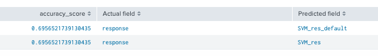
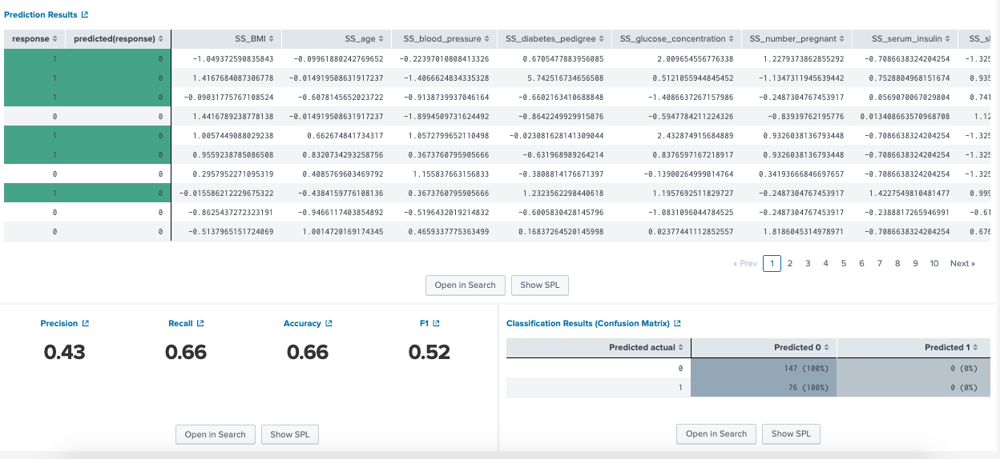

# IV. Evaluate classifier results
Scoring methods name:

	1. Accuracy scoring
	2. Confusion matrix
	3. F1-score
	4. Precision
	5. Precision-Recall-F1-Support
	6. Recall
	7. ROC-AUC-score
	8. ROC-curve
Syntax:| score <scoring-method-name> <actual_field_1> ... <actual_field_n> against <predicted_field_1> ... <predicted_field_n> [options]
Options: averge = choose from table below
	
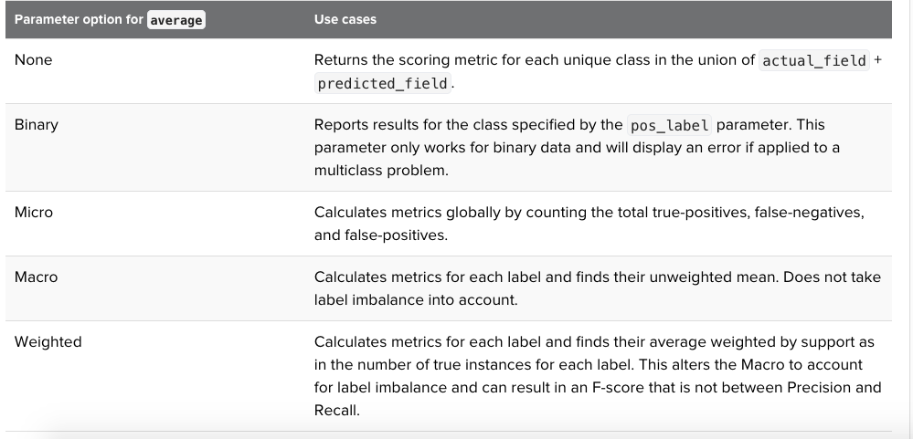

Look at [Scoring your model](https://docs.splunk.com/Documentation/MLApp/4.2.0/User/ScoreCommand)

## 1. Accuracy scoring : get the prediction accuracy between actual-labels and predicted-labels
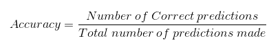

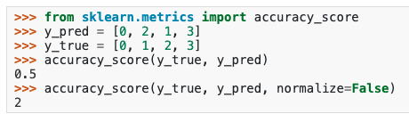

Syntax: ...|score accuracy_score <\actual_field_1> ... <\actual_field_n> against <\predicted_field_1> ... <\predicted_field_n> normalize=<True|False>

...| score accuracy_score species ~ Ber_species DT_species Gau_species GB_species LR_species MLP_species RF_species SGD_species SVM_species
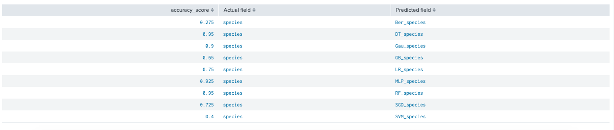

Result: RF and Decision tree has a highest accuracy_score in this experiment.

## 2. Consusion_matric: a matrix as output and describes the complete performance of the model.
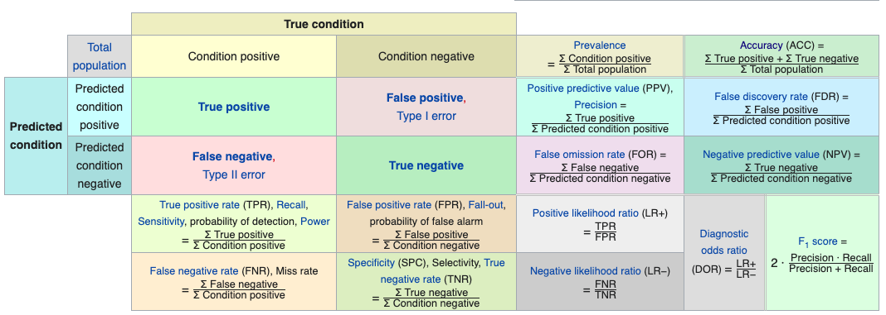
	
	True Positives : The cases in which we predicted YES and the actual output was also YES.
	True Negatives : The cases in which we predicted NO and the actual output was NO.
	False Positives : The cases in which we predicted YES and the actual output was NO.
	False Negatives : The cases in which we predicted NO and the actual output was YES.

Syntax: score confusion_matrix <\actual_field> against <\predicted_field>

...| score confusion_matrix species against DT_species

| n= 40                    | Actual  (Iris Setosa) | Actual (Iris Versicolor) | Actual (Iris Virginica) |    |                                                 |
|--------------------------|-----------------------|--------------------------|-------------------------|----|-------------------------------------------------|
| Predict(Iris Setosa)     | 15 (TP)               | 0                        | 0                       | 15 | Accuracy_score = TP+TN/n = (15+9+14)/40 = 0.95 |
| Predict(Iris Versicolor) | 0                     | 9 (TP)                   | 2(Evir/ver)FN           | 11 |                                                 |
| Predict(Iris Virginica)  | 0                     | 0                        | 14 (TP)                 | 14 |                                                 |
|                          | 15                    | 9                        | 16                      |    |                                                 |
## 3. Precision: the number of correct positive results divided by the number of positive results predicted by the classifier
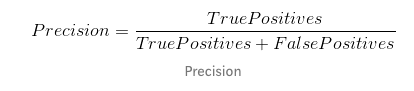

Syntax: |score precision_score <actual_field_1> ... <actual_field_n> against <predicted_field_1> ... <predicted_field_n> average=<binary(default)|micro|macro|weighted> pos_label=<str|int>

...| score precision_score species ~ Ber_species DT_species Gau_species GB_species LR_species MLP_species RF_species SGD_species SVM_species average=micro
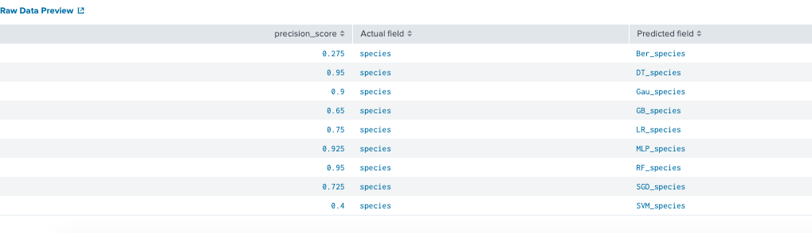

## 4. Recall: the number of correct positive results divided by the number of all relevant samples (all samples that should have been identified as positive).
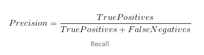

Syntax: |score recall <actual_field_1> ... <actual_field_n> against <predicted_field_1> ... <predicted_field_n> average=<binary(default)|micro|macro|weighted> pos_label=<str|int>

...| score recall species ~ Ber_species DT_species Gau_species GB_species LR_species MLP_species RF_species SGD_species SVM_species average=micro
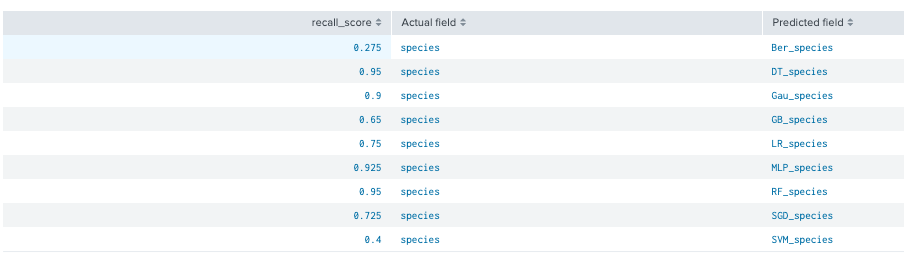

## 5. F1 score: measure a test’s accuracy, the higher the better.
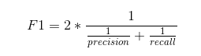

Syntax: |score f1_score <\actual_field_1> ... <\actual_field_n> against <\predicted_field_1> ... <\predicted_field_n> average=<\binary(default) | micro | macro | weighted> pos_label=<\str | int>

...| score f1_score species ~ Ber_species DT_species Gau_species GB_species LR_species MLP_species RF_species SGD_species SVM_species average=micro
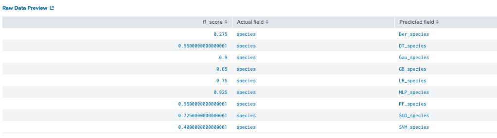
| n= 40                    | Actual  (Iris Setosa)                           | Actual (Iris Versicolor) | Actual (Iris Virginica) |    |                                                                         |
|--------------------------|-------------------------------------------------|--------------------------|-------------------------|----|-------------------------------------------------------------------------|
| Predict(Iris Setosa)     | 15 (TP)                                         | 0                        | 0                       | 15 | Accuracy_score = TP+TN/n = (15+9+14)/40 = 0.95                         |
| Predict(Iris Versicolor) | 0                                               | 9 (TP)                   | 2(Evir/ver)FN           | 11 | Precision= TP/TP+FP = (15+9+14)/(15+9+14)+2 = 0.95                    |
| Predict(Iris Virginica)  | 0                                               | 0                        | 14 (TP)                 | 14 |                                                                         |
|                          | 15                                              | 9                        | 16                      |    |                                                                         |
|                          | Recall= TP/TP+FN = (15+14+9)/(15+14+9)+2 = 0.95 |                          |                         |    | F1= 2*(Precison*Recall)/(Precision+Recall) = 2*(0.95*0.95)/(0.95+0.95) |

## 6.Precision-Recall-F1-Support : Compute precision, recall, F-measure and support for each class

Syntax: score precision_recall_fscore_support <\actual_field_1> ... <\actual_field_n> against <\predicted_field_1> ... <\predicted_field_n> pos_label=<\str> average=<\str> beta=<\float>

...| score precision_recall_fscore_support species ~ Ber_species DT_species Gau_species GB_species LR_species MLP_species RF_species SGD_species SVM_species average=micro

... average=weighted

## 7. ROC-AUC-score: Area Under Curve(AUC) is one of the most widely used metrics for evaluation. It is used for binary classification problem. AUC of a classifier is equal to the probability that the classifier will rank a randomly chosen positive example higher than a randomly chosen negative example. AUC is the area under the curve of plot False Positive Rate(Specificity) vs True Positive Rate(Sensitivity) at different points in [0, 1]. The higher the value, the better

Syntax: score roc_auc_score <\actual_field_1> ... <\actual_field_n> against <\predicted_field_1> ... <\predicted_field_n> pos_label=<\str | int>

	| inputlookup iris.csv
	 
	| sample partitions=100 seed=1234
	| search partition_number <= 70
	| fit LogisticRegression species from * probabilities=True into LR_iris

	| inputlookup iris.csv	 
	| sample partitions=100 seed=1234
	| search partition_number > 70 
	| apply LR_iris probabilities=True 
	| score roc_auc_score species against "probability(species=Iris Virginica)" pos_label="Iris Virginica"

## 8. ROC : shows how the true positive rate (tpr) varies with the false positive rate (fpr), along with the corresponding probability thresholds.
Syntax: score roc_curve <\actual_field_1> ... <\actual_field_n> against <\predicted_field_1> ... <\predicted_field_n> pos_label=<\str | int>

	..| score roc_curve species against "probability(species=Iris Virginica)" pos_label="Iris Virginica"

