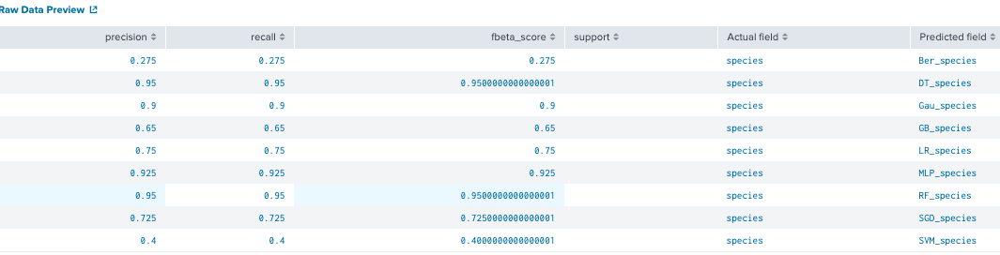

# Command

## FIT example : sample + fit on iris data set with 9 classifications algrs
	| inputlookup iris.csv
	 
	| sample partitions=100 seed=1234
	| search partition_number <= 70

	| fit BernoulliNB species from * into Ber_iris
	| fit DecisionTreeClassifier species from * into DT_iris
	| fit GaussianNB species from * into Gau_iris
	| fit GradientBoostingClassifier species from * into GB_iris
	| fit LogisticRegression species from * into LR_iris
	| fit MLPClassifier species from * into MLP_iris
	| fit RandomForestClassifier species from * into RF_iris
	| fit SGDClassifier species from * into SGD_iris
	| fit SVM species from *  probabilities=True into SVM_iris
## Apply example : sample + apply +score
	| inputlookup iris.csv
	 
	| sample partitions=100 seed=1234
	| search partition_number > 70
	 
	| apply Ber_iris as Ber_species 
	| apply DT_iris as DT_species
	| apply Gau_iris as Gau_species
	| apply GB_iris as GB_species
	| apply LR_iris as LR_species
	| apply MLP_iris as MLP_species
	| apply RF_iris as RF_species
	| apply SGD_iris as SGD_species
	| apply SVM_ris as SVM_species
	| score precision_recall_fscore_support species ~ Ber_species DT_species Gau_species GB_species LR_species MLP_species RF_species SGD_species SVM_species average=weighted

# Evaluate classifier results
Scoring methods name:

	1. Accuracy scoring
	2. Confusion matrix
	3. F1-score
	4. Precision
	5. Precision-Recall-F1-Support
	6. Recall
	7. ROC-AUC-score
	8. ROC-curve

Syntax:| score <scoring-method-name> <actual_field_1> ... <actual_field_n> against <predicted_field_1> ... <predicted_field_n> [options]
Options: averge = choose from table below

Look at [Scoring your model](https://docs.splunk.com/Documentation/MLApp/4.2.0/User/ScoreCommand)

## 1. Accuracy scoring : get the prediction accuracy between actual-labels and predicted-labels

Syntax: ...|score accuracy_score <\actual_field_1> ... <\actual_field_n> against <\predicted_field_1> ... <\predicted_field_n> normalize=<True|False>

...| score accuracy_score species ~ Ber_species DT_species Gau_species GB_species LR_species MLP_species RF_species SGD_species SVM_species

Result: RF and Decision tree has a highest accuracy_score in this experiment.

## 2. Consusion_matric: a matrix as output and describes the complete performance of the model.

	
	True Positives : The cases in which we predicted YES and the actual output was also YES.
	True Negatives : The cases in which we predicted NO and the actual output was NO.
	False Positives : The cases in which we predicted YES and the actual output was NO.
	False Negatives : The cases in which we predicted NO and the actual output was YES.

Syntax: score confusion_matrix <\actual_field> against <\predicted_field>

...| score confusion_matrix species against DT_species

| n= 40                    | Actual  (Iris Setosa) | Actual (Iris Versicolor) | Actual (Iris Virginica) |    |                                                 |
|--------------------------|-----------------------|--------------------------|-------------------------|----|-------------------------------------------------|
| Predict(Iris Setosa)     | 15 (TP)               | 0                        | 0                       | 15 | Accuracy_score = TP+TN/n = (15+9+14)/40 = 0.95 |
| Predict(Iris Versicolor) | 0                     | 9 (TP)                   | 2(Evir/ver)FN           | 11 |                                                 |
| Predict(Iris Virginica)  | 0                     | 0                        | 14 (TP)                 | 14 |                                                 |
|                          | 15                    | 9                        | 16                      |    |                                                 |
## 3. Precision: the number of correct positive results divided by the number of positive results predicted by the classifier

Syntax: |score precision_score <actual_field_1> ... <actual_field_n> against <predicted_field_1> ... <predicted_field_n> average=<binary(default)|micro|macro|weighted> pos_label=<str|int>

...| score precision_score species ~ Ber_species DT_species Gau_species GB_species LR_species MLP_species RF_species SGD_species SVM_species average=micro

## 4. Recall: the number of correct positive results divided by the number of all relevant samples (all samples that should have been identified as positive).

Syntax: |score recall <actual_field_1> ... <actual_field_n> against <predicted_field_1> ... <predicted_field_n> average=<binary(default)|micro|macro|weighted> pos_label=<str|int>

...| score recall species ~ Ber_species DT_species Gau_species GB_species LR_species MLP_species RF_species SGD_species SVM_species average=micro

## 5. F1 score: measure a test’s accuracy, the higher the better.

Syntax: |score f1_score <\actual_field_1> ... <\actual_field_n> against <\predicted_field_1> ... <\predicted_field_n> average=<\binary(default) | micro | macro | weighted> pos_label=<\str | int>

...| score f1_score species ~ Ber_species DT_species Gau_species GB_species LR_species MLP_species RF_species SGD_species SVM_species average=micro

| n= 40                    | Actual  (Iris Setosa)                           | Actual (Iris Versicolor) | Actual (Iris Virginica) |    |                                                                         |
|--------------------------|-------------------------------------------------|--------------------------|-------------------------|----|-------------------------------------------------------------------------|
| Predict(Iris Setosa)     | 15 (TP)                                         | 0                        | 0                       | 15 | Accuracy_score = TP+TN/n = (15+9+14)/40 = 0.95                         |
| Predict(Iris Versicolor) | 0                                               | 9 (TP)                   | 2(Evir/ver)FN           | 11 | Precision= TP/TP+FP = (15+9+14)/(15+9+14)+2 = 0.95                    |
| Predict(Iris Virginica)  | 0                                               | 0                        | 14 (TP)                 | 14 |                                                                         |
|                          | 15                                              | 9                        | 16                      |    |                                                                         |
|                          | Recall= TP/TP+FN = (15+14+9)/(15+14+9)+2 = 0.95 |                          |                         |    | F1= 2*(Precison*Recall)/(Precision+Recall) = 2*(0.95*0.95)/(0.95+0.95) |

## 6.Precision-Recall-F1-Support : Compute precision, recall, F-measure and support for each class

Syntax: score precision_recall_fscore_support <\actual_field_1> ... <\actual_field_n> against <\predicted_field_1> ... <\predicted_field_n> pos_label=<\str> average=<\str> beta=<\float>

...| score precision_recall_fscore_support species ~ Ber_species DT_species Gau_species GB_species LR_species MLP_species RF_species SGD_species SVM_species average=micro

... average=weighted

## 7. ROC-AUC-score: Area Under Curve(AUC) is one of the most widely used metrics for evaluation. It is used for binary classification problem. AUC of a classifier is equal to the probability that the classifier will rank a randomly chosen positive example higher than a randomly chosen negative example. AUC is the area under the curve of plot False Positive Rate(Specificity) vs True Positive Rate(Sensitivity) at different points in [0, 1]. The higher the value, the better

Syntax: score roc_auc_score <\actual_field_1> ... <\actual_field_n> against <\predicted_field_1> ... <\predicted_field_n> pos_label=<\str | int>

	| inputlookup iris.csv
	 
	| sample partitions=100 seed=1234
	| search partition_number <= 70
	| fit LogisticRegression species from * probabilities=True into LR_iris

	| inputlookup iris.csv	 
	| sample partitions=100 seed=1234
	| search partition_number > 70 
	| apply LR_iris probabilities=True 
	| score roc_auc_score species against "probability(species=Iris Virginica)" pos_label="Iris Virginica"

## 8. ROC : shows how the true positive rate (tpr) varies with the false positive rate (fpr), along with the corresponding probability thresholds.
Syntax: score roc_curve <\actual_field_1> ... <\actual_field_n> against <\predicted_field_1> ... <\predicted_field_n> pos_label=<\str | int>

	..| score roc_curve species against "probability(species=Iris Virginica)" pos_label="Iris Virginica"

