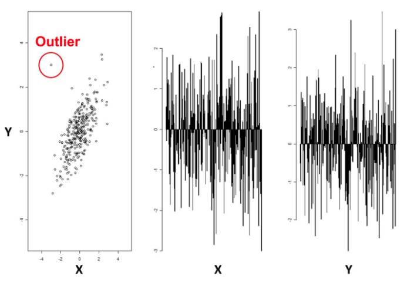

# Define anomaly detection : detect anomalies and outliers in numerical/ categorical fields.
Anomaly detection or outlier detection is the identification of rare items, events or observations which raise suspicions vy differing significantly from the majority of the data.

Example of 2 vars X,Y: unable to detect outlier in their plot in time. Because it is 2 dimensional data, it is easy to visually identify anomalies through data points located outside the typical distributions. We can not do that for 10-100s of vars.

# Identify anomaly detection use cases
Ex: anomaly data can be connected to some problem like actual machine failure or shutdown [condition monitoring](https://en.wikipedia.org/wiki/Condition_monitoring). 

The most common way to perform condition monitoring is to look at each sensor measurement from the machine and to impose a minimum and maximum value limit on it (healthy state). If the current value is within the bounds, then the machine is healthy. If the current value is outside the bounds, then the machine is unhealthy and an alarm is sent.
[.](https://towardsdatascience.com/how-to-use-machine-learning-for-anomaly-detection-and-condition-monitoring-6742f82900d7)

# Describe Splunk anomaly detection solutions: 3 algrs
[Anomaly Detection reading on Splunk](https://docs.splunk.com/Documentation/MLApp/5.1.0/User/Algorithms#Anomaly_Detection)
## 1. DensityFunction:
* DensityFuntion allows for grouping of the data using the by clause, where for each group a separate density function is fitted and stored, then utilise them for anomaly detection.

Supported 3 types of probability density functions:

	Normal
	Exponential 
	Gaussian Kernel Density Estimation (Gaussian KDE)

Read more about [KDE](https://rstudio-pubs-static.s3.amazonaws.com/238698_f5c485e2a4f2441dbc9a52ebda0fe8c0.html).

Watch more about [KDE](https://www.youtube.com/watch?v=x5zLaWT5KPs)

### Splunk syntax

Output: 
1. IsOutlier(boolean: Number 1 represents outliers, and 0 represents inliers, assigned to each data point) though fit commqnd(fit a probability density function over the data). Outliers are detected based on the values set for the threshold parameter. 

2. BoundaryRanges (boundary opening point, boundary closing point, and percentage of boundary region):
		
		1.In cases of a single boundary region, the value for the percentage of boundary region is 
		equal to the threshold parameter value. 
		2.BoundaryRanges is calculated as an approximation and can be empty.
		3.Data points that are exactly at the boundary opening or closing point are assigned as inliers.
		An opening or closing point is determined by the density function in use.
		4.Normal density function has left(closing point) and right(opening point) boundary regions. 
		5.Exponential density function has one boundary region. Data points on the right of the right boundary 
		opening point are assigned as outliers.
		6.Gaussian KDE density function can have one or more boundary regions, depending on the number of 
		peaks and dips within the density function. Data points in these boundary regions are assigned as 
		outliers.

3. Param:

		1. by clause : is 5 at max, in quotation marks,max group 1024
		2. dist = auto(default), norm (normal distribution), expon (exponential distribution),
		and gaussian_kde (Gaussian KDE distribution) 
		3. show_dendity: fault as default. If true, the density of each data point will be provided 
		as output in a new field called ProbabilityDensity.
		4. sample: fault as default. If the sample parameter is set to True:
			Samples are taken from the fitted density function.
			Results output in a new column called SampledValue.
			Sampled values only come from the inlier region of the distribution.
		5. full_sample: fault as default. If the sample parameter is set to True:
			Samples are taken from the fitted density function.
			Results output in a new column called FullSampledValue.
			Sampled values come from the whole distribution (both inlier and outlier regions).
		6. threshold : within the range of 0.00000001 to 1. For example, if threshold=0.01(default),
		then 1% of the fitted density function will be set as the outlier area.
		The threshold, lower_threshold, and upper_threshold parameters can take multiple values.
		7. metric: kolmogorov_smirnov and wasserstein(default)

* If the distribution of the data changes through time, retrain your models frequently

### Example : call_center data set

	| inputlookup call_center.csv
	| eval _time=strptime(_time, "%Y-%m-%dT%H:%M:%S")
	| bin _time span=15m
	| eval HourOfDay=strftime(_time, "%H")
	| eval BucketMinuteOfHour=strftime(_time, "%M")
	| eval DayOfWeek=strftime(_time, "%A")
	| stats max(count) as Actual by HourOfDay,BucketMinuteOfHour,DayOfWeek,source,_time
	| fit DensityFunction Actual by "HourOfDay,BucketMinuteOfHour,DayOfWeek" show_density=true 
	threshold=0.2 random_state=1234 into mymodel

	| inputlookup call_center.csv
	| eval _time=strptime(_time, "%Y-%m-%dT%H:%M:%S")
	| bin _time span=15m
	| eval HourOfDay=strftime(_time, "%H")
	| eval BucketMinuteOfHour=strftime(_time, "%M")
	| eval DayOfWeek=strftime(_time, "%A")
	| stats max(count) as Actual by HourOfDay,BucketMinuteOfHour,DayOfWeek,source,_time
	| apply mymodel show_density=True sample=True

	
In this example the threshold is set to 20% (0.2). 

A left boundary range(1st row) which starts at 823.4721 and goes up to the number 1197.3685. The area of the left boundary range is 11.5% of the total area under the density function.

A right boundary range(2nd) which starts at a number 1253.8684 and goes up to Infinity. Again, the area of the right boundary range is the same as the left boundary range with 8.5% of the total area under the density function. 

The areas of right and left boundary ranges add up to the threshold value of 20%. 

	|summary mymodel

* What is cardinality? It is the original number of unique values in your data column. High cardinality = a lot of unique values

## 2. LocalOutlierFactor
[LOF sklearn](https://scikit-learn.org/stable/modules/generated/sklearn.neighbors.LocalOutlierFactor.html)
[LOF on Splunk](http://docs.splunk.com/Documentation/MLApp/5.1.0/User/Algorithms#DensityFunction#LocalOutlierFactor).
* The anomaly score of each sample is called Local Outlier Factor. It measures the local deviation of density of a given sample with respect to its neighbors. It is local in that the anomaly score depends on how isolated the object is with respect to the surrounding neighborhood. More precisely, locality is given by k-nearest neighbors, whose distance is used to estimate the local density. By comparing the local density of a sample to the local densities of its neighbors, one can identify samples that have a substantially lower density than their neighbors. These are considered outliers.

		LOF~1 => Not oulier
		LOF>1 => outlier

[Read more about distance](https://medium.com/@bhavnagupta0103/different-types-of-distances-used-in-machine-learning-83c4deae046)
### Splunk syntax
Output: Is_outlier(boolean: Number 1 represents outliers, and -1 for inliers

### Example : call_center data set

	| inputlookup call_center.csv
	| eval _time=strptime(_time, "%Y-%m-%dT%H:%M:%S")
	| bin _time span=15m
	| eval HourOfDay=strftime(_time, "%H")
	| eval BucketMinuteOfHour=strftime(_time, "%M")
	| eval DayOfWeek=strftime(_time, "%A")
	| stats max(count) as Actual by HourOfDay,BucketMinuteOfHour,DayOfWeek,source,_time
	| fit LocalOutlierFactor Actual n_neighbors=20 leaf_size=30 p=1 contamination=0.1 
	metric=minkowski anomaly_score=true 

## 3. OneClassSVM
[OneClassSVM sklearn](https://scikit-learn.org/stable/modules/generated/sklearn.svm.OneClassSVM.html)

[OneClassSVM on Splunk](https://docs.splunk.com/Documentation/MLApp/5.1.0/User/Algorithms#OneClassSVM)

* A One-Class Support Vector Machine is an unsupervised learning algorithm that is trained only on the ‘normal’ data. It learns the boundaries of these points and is therefore able to classify any points that lie outside the boundary as, you guessed it, outliers.
* The nu parameter should be the proportion of outliers you expect to observe (in our case around 2%)
* The gamma parameter determines the smoothing of the contour lines.
* Application: Remove outlier before going further into model.

[Read more OneClassSVM](https://towardsdatascience.com/outlier-detection-with-one-class-svms-5403a1a1878c)

### Splunk syntax
Output: isNormal=1 means normal and isNormal=-1 means anomalous

### Example : call_center data set

	| inputlookup call_center.csv
	| eval _time=strptime(_time, "%Y-%m-%dT%H:%M:%S")
	| bin _time span=15m
	| eval HourOfDay=strftime(_time, "%H")
	| eval BucketMinuteOfHour=strftime(_time, "%M")
	| eval DayOfWeek=strftime(_time, "%A")
	| stats max(count) as Actual by HourOfDay,BucketMinuteOfHour,DayOfWeek,source,_time
	| fit OneClassSVM Actual kernel=rbf nu=0.05 coef0=0.0 into myOneClassSVM

