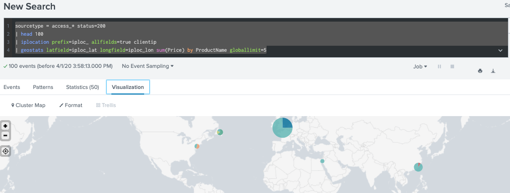

# Trendline command : returns compute a period( as you defined) of moving average
* Syntax: trendline ( trendtype period("field") [AS newfield] )

| Trendtype  | Meanings                  |  Notes                                                   |
| ----       | -----                     | ----                                                     |
| sma        | simple moving average     | compute a sum over the period of most recent values      |
| sma        | exponential moving average| compute a sum over the period of most recent values      |
| sma        | weight moving average     | puts more weight on recent values rather than past values|

[trendline document](https://docs.splunk.com/Documentation/SplunkCloud/latest/SearchReference/Trendline)

Example: index="coronavirus" sourcetype= ww-covid19
|stats max(TotalHospitalizedPatients) as italy_hospital_per_day by date
|trendline ema3(italy_hospital_per_day) as "exponential moving avg"

# Map command
# Iplocation command: returns information of ip address as city/country/lat/lon/region/metrocode/timezone
* Syntax : iplocation [prefix=string] [allfields=bool] [lang=string] ip-address-fieldname

Example : sourcetype = access_* | iplocation prefix=iploc_ allfields=true clientip | fields iploc_*

* Note: 
1. use iplocation to look up and add location info to an event

2. not all info is available for all ip address ranges

3. automatically defines the default lat+lon fields required by geostats

[ipocation document](https://docs.splunk.com/Documentation/Splunk/8.0.2/SearchReference/Iplocation)

# geostats command : returns statistical functions+ render a cluster map
* Syntax: geostats
[ translatetoxy=bool ]
[ latfield=string ]
[ longfield=string ]
[ globallimit=int ]
[ locallimit=int ]
[ outputlatfield=string ]
[ outputlongfield=string ]
[ binspanlat=float binspanlong=float ]
[ maxzoomlevel=int ]
stats-agg-term
[ by-clause]

Example: sourcetype = access_* status=200
| head 100
| iplocation prefix=iploc_ allfields=true clientip 
| geostats latfield=iploc_lat longfield=iploc_lon sum(Price) by ProductName globallimit=5

[geostats document](https://docs.splunk.com/Documentation/Splunk/8.0.2/SearchReference/Geostats)
  
# choropleth map command: use shading on geographic regions
* Syntax: geom [featureCollection] [allFeatures=boolean] [featureIdField=string] [gen=double] [min_x=double] [min_y=double] [max_x=double] [max_y=double]

* Note: 

1. required look up file: geo_us_states /geo_countries. 
2. you can defind your own (test by command |inputlookup filename)

Example1: sourcetype = access_* | stats count | eval featureId="California" | eval count=10000 | geom geo_us_states allFeatures=true

Example2: sourcetype = access_* 
| iplocation prefix=iploc_ allfields=true clientip 
| stats sum(Price) as sales by iploc_Country
| geom geo_countries featureIdField=iploc_Country

# Single value : returns a single value statistic. Viz by gauge/single value/ marker gauge

* Note: Use transforming command like timechart to generate a single value chart with spark line

* Add total: 2 options = via format options  OR  use addtotals command

1. Via format options: return a ROW as total at last

* Vizualization > Format > Summary > Total or Percentage chose YES

Example: index="coronavirus" sourcetype="auto_test" 
| where in  (maille_code,"DEP-75","DEP-77","DEP-78","DEP-91","DEP-92","DEP-93","DEP-94","DEP-95")
|sort 8 -date -hospitalises
|table date,maille_nom,"cas_confirmes",hospitalises,reanimation,deces,gueris,source_nom

2. Via command line: Addtotals returns a column/row as total at last

* Syntax: addtotals [row=bool] [col=bool] [labelfield=field] [label=string] [fieldname=field] [field-list]

Example1: row (row=true as default + fieldname= string)

index="coronavirus" sourcetype="auto_test" 
| where in  (maille_code,"DEP-75","DEP-77","DEP-78","DEP-91","DEP-92","DEP-93","DEP-94","DEP-95")
|sort 8 -date
|table date,maille_nom,"cas_confirmes",hospitalises,reanimation,deces,gueris,source_nom
|addtotals row=true fieldname=TotalSum

Eample2: col (col= true + labelfield= string)

index="coronavirus" sourcetype="auto_test" 
| where in  (maille_code,"DEP-75","DEP-77","DEP-78","DEP-91","DEP-92","DEP-93","DEP-94","DEP-95")
|sort 8 -date
|table date,maille_nom,"cas_confirmes",hospitalises,reanimation,deces,gueris,source_nom
|addtotals col=true labelfield=date label=TotalSum

[addtotals document ](https://docs.splunk.com/Documentation/Splunk/latest/SearchReference/Addtotals)

* Other:

[single value document](https://docs.splunk.com/Documentation/Splunk/8.0.2/Viz/SingleValueGenerate)

[custom single value document ](https://docs.splunk.com/Documentation/Splunk/8.0.2/Viz/SingleValueFormatting)

