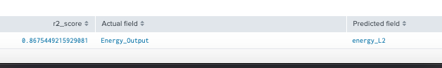
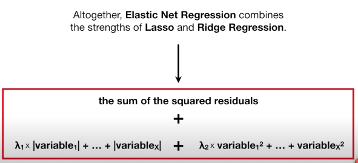

# Predictive model and Regressors:
* Predictive modeling is the problem of developing a model using historical data to make a prediction on new data where we do not have the answer.
* Predictive modeling can be described as the mathematical problem of approximating a mapping function (f) from input variables (X) to output variables (y). This is called the problem of function approximation.
* The job of the modeling algorithm is to find the best mapping function we can given the time and resources available.

		Classification is the task of predicting a discrete class label.
		Regression is the task of predicting a continuous quantity.

* Fundamentally, classification is about predicting a label and regression is about predicting a quantity.

[Read more about this ](https://machinelearningmastery.com/classification-versus-regression-in-machine-learning/)

* 10 regressors we will discuss in this topic:

		1.DecisionTreeRegressor
		2.ElasticNet
		3.GradientBoostingRegressor
		4.KernelRidge
		5.Lasso
		6.LinearRegression
		7.RandomForestRegressor
		8.Ridge
		9.SGDRegressor
		10.System Identification
# Scoring : Loss functions use in regressing
* Input: arrays of data specified by an ordered sequence of fields(the acutal and predicted fields)
* Output: raw_values: regressions scores or errors between each field in fields_a and field_b
		
	1. Explained variance score (EVS) when mean residual = 0 it is R2
	2. Mean absolute error score (MAE)
	3. Mean squared error (MSE)
	4. R2 score (R2)
## 1. Explained variance score:Best possible score is 1.0, lower values are worse. It explains how far observed values differ from the average of predicted values
* Explaned variance score in python: L(y_true,y_pred)= EVS = 1-np.cov(np.array(y_true)-np.array(y_pred))/np.cov(y_true)
* When the mean residual = 0. Explained variance score is equal with R2

Example on sklearn:

	Residual = Observed value – predicted value
	e = y – ŷ
	
	Mean residual= (11.5-12.5)/4 =-0.25 when y_pred = [2.5, 0.0, 2, 8] 
	Mean residual= 0 when y_pred=[2.5, 0.0, 2, 7]
	
[Read it on Splunk MLTK](https://docs.splunk.com/Documentation/MLApp/5.1.0/User/ScoreCommand#Regression_scoring)

[Read it on sklearn](https://scikit-learn.org/stable/modules/generated/sklearn.metrics.explained_variance_score.html#sklearn.metrics.explained_variance_score)
### Syntax on Splunk:

Param:
* multioutput: str in [‘raw_values’, ‘uniform_average’, ‘variance_weighted’]. Defines weights used to average scores.

	1. ‘raw_values’ : Returns a full set of scores in case of multioutput input.
	2. ‘uniform_average’ : Scores of all outputs are averaged with uniform weight.
	3. ‘variance_weighted’ : Scores of all outputs are averaged, weighted by the variances 
	of each individual output.

### Example on power_plant dataset with RFR algr
	| inputlookup power_plant.csv
	| sample partitions=9569 seed=1234
	| search partition_number <= 8000
	| fit DecisionTreeRegressor Energy_Output max_features=auto min_samples_split=2 
	random_state=1234 splitter=best from * into my_DTR as energy_DTR_default
	| fit DecisionTreeRegressor Energy_Output max_features=2 min_samples_split=2 
	random_state=1234 splitter=best from * into my_DTR_2 as energy_DTR_2
	| score explained_variance_score Energy_Output against energy_DTR_default energy_DTR_2 
	multioutput=raw_values

	| inputlookup power_plant.csv
	| sample partitions=9569 seed=1234
	| search partition_number <= 8000
	| apply my_DTR as pred_energy_default
	| apply my_DTR_2 as pred_energy
	| score explained_variance_score Energy_Output, Energy_Output against 
	pred_energy_default,pred_energy

## 2. Mean absolute error score - MAE :

Mean Absolute Error (MAE): MAE measures the average magnitude of the errors in a set of predictions, without considering their direction.

MAE is not sensitive towards outliers and given several examples with the same input feature values, the optimal prediction will be their median target value. This should be compared with Mean squared error (MSE), where the optimal prediction is the mean.

Use MAE when you are doing regression and don’t want outliers to play a big role. It can also be useful if you know that your distribution is multimodal, and it’s desirable to have predictions at one of the modes, rather than at the mean of them.

[Read it on Splunk MLTK](https://docs.splunk.com/Documentation/MLApp/5.1.0/User/ScoreCommand#Mean_absolute_error_score)

[Read it on sklearn](https://scikit-learn.org/stable/modules/generated/sklearn.metrics.mean_absolute_error.html#sklearn.metrics.mean_absolute_error)
### Syntax on Splunk:

Param:
* multioutput: str in [‘raw_values’, ‘uniform_average’]. Defines aggregating of multiple output values

		1.‘raw_values’ : Returns a full set of scores in case of multioutput input.
		2.‘uniform_average’ : Scores of all outputs are averaged with uniform weight.

### Example on power_plant dataset with RFR algr
	| inputlookup power_plant.csv
	| sample partitions=9569 seed=1234
	| search partition_number <= 8000
	| fit DecisionTreeRegressor Energy_Output max_features=auto min_samples_split=2 
	random_state=1234 splitter=best from * into my_DTR as energy_DTR_default
	| fit DecisionTreeRegressor Energy_Output max_features=2 min_samples_split=2 
	random_state=1234 splitter=best from * into my_DTR_2 as energy_DTR_2
	| score mean_absolute_error Energy_Output against energy_DTR_default energy_DTR_2 multioutput=uniform_average

## 3. Mean absolute error score - MAE :

Mean squared error (MSE): Like MAE, treats deviations in either direction the same way. MSE diff to MAE is that MSE will tend to punish large errors more because it squares all the errors.

Minimizing MSE is equivalent of maximizing the likelihood of the data under the assumption that the target comes from a normal distribution, conditioned on the input.

MSE is sensitive towards outliers and given several examples with the same input feature values, the optimal prediction is the median. Thus, MSE is good to use if you believe that your target data, conditioned on the input, is normally distributed around a mean value, and when it's important to penalize outlier extra much. 

Use MSE when doing regression, believing that your target, conditioned on the input, is normally distributed, and want large errors to be significantly more penalized than small ones.

[Read it on Splunk MLTK](https://docs.splunk.com/Documentation/MLApp/5.1.0/User/ScoreCommand#Mean_squared_error)

[Read it on sklearn](https://scikit-learn.org/stable/modules/generated/sklearn.metrics.mean_squared_error.html#sklearn.metrics.mean_squared_error)
### Syntax on Splunk:

Param:
* multioutput: str in [‘raw_values’, ‘uniform_average’]. Defines aggregating of multiple output values

		1.‘raw_values’ : Returns a full set of scores in case of multioutput input.
		2.‘uniform_average’ : Scores of all outputs are averaged with uniform weight.

### Example on power_plant dataset with RFR algr
	| inputlookup power_plant.csv
	| sample partitions=9569 seed=1234
	| search partition_number <= 8000
	| fit DecisionTreeRegressor Energy_Output max_features=auto min_samples_split=2 
	random_state=1234 splitter=best from * into my_DTR as energy_DTR_default
	| fit DecisionTreeRegressor Energy_Output max_features=2 min_samples_split=2 
	random_state=1234 splitter=best from * into my_DTR_2 as energy_DTR_2
	| score mean_squared_error Energy_Output against energy_DTR_default energy_DTR_2 multioutput=uniform_average

## 4. R2 score (R2): varies between 0 and 100%

wiki:  ” … is the proportion of the variance in the dependent variable that is predictable from the independent variable(s).”

Other def, total variance explained by model / total variance.

If it is 100%: the two variables are perfectly correlated, with no variance at all.

A low value would show a low level of correlation, meaning a regression model that is not valid.

[Read it on Splunk MLTK](https://docs.splunk.com/Documentation/MLApp/5.1.0/User/ScoreCommand#R2_score)

[Read it on sklearn](https://scikit-learn.org/stable/modules/generated/sklearn.metrics.r2_score.html#sklearn.metrics.r2_score)
### Syntax on Splunk:

Param:
* multioutput: str in [‘raw_values’, ‘uniform_average’ 'variance_weighted']. Defines aggregating of multiple output values

		‘raw_values’ : Returns a full set of scores in case of multioutput input.
		‘uniform_average’ : Scores of all outputs are averaged with uniform weight.
		'variance_weighted':scores of all outputs, averaged with weights of each individual output's variance.

### Example on power_plant dataset with RFR algr
	| inputlookup power_plant.csv
	| sample partitions=9569 seed=1234
	| search partition_number <= 8000
	| fit DecisionTreeRegressor Energy_Output max_features=auto min_samples_split=2 
	random_state=1234 splitter=best from * into my_DTR as energy_DTR_default
	| fit DecisionTreeRegressor Energy_Output max_features=2 min_samples_split=2 
	random_state=1234 splitter=best from * into my_DTR_2 as energy_DTR_2
	| score r2_score Energy_Output against energy_DTR_default energy_DTR_2 multioutput=uniform_average

# 1.DecisionTreeRegressor
[Read it on Splunk MLTK](https://docs.splunk.com/Documentation/MLApp/5.1.0/User/Algorithms#DecisionTreeRegressor)

[Read it on sklearn](https://scikit-learn.org/stable/modules/generated/sklearn.tree.DecisionTreeRegressor.html)

Input: historical data. Output: function

## Syntax on Splunk

## Example: power_plant dataset with explained_variance_score method
	| inputlookup power_plant.csv
	| sample partitions=9569 seed=1234
	| search partition_number <= 8000
	| fit DecisionTreeRegressor Energy_Output max_features=auto min_samples_split=2 
	random_state=1234 splitter=best from * into my_DTR as energy_DTR_default
	| fit DecisionTreeRegressor Energy_Output max_features=2 min_samples_split=2 
	random_state=1234 splitter=best from * into my_DTR_2 as energy_DTR_2
	| score explained_variance_score Energy_Output against energy_DTR_default energy_DTR_2 
	multioutput=raw_values

	| inputlookup power_plant.csv
	| sample partitions=9569 seed=1234
	| search partition_number <= 8000
	| apply my_DTR as pred_energy_default
	| apply my_DTR_2 as pred_energy
	| score explained_variance_score Energy_Output, Energy_Output against 
	pred_energy_default,pred_energy

	|summary my_DTR
# 2. Linear Regression:
Ordinary least squares OLS attempts to minimize the sum of error squared. The equation for this model is referred to as the cost function and is a way to find the optimal error (the dif between the actual data point and its predicted value) by minimizing and measuring it.

[Read it on Splunk MLTK](https://docs.splunk.com/Documentation/MLApp/5.1.0/User/Algorithms#LinearRegression)
## Syntax on Splunk

## Example: power_plant dataset 
	| inputlookup power_plant.csv
	| sample partitions=9569 seed=1234
	| search partition_number <= 8000
	| fit LinearRegression Energy_Output from * into my_LR as energy_LR fit_intercept=True normalize=True
	| score r2_score Energy_Output against energy_LR multioutput=raw_values

	| inputlookup power_plant.csv
	| sample partitions=9569 seed=1234
	| search partition_number <= 8000
	| apply my_LR as pred_energy_LR
	| score r2_score Energy_Output against pred_energy_LR multioutput=raw_values

# 3.Ridge regression(L2): OLS + lamda * the slope^2 
One situation is the data showing multi-collinearity, this is when predictor variables are correlated to each other and to the response variable. 

To produce a more accurate model of complex data we can add a penalty term to the OLS equation. A penalty adds a bias towards certain values. These are known as L1 regularization(Lasso regression) and L2 regularization(ridge regression).

Ridge regression has more bias than OLS. Thanks to a small bias, it had a significant drop in variance

* Ridge regression can only shrink the slop asymptotically close to 0. Ridge regression do litter better than Lasso regression in models that most variable are usefull.

[Read it on Splunk MLTK](https://docs.splunk.com/Documentation/MLApp/5.1.0/User/Algorithms#Ridge)
## Syntax on Splunk

## Example: power_plant dataset with explained_variance_score method
	| inputlookup power_plant.csv
	| sample partitions=9569 seed=1234
	| search partition_number <= 8000
	| fit Ridge Energy_Output from * into my_L2 as energy_L2 fit_intercept=True normalize=True alpha=0.5
	| score r2_score Energy_Output against energy_L1 multioutput=raw_values

	| inputlookup power_plant.csv
	| sample partitions=9569 seed=1234
	| search partition_number <= 8000
	| apply my_L2 as pred_energy_L2
	| score r2_score Energy_Output against pred_energy_L2 multioutput=raw_values

# 4.Lasso regression(L1): OLS +lamda x |the slope| 

* Lasso regression can shrink the slope all the way to 0. when it is 0, Lasso regression is OLS. Thus, it can excule useless variables from the equations, it is a litte better than Ridge regression at reducing the Variance in models that contain a lot of useless variables.

[Read it on Splunk MLTK](https://docs.splunk.com/Documentation/MLApp/5.1.0/User/Algorithms#Lasso)
## Syntax on Splunk

## Example: power_plant dataset
	| inputlookup power_plant.csv
	| sample partitions=9569 seed=1234
	| search partition_number <= 8000
	| fit Lasso Energy_Output from * into my_L1 as energy_L1 fit_intercept=True normalize=True alpha=0
	| score r2_score Energy_Output against energy_L1 multioutput=raw_values

	| inputlookup power_plant.csv
	| sample partitions=9569 seed=1234
	| search partition_number <= 8000
	| apply my_L1 as pred_energy_L1
	| score r2_score Energy_Output against pred_energy_L1 multioutput=raw_values

# 5.ElasticNet
[Read it on Splunk MLTK](https://docs.splunk.com/Documentation/MLApp/5.1.0/User/Algorithms#ElasticNet)

[Read it on sklearn](https://scikit-learn.org/stable/modules/generated/sklearn.linear_model.ElasticNet.html)

Lasso regression works best in model that has a lot of useless varbles. Ridge regression works beat in model that has all usefull variables. When we know all our variables, we can decieded Lasso or Ridge. How about too many variables to know everything about? You use ElasticNet

		EN equation = lamda1 and lamda2 are greater than 0. 
		Lamda1 =Lamda2 =0 : it is OLS
		Lamda1>0; Lamda2 =0 : It is Lasso and vice-versa
## Syntax on Splunk

## Example: power_plant dataset 
	| inputlookup power_plant.csv
	| sample partitions=9569 seed=1234
	| search partition_number <= 8000
	| fit ElasticNet Energy_Output from * into my_EN as energy_EN fit_intercept=True normalize=True alpha=1.0 l1_ratio=0.5
	| score r2_score Energy_Output against energy_EN multioutput=raw_values

	| inputlookup power_plant.csv
	| sample partitions=9569 seed=1234
	| search partition_number <= 8000
	| apply my_EN as pred_energy_EN
	| score r2_score Energy_Output against pred_energy_EN multioutput=raw_values
