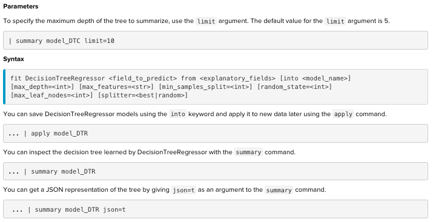

# Predictive model and Regressors:
* Predictive modeling is the problem of developing a model using historical data to make a prediction on new data where we do not have the answer.
* Predictive modeling can be described as the mathematical problem of approximating a mapping function (f) from input variables (X) to output variables (y). This is called the problem of function approximation.
* The job of the modeling algorithm is to find the best mapping function we can given the time and resources available.

		Classification is the task of predicting a discrete class label.
		Regression is the task of predicting a continuous quantity.

* Fundamentally, classification is about predicting a label and regression is about predicting a quantity.

[Read more about this ](https://machinelearningmastery.com/classification-versus-regression-in-machine-learning/)

* 10 regressors we will discuss in this topic:

		1.DecisionTreeRegressor
		2.ElasticNet
		3.GradientBoostingRegressor
		4.KernelRidge
		5.Lasso
		6.LinearRegression
		7.RandomForestRegressor
		8.Ridge
		9.SGDRegressor
		10.System Identification
# Scoring : Loss functions use in regressing
* Input: arrays of data specified by an ordered sequence of fields(the acutal and predicted fields)
* Output: raw_values: regressions scores or errors between each field in fields_a and field_b
		
		1. Explained variance score
		2. Mean absolute error score
		3. Mean squared error
		4. R2 score
## 1. Explained variance score:Best possible score is 1.0, lower values are worse.
* Explaned variance score in python: L(y_true,y_pred)= EVS = 1-np.cov(np.array(y_true)-np.array(y_pred))/np.cov(y_true)
* When the mean residual = 0. Explained variance score is equal with R2

Example on sklearn:

	Residual = Observed value – predicted value
	e = y – ŷ
	
	Mean residual= (11.5-12.5)/4 =-0.25 when y_pred = [2.5, 0.0, 2, 8] 
	Mean residual= 0 when y_pred=[2.5, 0.0, 2, 7]
	
[Read it on Splunk MLTK](https://docs.splunk.com/Documentation/MLApp/5.1.0/User/ScoreCommand#Regression_scoring)

[Read it on sklearn](https://scikit-learn.org/stable/modules/generated/sklearn.metrics.explained_variance_score.html#sklearn.metrics.explained_variance_score)
### Syntax on Splunk:

Param:
* multioutput: str in [‘raw_values’, ‘uniform_average’, ‘variance_weighted’]. Defines weights used to average scores.

	‘raw_values’ : Returns a full set of scores in case of multioutput input.
	‘uniform_average’ : Scores of all outputs are averaged with uniform weight.
	‘variance_weighted’ : Scores of all outputs are averaged, weighted by the variances 
	of each individual output.

### Example on power_plant dataset with RFR algr
	| inputlookup power_plant.csv
	| sample partitions=9569 seed=1234
	| search partition_number <= 8000
	| fit DecisionTreeRegressor Energy_Output max_features=auto min_samples_split=2 
	random_state=1234 splitter=best from * into my_DTR as energy_DTR_default
	| fit DecisionTreeRegressor Energy_Output max_features=2 min_samples_split=2 
	random_state=1234 splitter=best from * into my_DTR_2 as energy_DTR_2
	| score explained_variance_score Energy_Output against energy_DTR_default energy_DTR_2 
	multioutput=raw_values

	| inputlookup power_plant.csv
	| sample partitions=9569 seed=1234
	| search partition_number <= 8000
	| apply my_DTR as pred_energy_default
	| apply my_DTR_2 as pred_energy
	| score explained_variance_score Energy_Output, Energy_Output against 
	pred_energy_default,pred_energy

### Quick notice: my_DTR_2 have a higher explained variance score on training dataset than my_DTR. But my_DTR returns a better prediction on the test set. Could be overfitting on my_DTR_2.

# 1.DecisionTreeRegressor
[Read it on Splunk MLTK](https://docs.splunk.com/Documentation/MLApp/5.1.0/User/Algorithms#DecisionTreeRegressor)

[Read it on sklearn](https://scikit-learn.org/stable/modules/generated/sklearn.tree.DecisionTreeRegressor.html)

Input: historical data. Output: function

## Syntax on Splunk

## Example: power_plant dataset with explained_variance_score method
	| inputlookup power_plant.csv
	| sample partitions=9569 seed=1234
	| search partition_number <= 8000
	| fit DecisionTreeRegressor Energy_Output max_features=auto min_samples_split=2 
	random_state=1234 splitter=best from * into my_DTR as energy_DTR_default
	| fit DecisionTreeRegressor Energy_Output max_features=2 min_samples_split=2 
	random_state=1234 splitter=best from * into my_DTR_2 as energy_DTR_2
	| score explained_variance_score Energy_Output against energy_DTR_default energy_DTR_2 
	multioutput=raw_values

	| inputlookup power_plant.csv
	| sample partitions=9569 seed=1234
	| search partition_number <= 8000
	| apply my_DTR as pred_energy_default
	| apply my_DTR_2 as pred_energy
	| score explained_variance_score Energy_Output, Energy_Output against 
	pred_energy_default,pred_energy

	|summary my_DTR
