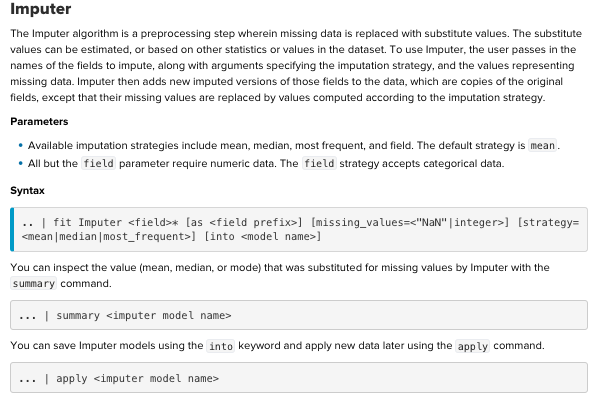
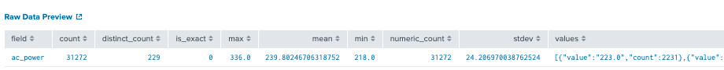
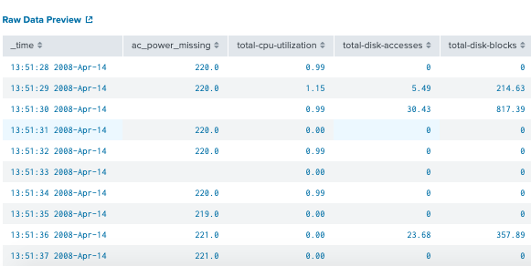
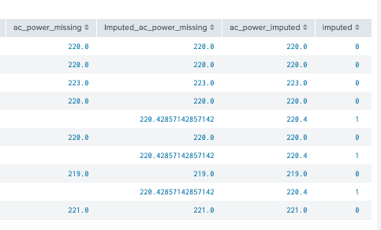
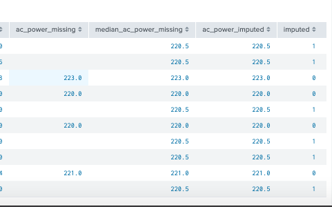
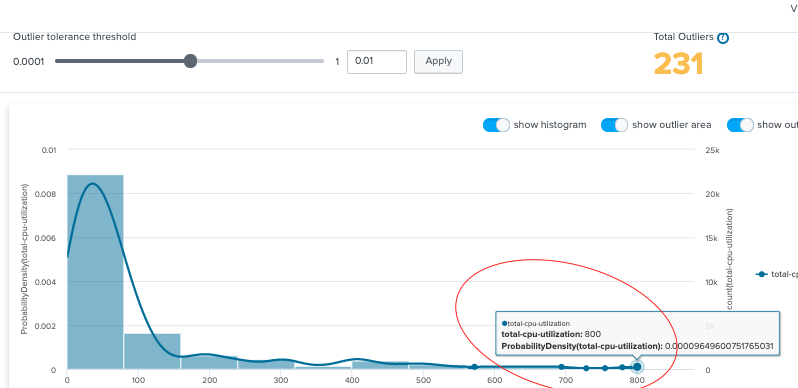
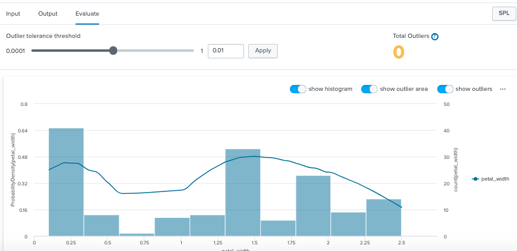

# Imputer : data cleaning 
Missing data is a normal problem to DS. How to deal with it? We have to drop it or we have to work our best to replace missing data with appropriate values. If that is the case, how can we do it?

* Wanna discover: Splunk imputation apply during traing phase or during prediction phase. May be it works for both???

READING:

1.[Imputer on Splunk doc](https://docs.splunk.com/Documentation/MLApp/5.1.0/User/Algorithms#Imputer)

2.Not clear enough. Read about [imputation during prediction phase ](http://jmlr.csail.mit.edu/papers/volume8/saar-tsechansky07a/saar-tsechansky07a.pdf)

3.[Another good reading](https://towardsdatascience.com/6-different-ways-to-compensate-for-missing-values-data-imputation-with-examples-6022d9ca0779)
##  What is imputation?
Imputation is the process of replacing missing data with substituted values. 

## When to drop or replace missing data?
My understanding:
* One variable in your data set have 95% of missing data. My suggestion is review the title of the col and make decision to drop it or not. 
* 1. If it is un nessesary data, dont waste time to replace missing data for it. Missing data as blanks, nans,etc. are incompatible to your estimators in ML algrs. 
* 2.If it is importance, you need to find a way to collect more data for it, because you re missing 95% of that potential variable. 

## Splunk syntax

## Example : Dataset server_power
	| inputlookup server_power.csv
	| fieldsummary ac_powder

Use fieldsummary to have a statistic about variable ac_power. Since it is a well prepared dataset with no missing data. We need to change it a bit so we can play with imputation syntax. 

Next move, create a missing data by random() devided by 3 without remainder, it will be recored as null, others, it will be as its original data (ac_power)

	| inputlookup server_power.csv
	| eval ac_power_missing=if(random() % 3 = 0, null, ac_power)
	| fields - ac_power

Next move, create "imputed" with boolean values to keep track. Write all results of Imputer into new var "ac_power_imputed". Method used is default "mean"

	| inputlookup server_power.csv
	| eval ac_power_missing=if(random() % 3 = 0, null, ac_power)
	| fields - ac_power
	| fit Imputer ac_power_missing
	| eval imputed=if(isnull(ac_power_missing), 1, 0)
	| eval ac_power_imputed=round(Imputed_ac_power_missing, 1)

	

Another example with named prefix + strategy=median

	| inputlookup server_power.csv
	|head 10
	| eval ac_power_missing=if(random() % 3 = 0, null, ac_power)
	| fields - ac_power
	| fit Imputer ac_power_missing  as "median" strategy=median
	| eval imputed=if(isnull(ac_power_missing), 1, 0)
	| eval ac_power_imputed=round(median_ac_power_missing, 1)

	
## When to use mean, median and most frequent?
### 1. One missing value at a time of point
		t1 = 10
		t2= Nan
		t3= 14
	t2=(t1+t3)/2

### 2. A great outliers found (skewness). Should use median
	 a. detech outlier (image total_cpu_utilization)
	 b. found a geart outlier, think of using median 
	

### 3. generally normal distributed. Should use mean
	 a. detech outlier (image petal_width)
	 b. normal distributed, think of using mean
	

### 4. categric variables. Should use most_frequent

### Aplly both mean and median to ac_power and evaluate. As results, mean strategy is slightly better than median on ac_power
	| inputlookup server_power.csv
	| eval ac_power_missing=if(random() % 3 = 0, null, ac_power)
	| fit Imputer ac_power_missing  as "median" strategy=median
	| fit Imputer ac_power_missing  as "mean" strategy=mean
	| eval imputed=if(isnull(ac_power_missing), 1, 0)
	| eval ac_power_imputed_median=round(median_ac_power_missing, 1)
	| eval ac_power_imputed_mean=round(mean_ac_power_missing, 1)
	|fieldsummary ac_power, median_ac_power_missing,mean_ac_power_missing

