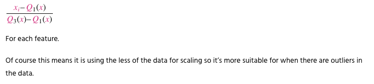
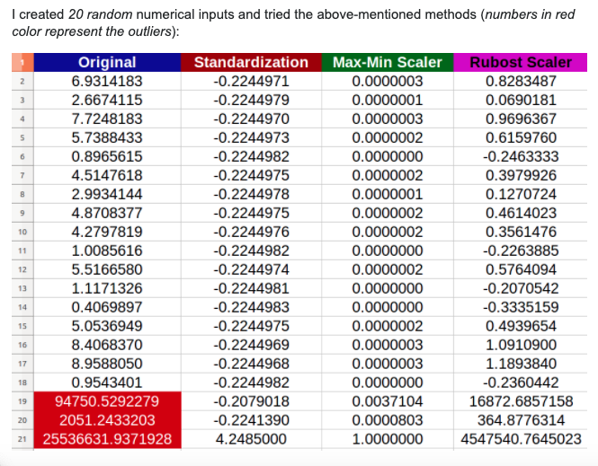
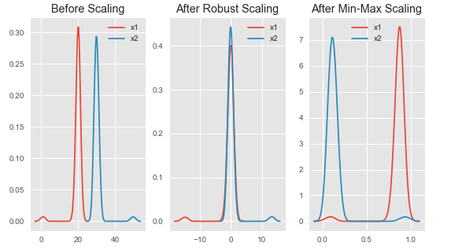
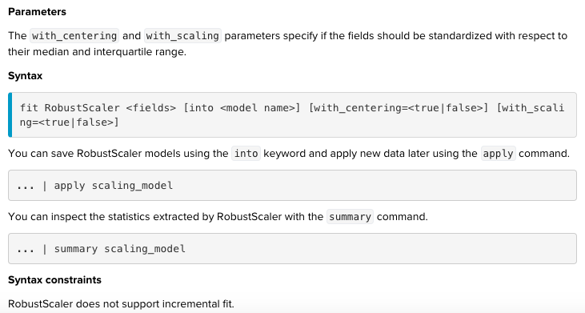
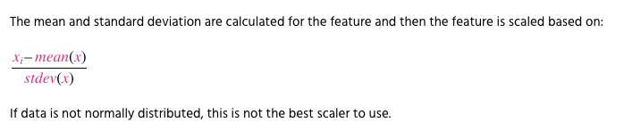
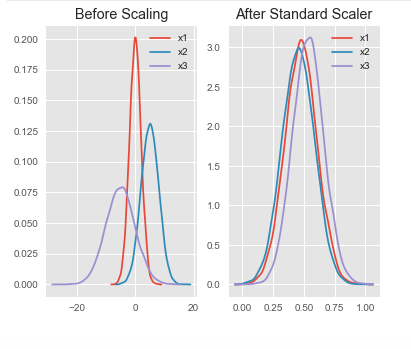
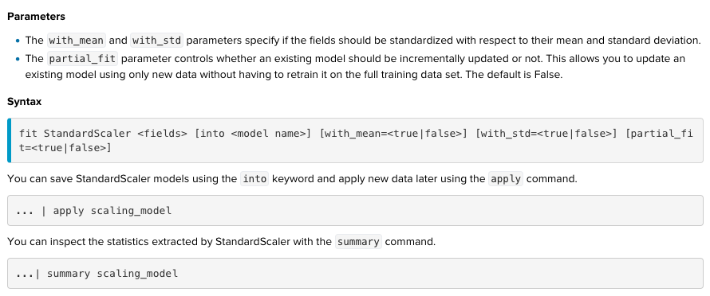
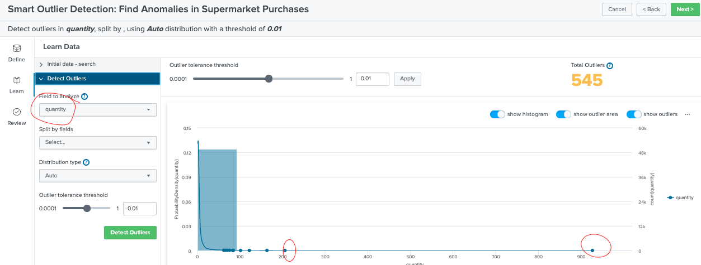
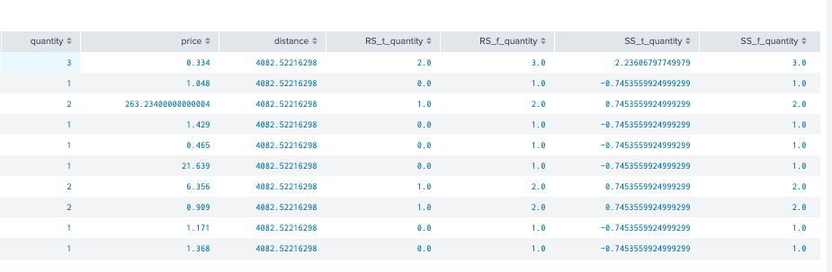
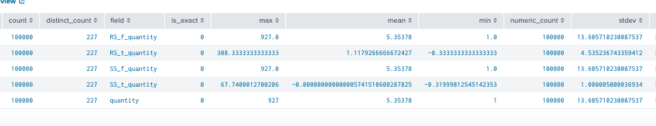

# 1. Imputer : data cleaning 
Missing data is a normal problem to DS. How to deal with it? We have to drop it or we have to work our best to replace missing data with appropriate values. If that is the case, how can we do it?

* Wanna discover: Splunk imputation apply during traing phase or during prediction phase. May be it works for both???

READING:

1.[Imputer on Splunk doc](https://docs.splunk.com/Documentation/MLApp/5.1.0/User/Algorithms#Imputer)

2.Not clear enough. Read about [imputation during prediction phase ](http://jmlr.csail.mit.edu/papers/volume8/saar-tsechansky07a/saar-tsechansky07a.pdf)

3.[Another good reading](https://towardsdatascience.com/6-different-ways-to-compensate-for-missing-values-data-imputation-with-examples-6022d9ca0779)
##  What is imputation?
Imputation is the process of replacing missing data with substituted values. 

## When to drop or replace missing data?
My understanding:
* One variable in your data set have 95% of missing data. My suggestion is review the title of the col and make decision to drop it or not. 
* 1. If it is un nessesary data, dont waste time to replace missing data for it. Missing data as blanks, nans,etc. are incompatible to your estimators in ML algrs. 
* 2.If it is importance, you need to find a way to collect more data for it, because you re missing 95% of that potential variable. 

## Splunk syntax

## Example : Dataset server_power
	| inputlookup server_power.csv
	| fieldsummary ac_powder

Use fieldsummary to have a statistic about variable ac_power. Since it is a well prepared dataset with no missing data. We need to change it a bit so we can play with imputation syntax. 

Next move, create a missing data by random() devided by 3 without remainder, it will be recored as null, others, it will be as its original data (ac_power)

	| inputlookup server_power.csv
	| eval ac_power_missing=if(random() % 3 = 0, null, ac_power)
	| fields - ac_power

Next move, create "imputed" with boolean values to keep track. Write all results of Imputer into new var "ac_power_imputed". Method used is default "mean"

	| inputlookup server_power.csv
	| eval ac_power_missing=if(random() % 3 = 0, null, ac_power)
	| fields - ac_power
	| fit Imputer ac_power_missing
	| eval imputed=if(isnull(ac_power_missing), 1, 0)
	| eval ac_power_imputed=round(Imputed_ac_power_missing, 1)

	

Another example with named prefix + strategy=median

	| inputlookup server_power.csv
	|head 10
	| eval ac_power_missing=if(random() % 3 = 0, null, ac_power)
	| fields - ac_power
	| fit Imputer ac_power_missing  as "median" strategy=median
	| eval imputed=if(isnull(ac_power_missing), 1, 0)
	| eval ac_power_imputed=round(median_ac_power_missing, 1)

	
## When to use mean, median and most frequent?
### 1. One missing value at a time of point
		t1 = 10
		t2= Nan
		t3= 14
	t2=(t1+t3)/2

### 2. A great outliers found (skewness). Should use median
	 a. detech outlier (image total_cpu_utilization)
	 b. found a geart outlier, think of using median 
	

### 3. generally normal distributed. Should use mean
	 a. detech outlier (image petal_width)
	 b. normal distributed, think of using mean
	

### 4. categric variables. Should use most_frequent

### Aplly both mean and median to ac_power and evaluate. As results, mean strategy is slightly better than median on ac_power
	| inputlookup server_power.csv
	| eval ac_power_missing=if(random() % 3 = 0, null, ac_power)
	| fit Imputer ac_power_missing  as "median" strategy=median
	| fit Imputer ac_power_missing  as "mean" strategy=mean
	| eval imputed=if(isnull(ac_power_missing), 1, 0)
	| eval ac_power_imputed_median=round(median_ac_power_missing, 1)
	| eval ac_power_imputed_mean=round(mean_ac_power_missing, 1)
	|fieldsummary ac_power, median_ac_power_missing,mean_ac_power_missing

# 2. RobustScaler: data transformation - normalization
## What is normalization?
Convert the values of numeric colmns to a common scale, without distoring differences in the ranges of values.

In ML, it is required normalization only when features have different ranges. Ex: age ranges from 0-100, income ranges from 0-100,000. If we use LR, the attributed income will instrinsically influence the result more due to its larger value. But this doesnt necessartily mean salarie is more importance than age as a predictor. So we normalize the data to bring all the variables to the same range, reduce bias.

# When we need to do normalization?
Normalization is a good technique to use when you do not know the distribution of your data or when you know the distribution is not Gaussian (a bell curve). Normalization is useful when your data has varying scales and the algorithm you are using does not make assumptions about the distribution of your data, such as k-nearest neighbors and artificial neural networks.

##  What is robust scaler?
The RobustScaler uses the interquartile range, so that it is robust to outliers. Therefore it follows the formula:

Standardization: scales features such that the distribution is centered around 0, with a standard deviation of 1.

Normalization: shrinks the range such that the range is now between 0 and 1 (or -1 to 1 if there are negative values).

Robust Scaler: similar to normalization but it instead uses the interquartile range, so that it is robust to outliers.

x1 :distribution with lower outlier

x2: distribution with higher outlier

Notice that after Robust scaling, the distributions are brought into the same scale and overlap, but the outliers remain outside of bulk of the new distributions.

However, in Min-Max scaling, the two normal distributions are kept seperate by the outliers that are inside the 0-1 range.

READING:

1.[RobustScaler on Splunk doc](https://docs.splunk.com/Documentation/MLApp/5.1.0/User/Algorithms#RobustScaler)

2.[feature scaling with sklearn](https://benalexkeen.com/feature-scaling-with-scikit-learn/)

## Splunk syntax

# 3. StandardScaler :standardization
## What is standardization?
Standardizing the features around the center and 0 with a standard deviation of 1 is important when we compare measurements that have different units. Variables that are measured at different scales do not contribute equally to the analysis and might end up creating a bais. Typical data standardization procedures equalize the range and/or data variability.

For example, A variable that ranges between 0 and 1000 will outweigh a variable that ranges between 0 and 1. Using these variables without standardization will give the variable with the larger range weight of 1000 in the analysis. Transforming the data to comparable scales can prevent this problem. 

# When we need to do standardization?
Standardization assumes that your data has a Gaussian (bell curve) distribution. This does not strictly have to be true, but the technique is more effective if your attribute distribution is Gaussian. Standardization is useful when your data has varying scales and the algorithm you are using does make assumptions about your data having a Gaussian distribution, such as linear regression, logistic regression, and linear discriminant analysis.

##  What is standard scaler?
The StandardScaler assumes your data is normally distributed within each feature and will scale them such that the distribution is now centred around 0, with a standard deviation of 1.

All features are now on the same scale relative to one another.

READING:

1.[StandardScaler on Splunk doc](https://docs.splunk.com/Documentation/MLApp/5.1.0/User/Algorithms#StandardScaler)

## Splunk syntax

## Example : Dataset supermarket
Field quantity has outlier as photo

Apply both robust scaler and standard scaler

	|inputlookup supermarket.csv 
	|fit RobustScaler distance,price into RS1 as RS_t with with_centering=true with_scaling=true
	|fit RobustScaler distance,price  into RS2 as RS_f with with_centering=false with_scaling=false
	|fit StandardScaler distance,price  into SS1 as SS_t with_mean=true with_std=true
	|fit StandardScaler distance,price  into SS2 as SS_f with_mean=f with_std=f
	|fieldsummary RS_t_distance RS_f_distance SS_t_distance SS_f_distance distance

