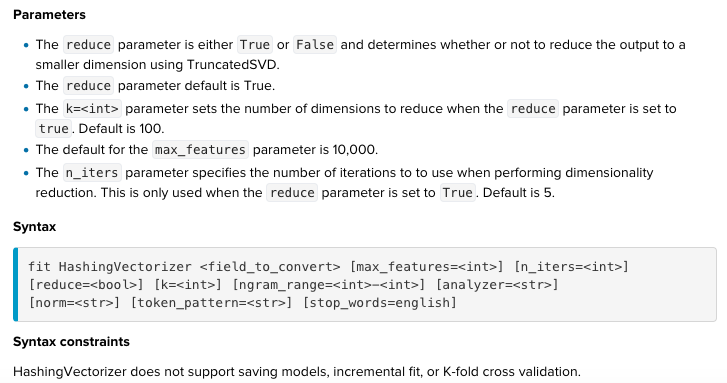

# What is feature extraction vs feature selection?
Feature extraction concerning the translation of existing data into useful features

Feature selection is about creating a subset of the original pool of features.

Three benefits of performing feature selection before modeling your data are:

* Reduces Overfitting: Less redundant data means less opportunity to make decisions based on noise.
* Improves Accuracy: Less misleading data means modeling accuracy improves.
* Reduces Training Time: Less data means that algorithms train faster.

# 1. FieldSelector (feature selection)
## What is this?
FieldSelector uses the scikit-learn GenericUnivariateSelect.

1. Univariate feature selection works by selecting the best features based on univariate statistical tests. 

2. GenericUnivariateSelect allows to perform univariate feature selection with a configurable strategy. This allows to select the best univariate selection strategy with hyper-parameter search estimator. Including:

		percentile : removes all but keep a user-specified highest scoring percentage 
		of features (default =10)
		k_best: removes all but the k highest scoring features (default=10)
		fpr: false positive rate (default=0.05)
		fdr: falsr discovery rate (default=0.05)
		fwe: family wise error (default=0.05)

		For regression: f_regression, mutual_info_regression
		For classification: chi2, f_classif, mutual_info_classif

## Document
[Read it on Splunk](https://docs.splunk.com/Documentation/MLApp/5.1.0/User/Algorithms#FieldSelector)

[Read it on sklearn](https://scikit-learn.org/stable/modules/generated/sklearn.feature_selection.GenericUnivariateSelect.html)

## Syntax on Splunk

## Example : dataset dish_failures predict disk_failure(binary value)
		|inputlookup disk_failures.csv
		|fit FieldSelector type=categorical mode=k_best param=4 DiskFailure from CapacityBytes,Model,SMART_1_raw,SMART_2_raw,SMART_3_raw,SMART_4_raw,SMART_5_rawinto FS_kbest
		|fit FieldSelector type=categorical mode=percentile param=5 DiskFailure from * into FS_percentile
		|fit FieldSelector type=categorical mode=fpr DiskFailure from * into FS_fpr

Seem like a bug in this algr on Splunk. So i have to test the experiment:

* FieldSelector mode=k_best

* FieldSelector mode=percentile

* FieldSelector mode=fwe

# 2.HashingVectorizer : term frequency 
## What is this?
HashingVectorizer and CountVectorizer are meant to do the same thing. Which is to convert a collection of text documents to a matrix of token occurrences. If you need the raw counts or normalized counts (term frequency), then you should use CountVectorizer or HashingVectorizer.

If your are looking to get term frequencies weighted by their relative importance (IDF) then Tfidfvectorizer is what you should use. 
## Document
[Read it on Splunk](https://docs.splunk.com/Documentation/MLApp/5.1.0/User/Algorithms#HashingVectorizer)

[Read it on sklearn](https://scikit-learn.org/stable/modules/generated/sklearn.feature_extraction.text.HashingVectorizer.html)

[other blog](https://kavita-ganesan.com/hashingvectorizer-vs-countvectorizer/#.Xr1c5hMzbVq)
## Syntax on Splunk

	ngram_range:unigram or bigram
	k :n_features The number of features (columns) in the output matrices.

## Example : dataset authorization.csv
Use HashingVectorizer for term frequency and then cluster into 3 group by KMeans, giving 5 example for each cluter.

		| inputlookup authorization.csv 
		| fit HashingVectorizer Logs ngram_range=1-2 k=50 stop_words=english 
		| fit KMeans Logs_hashed* k=3 
		| fields cluster* Logs 
		| sample 5 by cluster 
		| sort by cluster

# 3.ICA Independent component analysis 
## What is this?
ICA seperates a multivariate signal into additive sub-components that are maximally indepent.  The ICA model does not include a noise term for the model to be correct, meaning whitening must be applied(unlike PCA where whitenning can be done internally using whiten argument)

Whitenning(identity matrix): involves the eigen-value decomposition of its covariance matrix. 
* D : a diagonal matrix of eigenvalues
* lamda: is a eigenvalue of the covariance matrix

## Document
[Read it on Splunk](https://docs.splunk.com/Documentation/MLApp/5.1.0/User/Algorithms#ICA)

[Read it on sklearn](https://scikit-learn.org/0.19/modules/generated/sklearn.feature_extraction.text.HashingVectorizer.html)

[other blog](https://towardsdatascience.com/independent-component-analysis-ica-in-python-a0ef0db0955e)

## Syntax on Splunk

## Example : 

		| makeresults count=2
		| streamstats count as count
		| eval time=case(count=2,relative_time(now(),"+2d"),count=1,now())
		| makecontinuous time span=15m
		| eval _time=time
		| eval s1 = sin(2*time)
		| eval s2 = sin(4*time)
		| eval m1 = 1.5*s1 + .5*s2, m2 = .1*s1 + s2
		| fit ICA m1, m2 n_components=2 as IC
		| fit PCA m1, m2 k=2 as PC
		| fields _time, *
		| fields - count, time

The following example shows how ICA is able to find the two original sources of data from two measurements that have mixes of both. As a comparison, PCA is used to show the difference between the two – PCA is not able to identify the original sources.

# 4. KernelPCA
## What is this?
PCA is a linear method (suitable to apply to datasets which are linearly separable). Kernel PCA uses a kernel function to project dataset into a higher dimensional feature space, where it is linearly separable.

Ex: nonlinearly dataset and after applied KernelPCA

## Document
[Read it on Splunk](https://docs.splunk.com/Documentation/MLApp/5.1.0/User/Algorithms#KernelPCA)

[Read it on sklearn](https://scikit-learn.org/stable/modules/generated/sklearn.decomposition.KernelPCA.html)

[other blog on PCA kernelPCA vs ICA](https://towardsdatascience.com/kernel-pca-vs-pca-vs-ica-in-tensorflow-sklearn-60e17eb15a64)

## Syntax on Splunk

	degree:degree of poly kernel, default=3
	k:nb of components. default None, all non_zero components are kept
	gamma:kernel cofficient for rbf,poly,sigmoid.default 1/n_features 
	tolerance:Convergence tolerance for arpack. If 0, optimal value will be chosen by arpack.
	max_iteration:max nb of iteration(default none, choose optimal)

## Example : dataset 
	|inputlookup iris.csv
	|fit StandardScaler petal_length,petal_width,sepal_length,sepal_width as SS
	|fit KernelPCA SS_petal_length,SS_petal_width,SS_sepal_length,SS_sepal_width into kernelPCA k=3

* Note: + or - means its direction so it does not mean + is better than -

# 4. PCA
## What is this?
PCA is a linear method (suitable to apply to datasets which are linearly separable). PCA attempts to find uncorrelated sources. It reduces the number of features by extracting uncorrelated features out of the data. 

ICA attempts to find independent sources.
## Document
[Read it on Splunk](https://docs.splunk.com/Documentation/MLApp/5.1.0/User/Algorithms#PCA)

[Read it on sklearn](https://scikit-learn.org/stable/modules/generated/sklearn.decomposition.PCA.html)

[PCA on iris](https://www.kaggle.com/shrutimechlearn/step-by-step-pca-with-iris-dataset)
## Syntax on Splunk

## Example : dataset 
	|inputlookup iris.csv
	|fit StandardScaler petal_length,petal_width,sepal_length,sepal_width as SS
	|fit PCA SS_petal_length,SS_petal_width,SS_sepal_length,SS_sepal_width into pca

# 6. NPR - Normalized Perlich Ratio:
## What is this?
NPR converts high cardinality categorical field values into numeric field (does not perfrom one-hot encoding)
Ex:Zipcode, streetname, family name, bank account :are very predictive but they are high-cardinality attritutes( a variable with more than 100 distinct values). Despite their potential, unfortunatedly such variables are discarded in predictive modeling. Solution is sparse matrix (most elements are 0)

Splunk NPR intelligently handling space optimization and low computational costs.

## Document
[Read it on Splunk](https://docs.splunk.com/Documentation/MLApp/5.1.0/User/Algorithms#NPR)

[Other](https://www.kdnuggets.com/2016/08/include-high-cardinality-attributes-predictive-model.html)
## Syntax on Splunk

Returns: NPR_inputfield_targetvariable's value

## Example : dataset disk_failure.csv 

	DiskFaiure: target variable (boolean:Yes or No)
	Model : high cardinality variable.

	| inputlookup disk_failures.csv
	| fit NPR DiskFailure from Model into myNPR_1
	| fit NPR DiskFailure from SerialNumber into myNPR_2
	| fit SGDClassifier DiskFailure from NPR_* random_state=1234 n_iter=2 
	| score accuracy_score DiskFailure against predicted*

# 7. TFIDF :  term frequency–inverse document frequency
## What is this?
TFIDF is a numerical statistic that is intended to reflect how important a word is to a document in a corpus.

TF: Term Frequency, which measures how frequently a term occurs in a document. Since every document is different in length, it is possible that a term would appear much more times in long documents than shorter ones. Thus, the term frequency is often divided by the document length (aka. the total number of terms in the document) as a way of normalization:

TF(t) = (Number of times term t appears in a document) / (Total number of terms in the document).

IDF: Inverse Document Frequency, which measures how important a term is. While computing TF, all terms are considered equally important. However it is known that certain terms, such as "is", "of", and "that", may appear a lot of times but have little importance. Thus we need to weigh down the frequent terms while scale up the rare ones, by computing the following:

IDF(t) = log_e(Total number of documents / Number of documents with term t in it).

	Example:
	Consider a document containing 100 words wherein the word cat appears 3 times. 
	TF(cat)= (3 / 100) = 0.03. 
	Now, assume we have 10 million documents and the word cat appears in one thousand of these. 
	IDF = log(10,000,000 / 1,000) = 4. 
	Thus, the Tf-idf weight is the product of these quantities: 0.03 * 4 = 0.12.

## Document
[Read it on Splunk](https://docs.splunk.com/Documentation/MLApp/5.1.0/User/Algorithms#TFIDF)

[Read it on sklearn](https://scikit-learn.org/stable/modules/generated/sklearn.feature_extraction.text.TfidfVectorizer.html)

## Syntax on Splunk

	param:
	max_features = int.Default is 100, build a vocabulary that only consider the top ordered by TF across the corpus
	max_df = float. Use to ignore common words
	min_df = flot. Use to ignore rare words
	ngram_range = int-int. unigrams(1-1), unigrams and bigrams(1,2), bigrams(2,2)
	analyzer = {‘word’, ‘char’, ‘char_wb’} or callable, default =’word’
	norm = {‘l1’, ‘l2’}, default=’l2’
	token_pattern = str(use only analyzer=="word")
	stop_words = english

Returns: 

## Example : dataset authorization

	Logs: field_to_convert (contains text)
	returns: Logs_tfidf_ranking_bigrams'values

	| inputlookup authorization.csv 
	| fit TFIDF Logs ngram_range=1-2 max_df=0.6 min_df=0.2 stop_words=english 

	
	| inputlookup authorization.csv 
	| fit TFIDF Logs ngram_range=1-2 max_df=0.6 min_df=0.2 stop_words=english 
	| fit KMeans Logs_tfidf* k=3 
	| fields cluster Logs 
	| sample 6 by cluster 
	| sort by cluster

