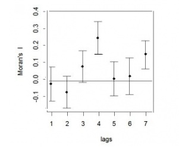
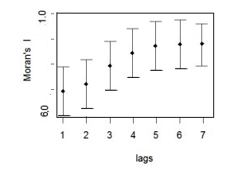
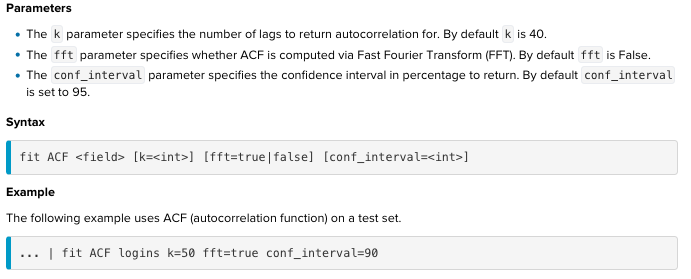
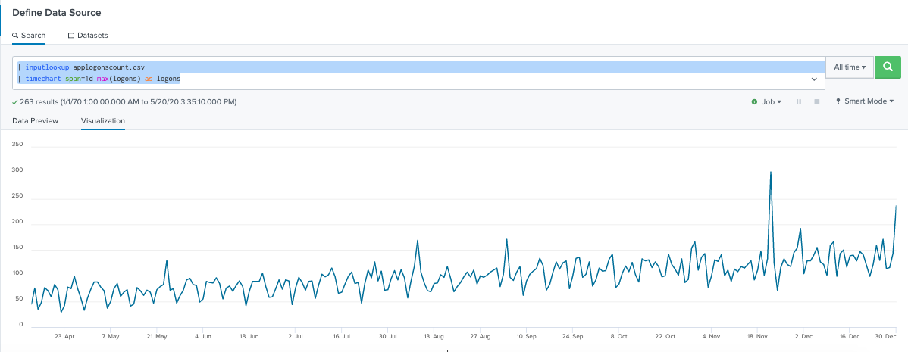
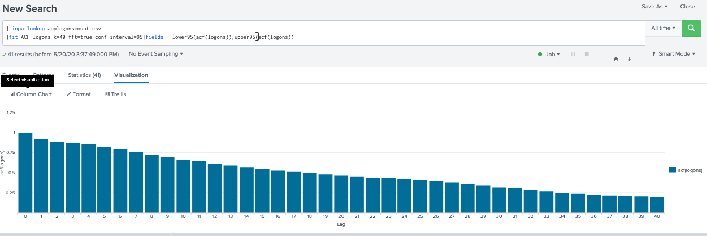
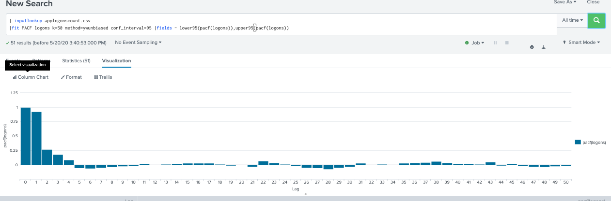

# 1. ACF (autocorrelation function)
## What is this?
Autocorrelation function is a measure of the correlation between observations of a time series that are separated by k time units (yt and yt–k). 

We can assume the distribution of each variable fits a Gaussian (bell curve) distribution. If this is the case, we can use the Pearson’s correlation coefficient to summarize the correlation between the variables.

The Pearson’s correlation coefficient is a number between -1 and 1 that describes a negative or positive correlation respectively. A value of zero indicates no correlation.

We can calculate the correlation for time series observations with observations with previous time steps, called lags. Because the correlation of the time series observations is calculated with values of the same series at previous times, this is called a serial correlation, or an autocorrelation. A plot of the autocorrelation of a time series by lag is called the AutoCorrelation Function

*Note: The data should be stationary before you interpret the autocorrelation plot. A stationary time series has a mean, variance, and autocorrelation function that are essentially constant through time.

Output: use lags diagrams on your data set to see it is likely has significant autocorrelection or not. Use partial autocorrelation function to determine the order of the autoregressive term, etc.

Example:
* 1. The above image shows relatively small Moran’s I (between about -0.2 and 0.35). In addition, there is no pattern in the autocorrelations (i.e. no consistent upward or downward pattern as you travel across the x-axis). This set of data likely has no significant autocorrelation.

* 2. On the other hand, this next image shows fairly high Moran’s I values and an upward trend. This indicates that autocorrelation is highly likely for your set of data.

## Document
[Read it on Splunk](https://docs.splunk.com/Documentation/MLApp/5.1.0/User/Algorithms#ACF_.28autocorrelation_function.29)

[Read it on statsmodels](https://www.statsmodels.org/stable/generated/statsmodels.tsa.stattools.acf.html)

[ACF and PACF](https://machinelearningmastery.com/gentle-introduction-autocorrelation-partial-autocorrelation/)
## Syntax on Splunk

	Returns: 
	4 cols : Lags, acf(field), lower95(acf(field)),upper95(acf(field))
	

## Example : dataset applogonscount.csv

	| inputlookup applogonscount.csv
	| fit ACF logons k=40 fft=true conf_interval=95

At lag=0 has highest value, however, there is no significant autocorrelation.

# 1. PACF (autocorrelation function)
## What is this?
A partial autocorrelation is a summary of the relationship between an observation in a time series with observations at prior time steps with the relationships of intervening observations removed.

*The partial autocorrelation at lag k is the correlation that results after removing the effect of any correlations due to the terms at shorter lags.

PACF seeks to remove these indirect correlations.

For the PACF, we would expect the plot to show a strong relationship to the lag and a trailing off of correlation from the lag onwards.

## AR(k)
The ACF for the AR(k) time series to be strong to a lag of k and the inertia of that relationship would carry on to subsequent lag values, trailing off at some point as the effect was weakened. 

We know that the PACF only describes the direct relationship between an observation and its lag. This would suggest that there would be no correlation for lag values beyond k.

## MA(k)
We would expect the ACF for the MA(k) process to show a strong correlation with recent values up to the lag of k, then a sharp decline to low or no correlation. By definition, this is how the process was generated.

For the PACF, we would expect the plot to show a strong relationship to the lag and a trailing off of correlation from the lag onwards.

## Document
[Read it on Splunk](https://docs.splunk.com/Documentation/MLApp/5.1.0/User/Algorithms#PACF_.28partial_autocorrelation_function.29)

[Read it on statsmodels](https://www.statsmodels.org/stable/generated/statsmodels.tsa.stattools.pacf.html)

## Syntax on Splunk

	Params:
	‘yw’ or ‘ywunbiased’ : Yule-Walker with bias correction in denominator for acovf. Default.
	‘ywm’ or ‘ywmle’ : Yule-Walker without bias correction.
	‘ols’ : regression of time series on lags of it and on constant.

	Returns: 
	4 cols : Lags, acf(field), lower95(acf(field)),upper95(acf(field))
	

## Example : dataset applogonscount.csv

	| inputlookup applogonscount.csv
	| fit PACF logons k=50 method=ywunbiased conf_interval=95
	|fields - lower95(pacf(logons)),upper95(pacf(logons))

