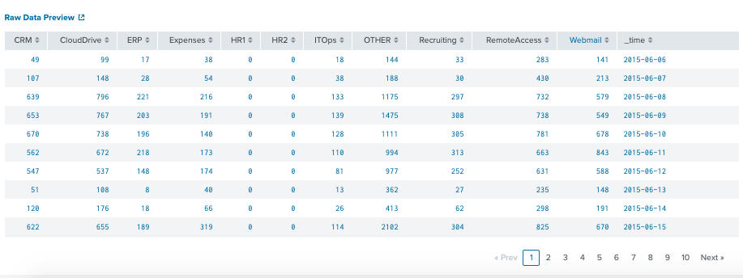
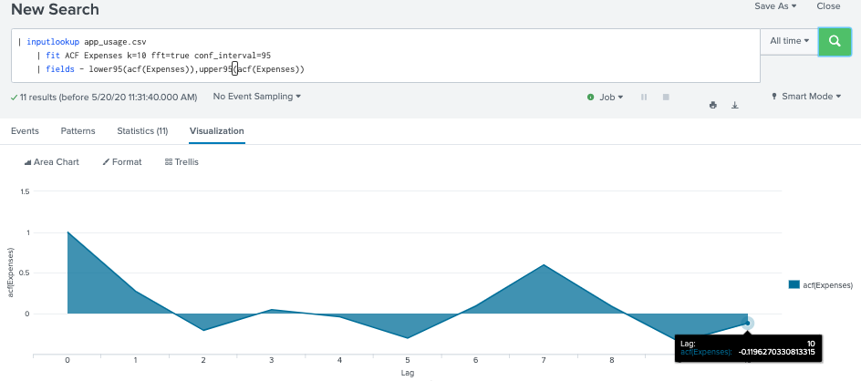
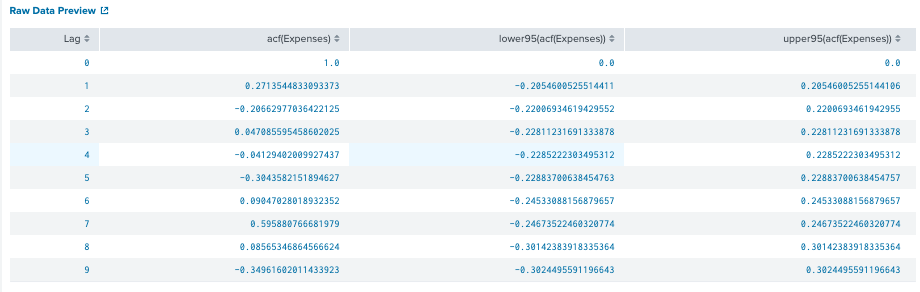

# 1. ACF (autocorrelation function)
## What is this?
Autocorrelation function is a measure of the correlation between observations of a time series that are separated by k time units (yt and yt–k). 

We can assume the distribution of each variable fits a Gaussian (bell curve) distribution. If this is the case, we can use the Pearson’s correlation coefficient to summarize the correlation between the variables.

The Pearson’s correlation coefficient is a number between -1 and 1 that describes a negative or positive correlation respectively. A value of zero indicates no correlation.

We can calculate the correlation for time series observations with observations with previous time steps, called lags. Because the correlation of the time series observations is calculated with values of the same series at previous times, this is called a serial correlation, or an autocorrelation. A plot of the autocorrelation of a time series by lag is called the AutoCorrelation Function

*Note: The data should be stationary before you interpret the autocorrelation plot. A stationary time series has a mean, variance, and autocorrelation function that are essentially constant through time.

Output: use lags diagrams on your data set to see it is likely has significant autocorrelection or not. Use partial autocorrelation function to determine the order of the autoregressive term, etc.

Example:
* 1. The above image shows relatively small Moran’s I (between about -0.2 and 0.35). In addition, there is no pattern in the autocorrelations (i.e. no consistent upward or downward pattern as you travel across the x-axis). This set of data likely has no significant autocorrelation.

* 2. On the other hand, this next image shows fairly high Moran’s I values and an upward trend. This indicates that autocorrelation is highly likely for your set of data.

## Document
[Read it on Splunk](https://docs.splunk.com/Documentation/MLApp/5.1.0/User/Algorithms#ACF_.28autocorrelation_function.29)

[Read it on statsmodels](https://www.statsmodels.org/stable/generated/statsmodels.tsa.stattools.acf.html)

[ACF and PACF](https://machinelearningmastery.com/gentle-introduction-autocorrelation-partial-autocorrelation/)
## Syntax on Splunk

	Returns: 
	4 cols : Lags, acf(field), lower95(acf(field)),upper95(acf(field))
	

## Example : dataset app_usage

	| inputlookup app_usage.csv
	| fit ACF Expenses k=40 fft=true conf_interval=95

At lag=0 has highest value, however, there is no significant autocorrelation.
