# 1. Time Series Analysis:
## What is this?
Time series can be decomposed into several components: trend component, seasonal component, and residual component. 

### Trend
Trend is a general direction of changing time series value. Increasing trend, for example, means that the values of time series are, in average, larger than previous ones. 

### Seasonal:
Seasonal component stands for some periodic fluctuations in data. For example, number of logins in night hours is constantly smaller than in day hours, as well as number of logins in weekdays is larger than on weekends. 

### Residual :
Residual component is the difference between time series values and determinate components (trend, seasonality) and often stands for some kind of noise.

### Stationary:
Assumption: it is need to be stationary which means :mean, varian, and autocorrelation are constant over time.

In the picture below you find some examples of stationary (blue) and non-stationary (yellow, red, violet) time series. Mean and variance of ‘blue’ series are equal to 0 and 1 respectively, so this series is stationary. ‘Yellow’ series shows an increasing trend, that is mean is not constant. ‘Red’ series shows an obvious daily seasonality, that is autocorrelation function has a local maximum at the lags of 24, 48, … hours — and it’s not constant, too. ‘Violet’ series shows an increasing trend and disturbance, that is mean and variance are not constant as well.

# 2. Kalman filter
## What is this?
Kalman filter takes time series as input and performs some kind of smoothing and denoising. After this, smoothed series might be predicted. But one should take into account that Kalman filter is firstly for denoising, rather than forecasting. That’s why the results of forecasting might be a bit inappropriate.
## Document
[Read it on blog](https://towardsdatascience.com/time-series-forecasting-with-splunk-part-i-intro-kalman-filter-46e4bff1abff)

[Kalman filter](https://discoveredintelligence.ca/forecasting-time-series-data-using-splunk-machine-learning-toolkit/)
## Syntax on Splunk
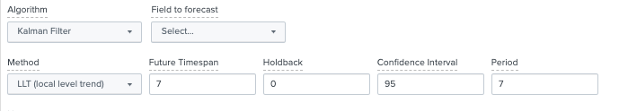
|predict input_field as output_field algorithm=[LLT|LL|LLP|LLP5] 
holdback=int 
future_timespan=int 
period=int 
upper95=upper[int] 
lower95=lower[int]

	Params:
	algorithm:
		* LL (Local Level) to predict only local level of time series (without any trend or seasonality);
		* LLT (Local Level Trend) to predict only trend;
		* LLP (Seasonal Local Level) to predict only seasonal component;
		* LLP5 (combines LLT and LLP) to account for both trend and seasonality.
	holdback: default=0 is the nb of data points held back from training, keep for testing
	period: specify if your data has a known periodicity. 
	The algorithms LLP and LLP5 automatically attempt to calculate the period if no value is specified.
	future_timespan: specify how many future predictions you want the algorithm to compute
	lowerXX
	upperXX

	Returns:
		outputfield with lower and upper

## Example : dataset applogonscount.csv with _time and logons(type=int)

	| inputlookup  applogonscount.csv
	| timechart span=1d fixedrange=f max(logons) as daylogins
	| predict "daylogins" as prediction algorithm=LLT holdback=0 future_timespan=7 period=7 upper95=upper95 lower95=lower95 

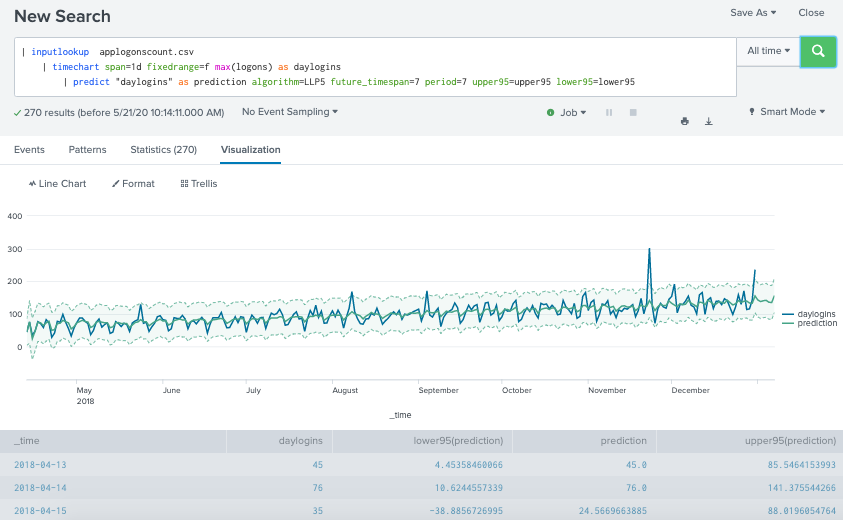

Filter really removes normally distributed noise and predicts actual trend and seasonality. Anyway, this forecast is acceptable.

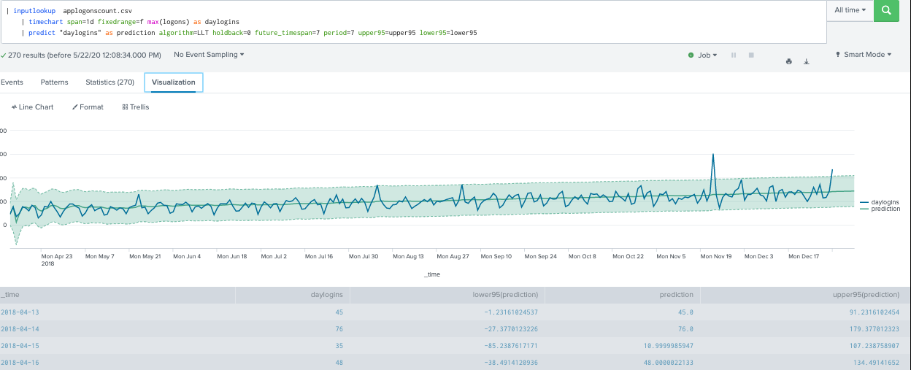

I use LLT this time... It’s pretty obvious that the result is slightly not as expected. It seems that filter considers our fluctuations in data as a noise. Thereby, filter eliminates this noise and keeps only the trend component. Anyway, this forecast is unacceptable.

	| inputlookup applogonscount.csv
	| timechart span=1d fixedrange=f max(logons) as daylogins
	| predict "daylogins" as prediction algorithm=LLT holdback=0 future_timespan=7 period=7 upper95=upper95 lower95=lower95 
	|eval daylogins = case(daylogins < 'lower95(prediction)', 'lower95(prediction)', daylogins > 'upper95(prediction)', 'upper95(prediction)', 1=1, daylogins)
	| eval season = daylogins / prediction
	|predict "season" as season_prediction algorithm="LLP" future_timespan=7 period=7 lower"0"=lower"0" upper"0"=upper"0"
	| eval prediction = prediction * season_prediction
	| table _time, daylogins, prediction

Compute seasonality from upper and lower bounds of confidence interval. Notice that variance of initial time series increases over time. So daylogins= prediction\*season seem appropriate in our case. Our prediction is acceptable in this case.

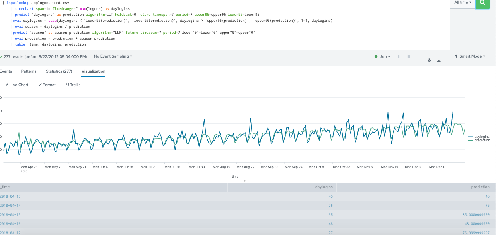

# 3. ARIMA - Autoregressive Intergrated Moving Average
## What is this?
As discussed above, Kalman filter was useful in reducing noise. Kalman filter forecasting capabilities as extending the existing pattern, sort of copy-paste method which may be advantageous when forecasting short term data. On the other hand ARIMA has an advantage in predicting data points when we are uncertain about the future trend of the data points in the long term. ARIMA works on data that has moving averages over time or where the value of a data point is linearly depending on its previous values. 

There are three arguments that make up the ARIMA model:

### Auto regressive (AR):
AR component refers to the use of past values in the regression equation. Higher the value the more past terms you will use in the equation. This concept is also called ‘lags’. Another way of describing this concept is if the value your data point is depending on its previous value e.g process time right now will depend on the process time 30 seconds before (from our data set)

### Intergrated(d):
The d represents the degrees of differencing as discussed in the below section. This makes up the integrated component of the ARIMA model and is needed for the stationary assumption of the data.

### Moving Average (MA):
MV in ARIMA refers to the use of past errors in the equation. It is the use of lagging (like AR) but for the error terms.

## Transform into stationary data by removing the increasing trend (use Splunk autoregress command):

*ARIMA assumption is stationary data.

* Example: 

		|inputlookup  applogonscount.csv
		|timechart span=1d max(logons) as daylogins 
		|autoregress daylogins 
		|eval new_daylogins=daylogins-daylogins_p1
		
Without creating a trendline, we see that the data fluctuates around a constant mean value of "0" by apply differencing by an order of 1. Differencing = the current- prevous data points. It makes the data stationary 

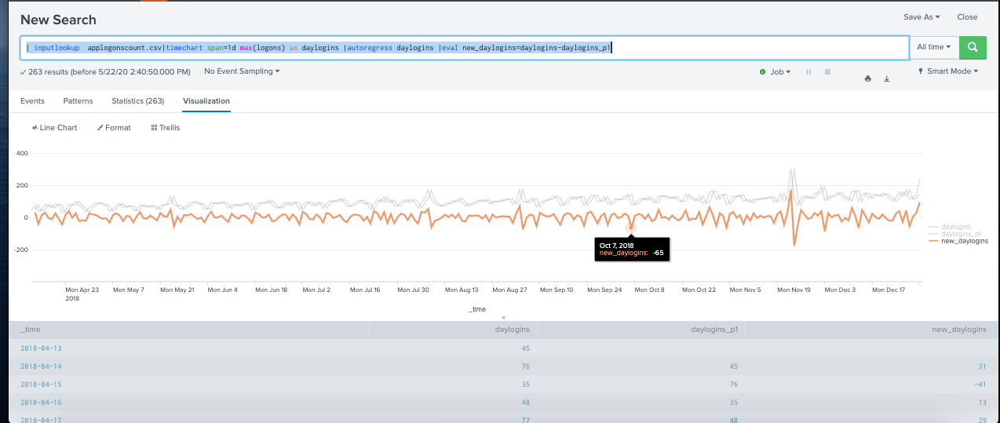

## Document
[Read it on Splunk](https://docs.splunk.com/Documentation/MLApp/5.1.0/User/Algorithms#ARIMA)

[Read it on statsmodels](https://www.statsmodels.org/devel/generated/statsmodels.tsa.arima_model.ARIMA.html)

[read it on blog ](https://discoveredintelligence.ca/forecasting-time-series-data-using-splunk-machine-learning-toolkit-part-ii/)
## Syntax on Splunk
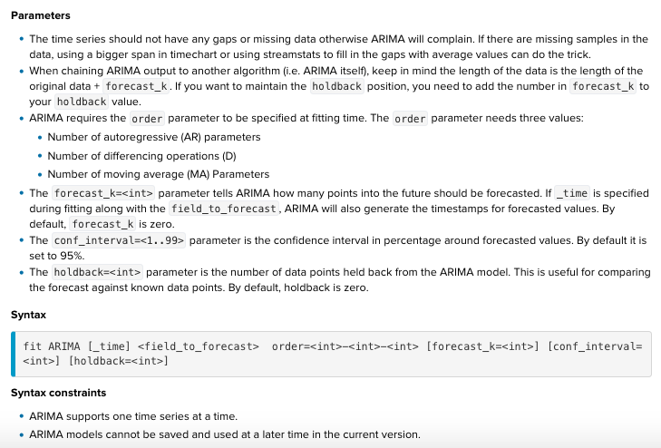

## Example : dataset  applogonscount.csv

### Trial 1: ARIMA(0,0,0) with future_timespan=2- and holdback=20 and confidence interval=95
	| inputlookup  applogonscount.csv
	|timechart span=1d max(logons) as daylogins
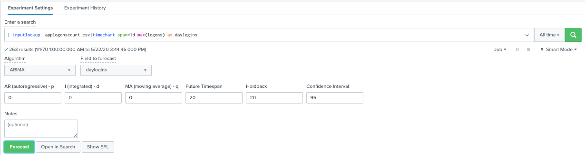
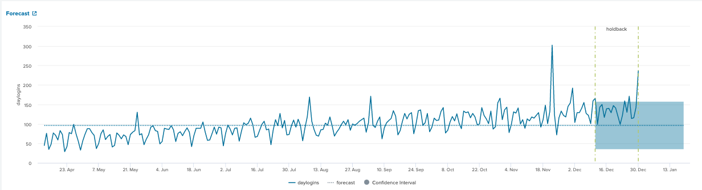
* The prediction is unacceptable because of the data is not stationary.

### Trial 2: ARIMA(0,1,0) by an order of 1 for differencing.
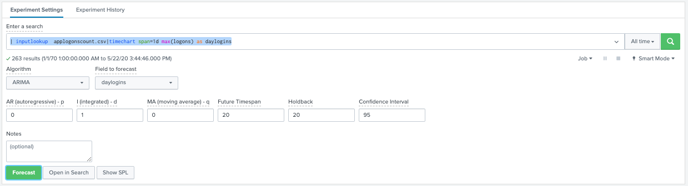
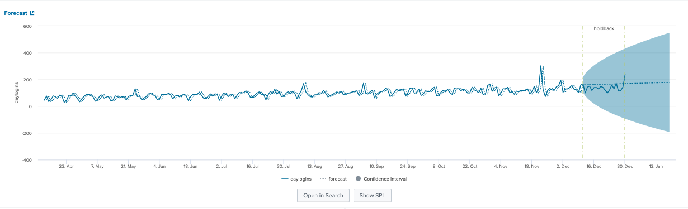

* Examine the PACF plot for a suggestion for AR(value) by coungting the prominent high spikes. The values of AR(p) that we pick is 6

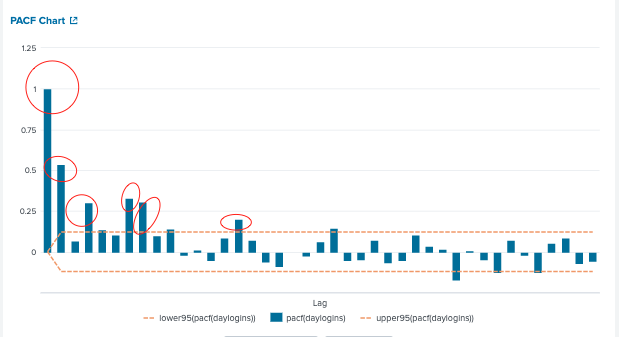

* Examine the ACF plot for a suggestion for MA(value) by coungting the prominent high spikes. The values of MA(p) that we pick is 6

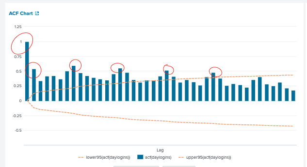

But we get error regarding to invertability or non stantionary. It means the model does not converge when its forecasts. We try to optimise our AR(p) and MA(q) via R-square and Root Mean Square Error value from model statistics.
* A higher R-square indicates a better fit the model has on the data. R-square is the amount of variability that the model can explain on the process time data points.
* The lower the RMSE is the better the fit the model. RMSE is the difference between the data points the model predicted and our holadback points from the raw data.

| Intergrated  d = 0             | AR(1) MA(1)                      | AR(2) MA(2)                               | AR(3) MA(3)                             |
|--------------------------------|-----------------------------|---------------------------------|-------------------------------|
| (0,0,0) R=-0.0098 RSME= 33.11 | (1,0,1) R=0.4456 RSME=24.54 | (2,0,2) R=-776.2782 RSME=918.72 | (3,0,3) R= 0.5616 RSME= 21.75 |
|                            | (1,1,1) R=0.4986 RSME=23.26 | (2,1,2) R=0.5526 RSME=21.97     | (3,1,3) R=0.5616 RSME=21.75   |

* ARIMA(3,1,3) is the best in our limited gridsearch.

### Final on SPL command:
	| inputlookup applogonscount.csv
	|timechart span=1d max(logons) as daylogins 
	|fit ARIMA daylogins order=3-1-3 holdback=20 forecast_k=20 conf_interval=95
	
* order (3,1,3) is the best in this experiment but it is not as robust as Kalman filter for this example.

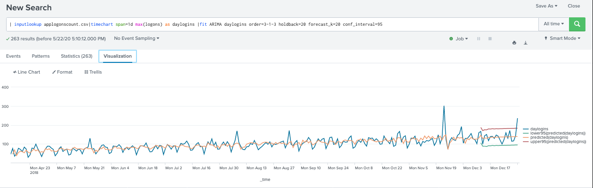
