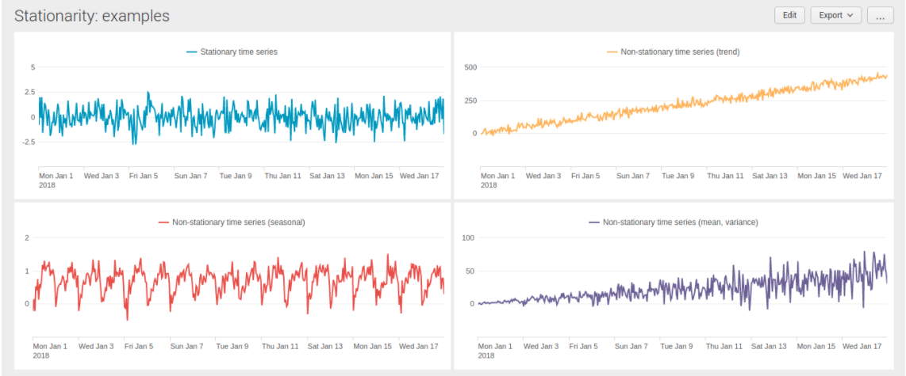

# 1. Time Series Analysis:
## What is this?
Time series can be decomposed into several components: trend component, seasonal component, and residual component. 

### Trend
Trend is a general direction of changing time series value. Increasing trend, for example, means that the values of time series are, in average, larger than previous ones. 

### Seasonal:
Seasonal component stands for some periodic fluctuations in data. For example, number of logins in night hours is constantly smaller than in day hours, as well as number of logins in weekdays is larger than on weekends. 

### Residual :
Residual component is the difference between time series values and determinate components (trend, seasonality) and often stands for some kind of noise.

### Stationary:
Assumption: it is need to be stationary which means :mean, varian, and autocorrelation are constant over time.

In the picture below you find some examples of stationary (blue) and non-stationary (yellow, red, violet) time series. Mean and variance of ‘blue’ series are equal to 0 and 1 respectively, so this series is stationary. ‘Yellow’ series shows an increasing trend, that is mean is not constant. ‘Red’ series shows an obvious daily seasonality, that is autocorrelation function has a local maximum at the lags of 24, 48, … hours — and it’s not constant, too. ‘Violet’ series shows an increasing trend and disturbance, that is mean and variance are not constant as well.

# 2. Kalman filter
## What is this?
Kalman filter takes time series as input and performs some kind of smoothing and denoising. After this, smoothed series might be predicted. But one should take into account that Kalman filter is firstly for denoising, rather than forecasting. That’s why the results of forecasting might be a bit inappropriate.
## Document
[Read it on blog](https://towardsdatascience.com/time-series-forecasting-with-splunk-part-i-intro-kalman-filter-46e4bff1abff)

## Syntax on Splunk

|predict input_field as output_field algorithm=[LLT|LL|LLP|LLP5] 
holdback=int 
future_timespan=int 
period=int 
upper95=upper[int] 
lower95=lower[int]

	Params:
	algorithm:
		* LL (Local Level) to predict only local level of time series (without any trend or seasonality);
		* LLT (Local Level Trend) to predict only trend;
		* LLP (Seasonal Local Level) to predict only seasonal component;
		* LLP5 (combines LLT and LLP) to account for both trend and seasonality.
	holdback: default=0 is the nb of data points held back from training
	period: specify if your data has a known periodicity
	future_timespan: specify how many future predictions you want the algorithm to compute

	Returns:
		outputfield with lower and upper

## Example : dataset applogonscount.csv with _time and logons(type=int)

	| inputlookup  applogonscount.csv
	| timechart span=1d fixedrange=f max(logons) as daylogins
	| predict "daylogins" as prediction algorithm=LLT holdback=0 future_timespan=7 period=7 upper95=upper95 lower95=lower95 

Filter really removes normally distributed noise and predicts actual trend and seasonality. Anyway, this forecast is acceptable.

I use LLT this time... It’s pretty obvious that the result is slightly not as expected. It seems that filter considers our fluctuations in data as a noise. Thereby, filter eliminates this noise and keeps only the trend component. Anyway, this forecast is unacceptable.

	| inputlookup applogonscount.csv
	| timechart span=1d fixedrange=f max(logons) as daylogins
	| predict "daylogins" as prediction algorithm=LLT holdback=0 future_timespan=7 period=7 upper95=upper95 lower95=lower95 
	|eval daylogins = case(daylogins < 'lower95(prediction)', 'lower95(prediction)', daylogins > 'upper95(prediction)', 'upper95(prediction)', 1=1, daylogins)
	| eval season = daylogins / prediction
	|predict "season" as season_prediction algorithm="LLP" future_timespan=7 period=7 lower"0"=lower"0" upper"0"=upper"0"
	| eval prediction = prediction * season_prediction
	| table _time, daylogins, prediction

Compute seasonality from upper and lower bounds of confidence interval. Notice that variance of initial time series increases over time. So daylogins= prediction\*season seem appropriate in our case. Our prediction is acceptable in this case.

