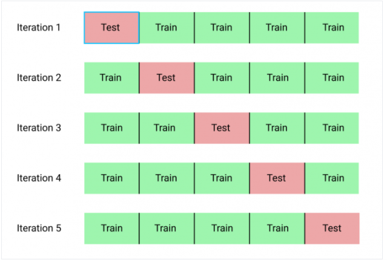
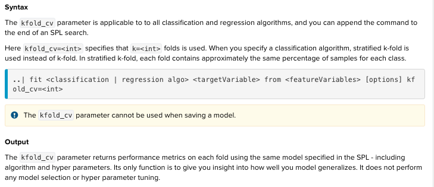
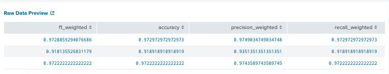

# Cross validation
Outcome: cross validation tells how well yout ML model perform on an independent dataset.

Cross validation is tupically used for :

	1. Compare +2 algrs against each other for best selection on a particular dataset
	2. Compare diff choices of hyper-params (same algrs)for best hyper params 
	on a particular dataset
	3. An improves method over train/test split 
	4. Cross validation is not suitable for data is ordered as time series. 
	Use Foward chaining for time series split.
# K-fold cross validation
## What is this?
	- Partitioned training set into k eauql-sized subsamples.
	- Each subsamples becomes the test set, so, the variance reduced as k is increased.
	- Take long time to be trained with Splunk
	- Can not be used with saving model

## Document
[Read it on Splunk](https://docs.splunk.com/Documentation/MLApp/5.1.0/User/Algorithms#K-fold_cross-validation)

## Syntax on Splunk

	Params:
	adding kfold_cv=int at the end of fit command.

	Returns:a set of metric for each fold

## Example : dataset  iris.csv
	| inputlookup iris.csv
	| sample partitions=100 seed=1234
	| search partition_number <= 70
	| fit DecisionTreeClassifier species from * kfold_cv=3 

