# 1. Birch (Balanced Iterative Reducing and Clustering using Hierarchies)

## What is this?
Output: clustered dataset
 	
	 	- only deals with metric variables(not categorical variables)
	 	- deals with large dataset by first generating a more compact summary that 
	 	retains as much distribution information as possible (Calles clustering feature),
	 	then clustering the summary data (instead of original dataset)

Algorithms overview:

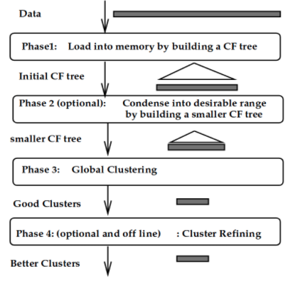

## Document
[Read it on Splunk](https://docs.splunk.com/Documentation/MLApp/5.1.0/User/Algorithms#Birch)

[Read it on sklearn](https://scikit-learn.org/stable/modules/generated/sklearn.cluster.Birch.html)

[Read blog](https://towardsdatascience.com/machine-learning-birch-clustering-algorithm-clearly-explained-fb9838cbeed9)
## Syntax on Splunk
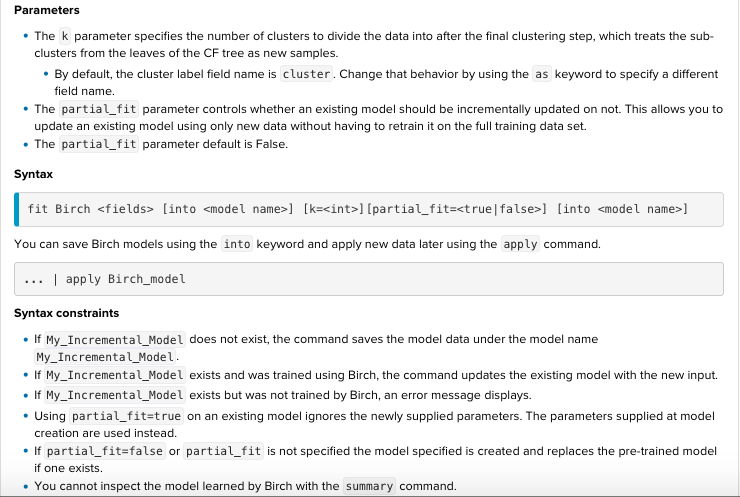

	Params:
	k : nb of cluters to devide the data into
	default name is cluster, use as to change it
	partial_fit: boolean. Defaut is false. If true, an existing model will be incrementally updated without having to retain on the full training data.

	Returns: cluster col with k categories

## Example : dataset  iris.csv without species(target variable)
	| inputlookup iris.csv 
	| fields - species
	| sample partitions=100 seed=1234
	| search partition_number <= 70
	| fit Birch petal_length petal_width sepal_length sepal_width k=3 partial_fit=F into my_brich

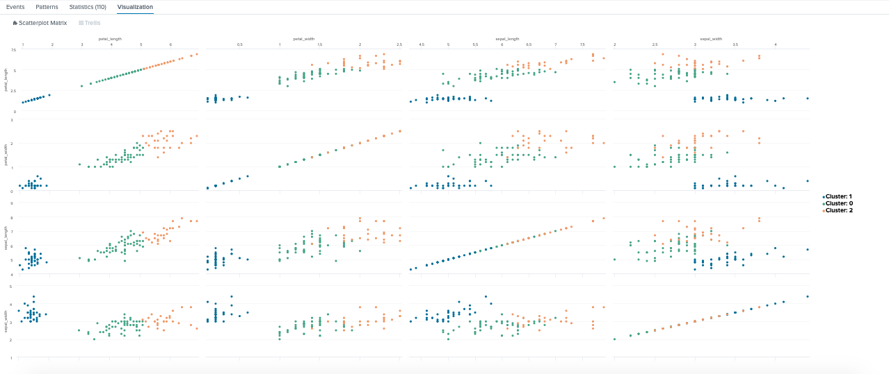

	| inputlookup iris.csv 
	| fields - species
	| sample partitions=100 seed=1234
	| search partition_number > 70
	| apply my_brich

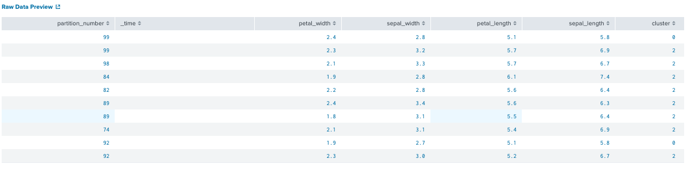
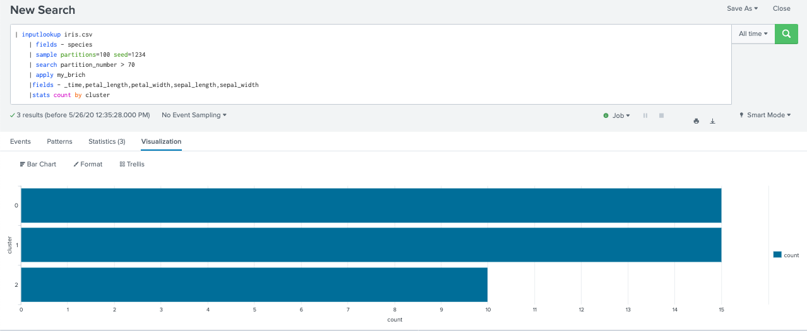

# 2. DBSCAN (Density-Based Spatial Clustering of Applications with Noise)

## What is this?
DBSCAN groups together points that are close to each other based on a distance measurement (usually Euclidean distance) and a minimum number of points. It also marks as outliers the points that are in low-density regions.

DBSCAN is distinct from K-Means in that it clusters results based on local density, and uncovers a variable number of clusters, whereas K-Means finds a precise number of clusters and it needs k as an input. For example, k=5 finds 5 clusters.

Params tuning:
eps:  if the eps value chosen is too small, a large part of the data will not be clustered. It will be considered outliers because don’t satisfy the number of points to create a dense region. On the other hand, if the value that was chosen is too high, clusters will merge and the majority of objects will be in the same cluster. The eps should be chosen based on the distance of the dataset (we can use a k-distance graph to find it), but in general small eps values are preferable.

min_samples: As a general rule, a minimum minPoints can be derived from a number of dimensions (D) in the data set, as minPoints ≥ D + 1. Larger values are usually better for data sets with noise and will form more significant clusters. The minimum value for the minPoints must be 3, but the larger the data set, the larger the minPoints value that should be chosen.

## Document
[Read it on Splunk](https://docs.splunk.com/Documentation/MLApp/5.1.0/User/Algorithms#DBSCAN)

[Read it on sklearn](https://scikit-learn.org/stable/modules/generated/sklearn.cluster.DBSCAN.html)

[Read blog](https://towardsdatascience.com/how-dbscan-works-and-why-should-i-use-it-443b4a191c80)
## Syntax on Splunk
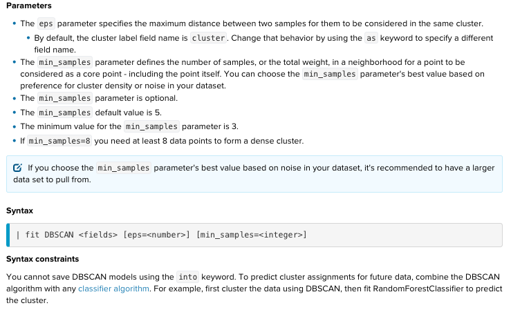

	Params:
	1. eps:  specifies how close points should be to each other to be considered a part of a cluster. 
	It means that if the distance between two points is lower or equal to this value (eps), 
	these points are considered neighbors.

	2. min_samples: the minimum number of points to form a dense region (min=3, default=5)
	For example, if we set the minPoints parameter as 5, then we need at least 5 points to form a dense region.

	Returns: cluster col 

	Disadvantage: 
	1. No saving model
	2. Can not turning with min_samples in experiment

## Example : dataset  iris.csv without species(target variable)
	| inputlookup iris.csv 
	| sample partitions=100 seed=1234
	| search partition_number <= 70
	| fit DBSCAN petal_length petal_width sepal_length sepal_width eps=0.5 min_samples=35 into my_DBSCAN
	|table species cluster 
	|stats count(cluster) as predict_cluster by species

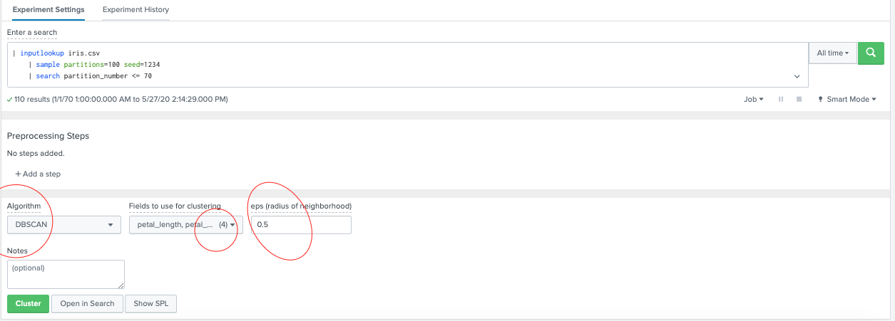
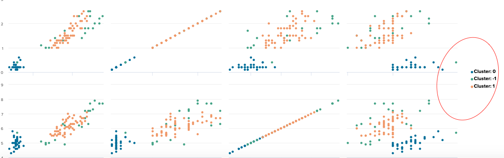
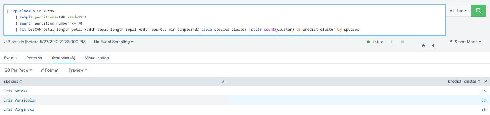

# 3. K-means
## What is this?
K-means groups similar data points, with the number of groups represented by the variable k. K-means required at least approximate knowledge of the total number of groups into which the data can be divided.

Using the K-means algorithm has the following advantages:

	1. Computationally faster than most other clustering algorithms.
	2. Simple algorithm to explain and understand.
	3. Normally produces tighter clusters than hierarchical clustering.

Using the K-means algorithm has the following disadvantages:

	1. Difficult to determine optimal or true value of k. See X-means
	2. Sensitive to scaling. See StandardScaler.
	3. Each clustering may be slightly different, 
		unless you specify the random_state parameter.
	4. Does not work well with clusters of different sizes and density.

## Document
[Read it on Splunk](https://docs.splunk.com/Documentation/MLApp/5.1.0/User/Algorithms#K-means)

[Read it on sklearn](https://scikit-learn.org/stable/modules/generated/sklearn.cluster.KMeans.html?highlight=k%20means#sklearn.cluster.KMeans)

[Read blog]()
## Syntax on Splunk

	Params:
	1. k: pecifies the number of clusters to divide the data into

	Returns: cluster  + cluster_distance cols 

## Example : dataset  iris.csv without species(target variable)
| inputlookup iris.csv 
	| fields - species
	| sample partitions=100 seed=1234
	| search partition_number <= 70
	| fit KMeans petal_length petal_width sepal_length sepal_width k=3 random_state=1234 into my_kmeans 
	|stats count by cluster

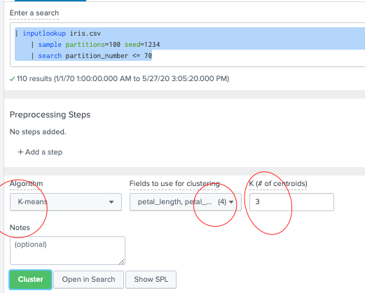
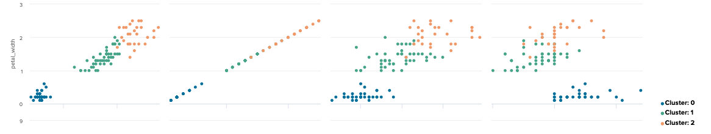
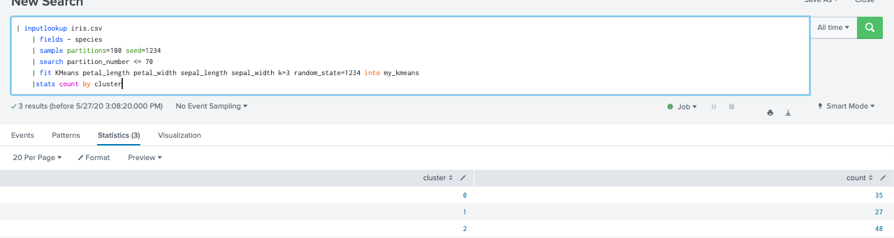
