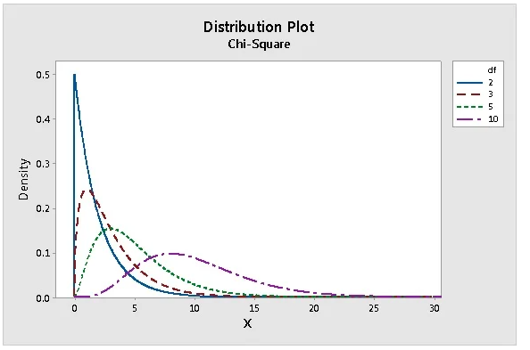
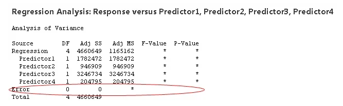
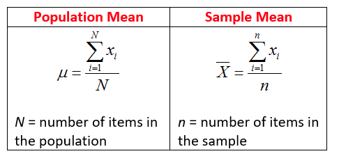
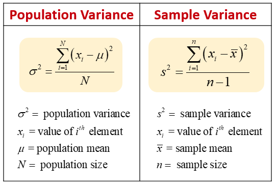
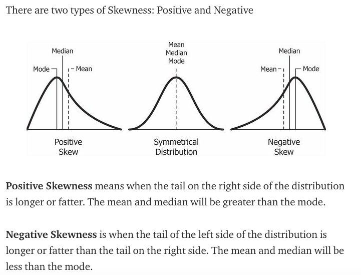
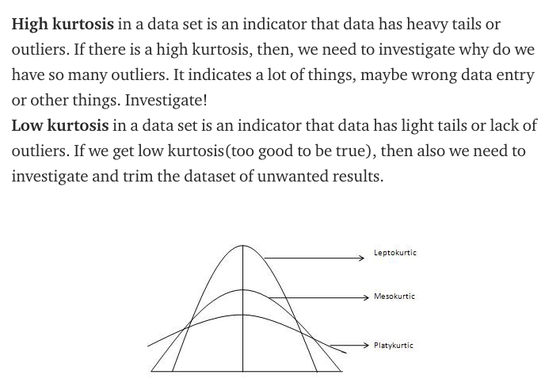

# Statistical functions (statsfunctions)

    1. Describe
    2. Moment
    3. Pearson
    4. Spearman
    5. Tmean
    6. Trim
    7. Tvar
    
 # Statsfunctions

	Input: prepared data (non NAN values, numerical fields)
	Output: statistical information on data 

		1.Describe
		2.Moment
		3.Pearson
		4.Spearman
		5.Tmean
		6.Trim
		7.Tvar
# 1.Describe
## What is this?

	Input params: lets discuss degrees of freedom and bias params
	Output params: min, max, mean, variance, nobs, kurtosis, skewness

### Degrees of freedom: 1 - n(sample T test)
You have n-1 degrees of freedom, where n is the sample size. For a 1-sample t-test, one degree of freedom is spent estimating the mean, and the remaining n-1 degrees of freedom estimate variability. Small sample size(n), which correspond with smaller degrees of freedom, the t-distribution has fatter tails. As n increases, the nb of degrees of freedom increases, t-distribution approaches a normal distribution.

### Degrees of freedom: Chi square test of independence
A chi-square test of independence is used to determine whether two categorical variables are dependent. Example:  the degrees of freedom are the number on cells in the two-way table of the categorical variables, given the constrains of the row and comuln marginal totals. Once you enter a number for one cell, the numbers for all the other cells are predetermined by the row and column totals. They're not free to vary. So the chi-square test for independence has only 1 degree of freedom for a 2 x 2 table.

For a table with r row and c columns, the nb of cells that can vary is (r-1)(c-1)

The chi-square distribution is positively skewed. As the degrees of fredoom increases, it appoarched the normal curve (pink line)

### Degrees of freedom: Regression
Recall that degrees of freedom generally equals the number of observations (or pieces of information) minus the number of parameters estimated. When you perform regression, a parameter is estimated for every term in the model, and and each one consumes a degree of freedom. Therefore, including excessive terms in a multiple regression model reduces the degrees of freedom available to estimate the parameters' variability. In fact, if the amount of data isn't sufficient for the number of terms in your model, there may not even be enough degrees of freedom (DF) for the error term and no p-value or F-values can be calculated at all.

If this happens, you either need to collect more data (to increase the degrees of freedom) or drop terms from your model (to reduce the number of degrees of freedom required). So degrees of freedom does have real, tangible effects on your data analysis, despite existing in the netherworld of the domain of a random vector.

### Bias

### Min, max, mean, variance, nobs, kurtosis, skewness
| Min      | Min value                                                           |
|----------|---------------------------------------------------------------------|
| Max      | Max value                                                           |
| Mean     | Average value                                                       |
| Variance | average of the squared diff between the data and the mean           |
| Skewness | degree of distortion from the symmetrical bell(normal distribution) |
| Kurtosis | measure the outlier (the tails) in the distribution                 |
* Variance formular

* Skewness

#### So, when is the skewness too much?
The rule of thumb seems to be:
* If the skewness is between -0.5 and 0.5, the data are fairly symmetrical.
* If the skewness is between -1 and -0.5(negatively skewed) or between 0.5 and 1(positively skewed), the data are moderately skewed.
* If the skewness is less than -1(negatively skewed) or greater than 1(positively skewed), the data are highly skewed.

* Kurtosis

* Mesokurtic: This distribution has kurtosis statistic similar to that of the normal distribution. It means that the extreme values of the distribution are similar to that of a normal distribution characteristic. This definition is used so that the standard normal distribution has a kurtosis of three.

* Leptokurtic (Kurtosis > 3): Distribution is longer, tails are fatter. Peak is higher and sharper than Mesokurtic, which means that data are heavy-tailed or profusion of outliers.
Outliers stretch the horizontal axis of the histogram graph, which makes the bulk of the data appear in a narrow (“skinny”) vertical range, thereby giving the “skinniness” of a leptokurtic distribution.

* Platykurtic: (Kurtosis < 3): Distribution is shorter, tails are thinner than the normal distribution. The peak is lower and broader than Mesokurtic, which means that data are light-tailed or lack of outliers.
The reason for this is because the extreme values are less than that of the normal distribution.

## Document
[Read it on Splunk](https://docs.splunk.com/Documentation/MLApp/5.1.0/User/ScoreCommand#Describe)

[Read it on sklearn](https://docs.scipy.org/doc/scipy/reference/generated/scipy.stats.describe.html)

[Degrees of freedom](https://blog.minitab.com/blog/statistics-and-quality-data-analysis/what-are-degrees-of-freedom-in-statistics)

## Syntax on Splunk

	Params: 
	1. field (_1 to _n)
	2. ddof (degree of freedom): default=1 (n-1 where sample size(n))
	3. bias:

	Returns: 
	field name + min, max, mean, variance, nobs, kurtosis, skewness

## Example : dataset iris.csv without species(target variable)

	| inputlookup iris.csv
	| score describe petal_length

   

