# Statistical functions (statsfunctions)

    1. Describe
    2. Moment
    3. Pearson
    4. Spearman
    5. Tmean
    6. Trim
    7. Tvar
    
 # Statsfunctions

	Input: prepared data (non NAN values, numerical fields)
	Output: statistical information on data 

		1.Describe
		2.Moment
		3.Pearson
		4.Spearman
		5.Tmean
		6.Trim
		7.Tvar
# 1.Describe
## What is this?

	Input params: lets discuss degrees of freedom and bias params
	Output params: min, max, mean, variance, nobs, kurtosis, skewness

### Degrees of freedom: 1 - n(sample T test)
You have n-1 degrees of freedom, where n is the sample size. For a 1-sample t-test, one degree of freedom is spent estimating the mean, and the remaining n-1 degrees of freedom estimate variability. Small sample size(n), which correspond with smaller degrees of freedom, the t-distribution has fatter tails. As n increases, the nb of degrees of freedom increases, t-distribution approaches a normal distribution.

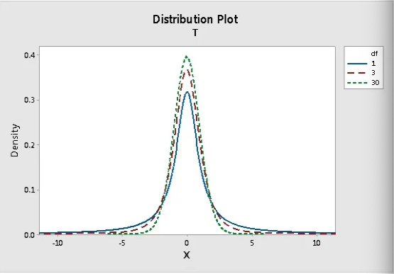

### Degrees of freedom: Chi square test of independence
A chi-square test of independence is used to determine whether two categorical variables are dependent. Example:  the degrees of freedom are the number on cells in the two-way table of the categorical variables, given the constrains of the row and comuln marginal totals. Once you enter a number for one cell, the numbers for all the other cells are predetermined by the row and column totals. They're not free to vary. So the chi-square test for independence has only 1 degree of freedom for a 2 x 2 table.

For a table with r row and c columns, the nb of cells that can vary is (r-1)(c-1)

The chi-square distribution is positively skewed. As the degrees of fredoom increases, it appoarched the normal curve (pink line)

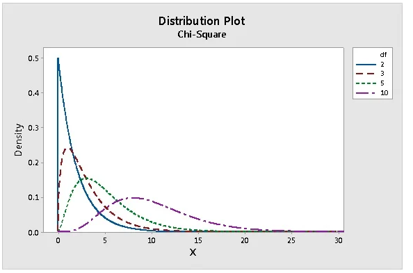

### Degrees of freedom: Regression
Recall that degrees of freedom generally equals the number of observations (or pieces of information) minus the number of parameters estimated. When you perform regression, a parameter is estimated for every term in the model, and and each one consumes a degree of freedom. Therefore, including excessive terms in a multiple regression model reduces the degrees of freedom available to estimate the parameters' variability. In fact, if the amount of data isn't sufficient for the number of terms in your model, there may not even be enough degrees of freedom (DF) for the error term and no p-value or F-values can be calculated at all.
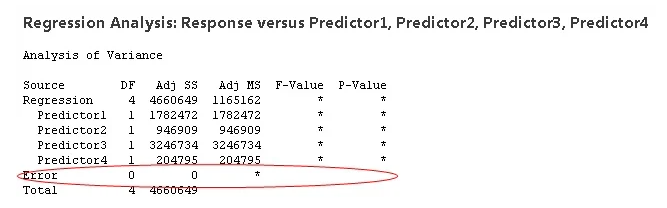

If this happens, you either need to collect more data (to increase the degrees of freedom) or drop terms from your model (to reduce the number of degrees of freedom required). So degrees of freedom does have real, tangible effects on your data analysis, despite existing in the netherworld of the domain of a random vector.

### Bias (related to the nb of observation in dataset)	

	Input params: bias = booleans(true or false). Default is false. 
	When n is very large, bias=0.
	When you do not have a limited sample (under 50). You should consider testing bias=true 

### Min, max, mean, variance, nobs, kurtosis, skewness
| Min      | Min value                                                           |
|----------|---------------------------------------------------------------------|
| Max      | Max value                                                           |
| Mean     | Average value                                                       |
| Variance | average of the squared diff between the data and the mean           |
| Skewness | degree of distortion from the symmetrical bell(normal distribution) |
| Kurtosis | measure the outlier (the tails) in the distribution                 |

* Variance formular

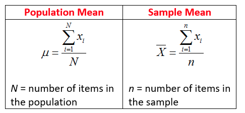
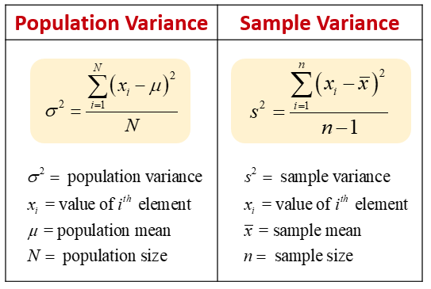

* Skewness

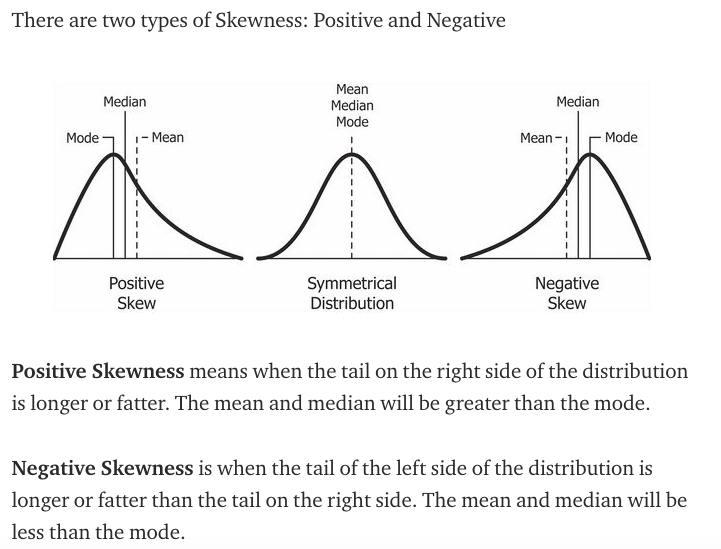

#### So, when is the skewness too much?
The rule of thumb seems to be:
* If the skewness is between -0.5 and 0.5, the data are fairly symmetrical.
* If the skewness is between -1 and -0.5(negatively skewed) or between 0.5 and 1(positively skewed), the data are moderately skewed.
* If the skewness is less than -1(negatively skewed) or greater than 1(positively skewed), the data are highly skewed.

* Kurtosis

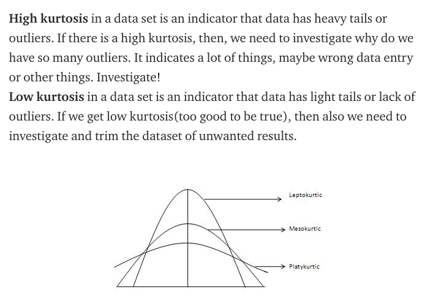

* Mesokurtic: This distribution has kurtosis statistic similar to that of the normal distribution. It means that the extreme values of the distribution are similar to that of a normal distribution characteristic. This definition is used so that the standard normal distribution has a kurtosis of three.

* Leptokurtic (Kurtosis > 3): Distribution is longer, tails are fatter. Peak is higher and sharper than Mesokurtic, which means that data are heavy-tailed or profusion of outliers.
Outliers stretch the horizontal axis of the histogram graph, which makes the bulk of the data appear in a narrow (“skinny”) vertical range, thereby giving the “skinniness” of a leptokurtic distribution.

* Platykurtic: (Kurtosis < 3): Distribution is shorter, tails are thinner than the normal distribution. The peak is lower and broader than Mesokurtic, which means that data are light-tailed or lack of outliers.
The reason for this is because the extreme values are less than that of the normal distribution.

## Document
[Read it on Splunk](https://docs.splunk.com/Documentation/MLApp/5.1.0/User/ScoreCommand#Describe)

[Read it on sklearn](https://docs.scipy.org/doc/scipy/reference/generated/scipy.stats.describe.html)

[Degrees of freedom](https://blog.minitab.com/blog/statistics-and-quality-data-analysis/what-are-degrees-of-freedom-in-statistics)

## Syntax on Splunk
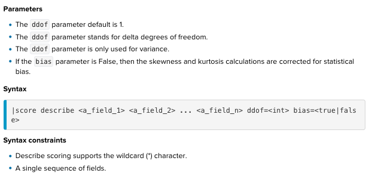

	Params: 
	1. field (_1 to _n)
	2. ddof (degree of freedom): default=1 (n-1 where sample size(n))
	3. bias:

	Returns: 
	field name + min, max, mean, variance, nobs, kurtosis, skewness

## Example : dataset iris.csv 

	| inputlookup iris.csv
	| score describe petal_length

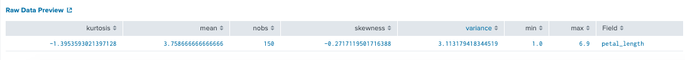   
# 2. Moment
## What is this?
A moment is a specific quantitative measure of the shape of a set of points.
	
	First moment :  is an average distance from 0
	Second moment(crude) :  is an average squared distance from 0
	Second moment(centred) :  is an average squared distance from the mean
	Third moment : is skewness
	Fourth moment: is kurtosiss

* centred vs crude: consider distance from the mean vs from 0

		dataset 1:[12,14,14,17,18] 
			second MOMENT(crude) = 229.8
			second MOMENT(centred) = 4.8
		dataset 2:[15,15,15,15,15] 
			second MOMENT(crude) = 225
			second MOMENT(centred) = 0

* The larger variance, the greated the second MOMENT. No variance=0

## Document
[Read it on Splunk](https://docs.splunk.com/Documentation/MLApp/5.1.0/User/Scorecommand#Moment)

[Read it on sklearn](https://docs.scipy.org/doc/scipy/reference/generated/scipy.stats.moment.html)

[Video on moment ](https://www.youtube.com/watch?v=ISaVvSO_3Sg)

## Syntax on Splunk
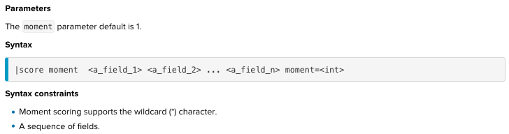

	Params: 
	1. fields
	2. moment=int. order of central moment that is returned. Default is 1

	Returns: moment values

## Example : dataset iris.csv 

	| inputlookup iris.csv
	|fields - species
	| score moment * moment=4
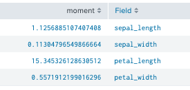

# 3. Pearson
## What is this?
Pearson correlation coefficient and p-value for testing non-correlation.

The Pearson correlation coefficient measures the linear relationship between two datasets. The calculation of the p-value relies on the assumption that each dataset is normally distributed. Like other correlation coefficients, this one varies between -1 and +1 with 0 implying no correlation. Correlations of -1 or +1 imply an exact linear relationship. Positive correlations imply that as x increases, so does y. Negative correlations imply that as x increases, y decreases.

* Aboved image show positive correlations = 1 for all 3 datasets. Positive correlations imply that as x increases, so does y. Negative correlations imply that as x increases, y decreases. Lastly, our confidence in our inferences depends on the amount of data we have collevted the p-value. The more data the smaller the p=value and the more confidence we have our inferences

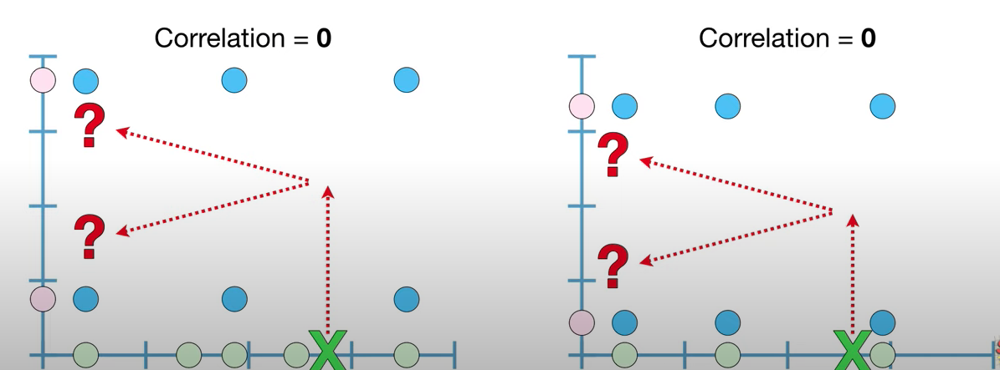
* Aboved image show correlation = 0

The p-value roughly indicates the probability of an uncorrelated system producing datasets that have a Pearson correlation at least as extreme as the one computed from these datasets.

* Aboved image show that all 3 datasets has the same correlation = 3 but the nb of observations increase. In this care, inceasing the sample size did not increase correlation (our guesses are pretty bad in all 3 cases) but it did increase our confidence in the guess.

Formula:

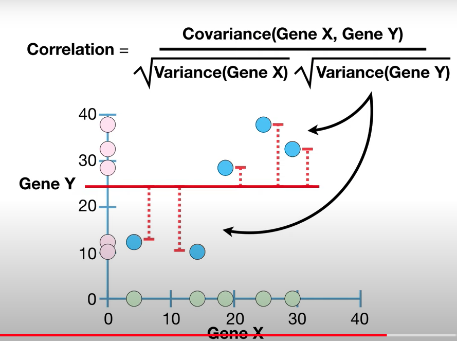

## Document
[Read it on Splunk](https://docs.splunk.com/Documentation/MLApp/5.1.0/User/Scorecommand#Pearson)

[Read it on sklearn](https://docs.scipy.org/doc/scipy/reference/generated/scipy.stats.pearsonr.html)

Video on pearson StatQuest](https://www.youtube.com/watch?v=xZ_z8KWkhXE)

## Syntax on Splunk
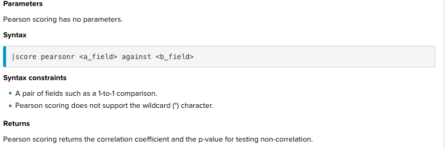

	Params:  1 to 1 comparison
	1. a_field : input array
	2. b_field : input array

	Returns: correlation (r) and p-value

## Example : dataset iris.csv 

	| inputlookup iris.csv
	| score pearsonr petal_length against sepal_length 

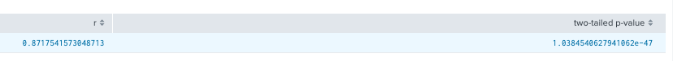

* Conclusion: Correlation r=  0.8 and very small p-value

# 4. Spearman
## What is this?
Like Pearson, Spearman correlation coefficient with associated p-value. Spearman r belongs to range[-1,1],etc. like pearson r.

However, The Spearman rank-order correlation coefficient is a nonparametric measure of the monotonicity of the relationship between two datasets. Unlike the Pearson correlation, the Spearman correlation does not assume that both datasets are normally distributed.

In other words, Pearson correlation coefficients measure only linear relationships. Spearman correlation coefficients measure only monotonic relationships. So a meaningful relationship can exist even if the correlation coefficients are 0. Examine a scatterplot to determine the form of the relationship and outlier. In case of outlier exist in the dataset, spearman could perform better than pearson.

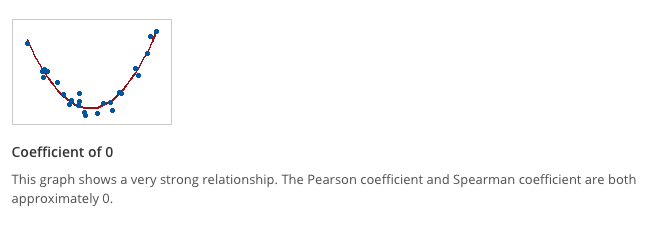

## Document
[Read it on Splunk](https://docs.splunk.com/Documentation/MLApp/5.1.0/User/Scorecommand#Spearman)

[Read it on sklearn](https://docs.scipy.org/doc/scipy/reference/generated/scipy.stats.spearmanr.html)

[Read other]()

## Syntax on Splunk

	Params:  1 to 1 comparison
		1. a_field : input array
		2. b_field : input array

	Returns: correlation (r) and p-value

## Example : dataset iris.csv 

	| inputlookup iris.csv
	| score spearmanr petal_length against sepal_length

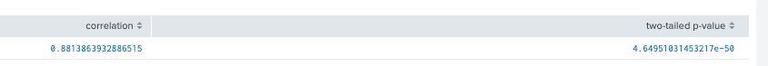
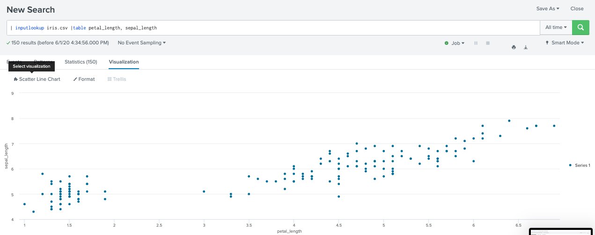

# 5. Tmean
## What is this?
It is trimmed mean.

	Mean: a calculated central value in the dataset
	Median: a value lying at the midpoint of the dataset
	Trimmed mean:removes a proportion of the largest+smallest obs 
		and then takes the average of the numbers that remains in the dataset

If we are taking a sample from a population, our goal is to have as low a standard error (SE) as feasibly possible. If our data is normally distributed, then the mean will have a low SE.

As the data begins to move away from a normal distribution, the mean is no longer optimal. In comparison, the median at this point will have a lower SE, but under a normal distribution, the SE of the median will be higher than that of the mean. 

The trimmed mean acts as a compromise, allowing us to establish a relatively low SE for both normal and non-normal distributions of data (Wilcox, 2005). A trimmed mean effectively allows us to throw away less of the data.

Another point of comparison for the trimmed mean against the median is that, with the median we are heavily protected against outliers, as we take only a single value in a middle. 

## Document
[Read it on Splunk](https://docs.splunk.com/Documentation/MLApp/5.1.0/User/Scorecommand#Tmean)

[Read it on sklearn](https://docs.scipy.org/doc/scipy/reference/generated/scipy.stats.tmean.html)

## Syntax on Splunk
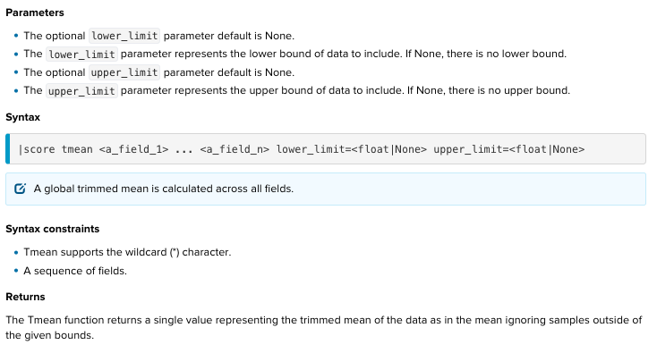

	Params: 
	1. lower_limit = float|None. default is none. all values are used
	2. upper_limit = float|None. default is none. all values are used
	3. a_field_1 to a_field_n

	Returns: 

## Example : dataset iris.csv on petal_length field

	|inputlookup iris.csv
	|stats mean(petal_length) median(petal_length) 
	|score tmean petal_length 

	tmean : trimmed_mean= 3.76
	mean : mean=3.76
	median : median =4.4

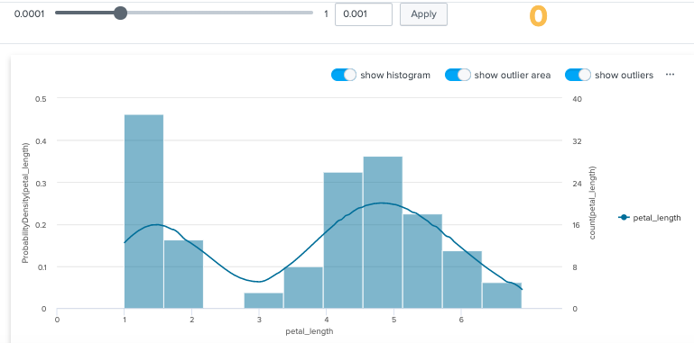

