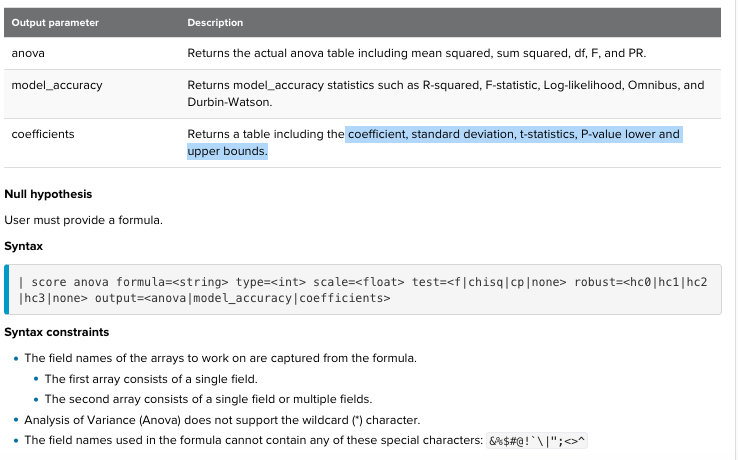

# Statistical testing (statstest)
    
    1. One-way ANOVA 
    2. Analysis of Variance (Anova)
    3. Normal-test
    4. T-test(1 sample)
    5. T-test(2 independent samples)
    6. T-test (2 related samples
    
# 1. One-way ANOVA (Analysis of Variance)
## What is this?
use One-way ANOVA to test the null hypothesis that two or more groups have the same population mean.

	Null hypothesis: +2 group have the same population mean
	H1: at least one mean differs from the others.

	Return: F-statistic and p-value
		p-value <0.05 fail to reject null hypothesis. 
		Otherwise, reject null hypothesis	

	Parametric test assumptions:
		1. Population distributions are normal
		2. Samples have equal variances
		3. Independence

However, it dont say which one differs or all differ to each other.

## Document
[Read it on Splunk](https://docs.splunk.com/Documentation/MLApp/5.1.0/User/Scorecommand#One-way_ANOVA)

[Read it on statsmodels](https://docs.scipy.org/doc/scipy/reference/generated/scipy.stats.f_oneway.html)

[ANOVA w python](https://www.pythonfordatascience.org/anova-python/#anova_scipy_stats)

## Syntax on Splunk

       Params: 
       1. field_1 field_n

       Returns: 
       1. p-value:
       2. F-statistic

## Example : dataset iris.csv 

       | inputlookup iris.csv
	   | score f_oneway petal_length petal_width sepal_length sepal_width

Check assumption:
1. Independence
2. Normality check (via normal-test)
3. homogeneity of variances

# 2. Analysis of Variance (Anova)
## What is this?
	This method conducts a one-way ANOVA in two steps:
	1. Fit the model using an estimation method,
		The default estimation method in most statistical software packages is ordinary least squares
		(If you are not familiar with it and don't care to really dive into it, then just know it's one of many types of estimation methods that aim to provide estimates of the parameter (mean, propertion, etc.) being tested)
	2. Pass fitted model into ANOVA method to produce ANOVA table

## Document
[Read it on Splunk](https://docs.splunk.com/Documentation/MLApp/5.1.0/User/Scorecommand#Analysis_of_Variance_.28Anova.29)

[Read it on statsmodels](https://www.statsmodels.org/stable/generated/statsmodels.stats.anova.anova_lm.html#statsmodels.stats.anova.anova_lm)

## Syntax on Splunk

       Params: 
       0. formula: str in "your formula"
       1. type : int. type=1,2,3. default is 1
       2. scale : float.variance estimation. Default is None, variance from ther largest model
       3. test: f|chisq|cp|none. Defaut if f
       4. robust : hc0|hc1|hc2|hc3|none. 
       5. output : anova|model_accuracy|coefficients

       Returns: 
       	1. anova: F-statistic and pvalue, mean squared and sum squared
       	2. model_accuracy: R-squared, F-statistic, Log-likelihood, Omnibus, and Durbin-Watson.
       	3. coefficients: coefficient, standard deviation, t-statistics, P-value lower and upper bounds.

## Example : dataset iris.csv 

       | inputlookup iris.csv
	| score anova formula="petal_length ~ sepal_length + sepal_length * sepal_width + sepal_width" output=anova

# 3. Normal-test
## What is this?
Test whether a sample differs from a normal distribution.

This function tests the null hypothesis that a sample comes from a normal distribution. It is based on D’Agostino and Pearson’s [1], [2] test that combines skew and kurtosis to produce an omnibus test of normality.
## Document
[Read it on Splunk](https://docs.splunk.com/Documentation/MLApp/5.1.0/User/Scorecommand#Normal-test)

[Read it on SciPy](https://docs.scipy.org/doc/scipy/reference/generated/scipy.stats.normaltest.html)

## Syntax on Splunk

	Params: 
	1. fields

	Returns: 
	F-statistic
	p-value
	fieldname + test decision

## Example : dataset iris.csv 

	| inputlookup iris.csv
	| score normaltest petal_length petal_width sepal_length sepal_width

* The sepal_length and sepal_width are most likely close to normal distribution

# 4. T-test (1 sample)
## What is this?
Calculate the T-test for the mean of ONE group of scores.

This is a two-sided test for the null hypothesis that the expected value (mean) of a sample of independent observations a is equal to the given population mean, popmean.

## Document
[Read it on Splunk](https://docs.splunk.com/Documentation/MLApp/5.1.0/User/Scorecommand#T-test_.281_sample.29)

[Read it on SciPy](https://docs.scipy.org/doc/scipy/reference/generated/scipy.stats.ttest_1samp.html)

## Syntax on Splunk

	Params: 
	1. field_1 field_n : field name
	2. popmean : float
	3. alpha : float

	Returns: 
	1. t-statistic
	2. p-value

## Example : dataset iris.csv 

	| inputlookup iris.csv
	| score ttest_1samp sepal_width popmean=3.5

# 5. T-test (2 independent samples)
## What is this?
Calculate the T-test for the means of two independent samples of scores.

This is a two-sided test for the null hypothesis that 2 independent samples have identical average (expected) values. This test assumes that the populations have identical variances by default.

## Document
[Read it on Splunk](https://docs.splunk.com/Documentation/MLApp/5.1.0/User/Scorecommand#T-test_.282_independent_samples.29)

[Read it on Scipy](https://docs.scipy.org/doc/scipy/reference/generated/scipy.stats.ttest_ind.html)

[Read other]()

## Syntax on Splunk

	Params: 
	1. a_field_1 a_field_n against b_field_1 b_field_n
	2. equal_var:boolean
		If true, perform a standard independent 2 sample test that assumes equal population variances.
		If false, perform Welch's T-test, which does not assume equal population variance.	
	3. alpha: float

	Returns: t-statistic, p-value

## Example : dataset iris.csv 

	| inputlookup disk_failures.csv
	| score ttest_ind SMART_1_Raw against SMART_2_Raw SMART_3_Raw SMART_4_Raw

* It shows that with an alpha of 0.05 you cannot reject the null hypothesis. It does not appear that disks 2, 3, and 4 are failing more than disk 1. All are close to each other. Other words, Disk 2,3,4 are not the reason to cause more failure than dish 1
