In additional to the module 5, you will find a wide application of eval command.
# Eval command : returns calculated or manipulate field values written to either new or existing fields. 

## I. Format results: viz in same example, dataset can be found at tmp.zip
* convert value : 'salary'/3
* round value : round('salary'/3,int)
* remove field : |fields - field_name
* concatenation : either + or . as 'first name'." ".'last name' 
* eval chains : define |eval one time and follow with list of action

Example: index= main sourcetype= data-eval
| eval test=  round('salary'/3,2), 
test =  "$" +'test', 
full_name = 'first name'." ".'last name' 
| table "first name", "last name",occupation, salary, test, full_name,
| fields - salary

## II. 10 types of functions:

### 1. Comparation/conditional: case, validation, if, nestedif, coalesce

#### CASE command: case ( defined condition, success_value,...)
index= main sourcetype= data-eval
| eval new_name = case('first name'="First_9","First_900",1=1,'first name') | table "first name",new_name

#### VALIDATION command: validation ( defined unvalid condition , success_value)

index= main sourcetype= data-eval
| eval new_field = validate('first name' = "First_9","Validation Passed") | table "first name", "last name", occupation, salary, new_field

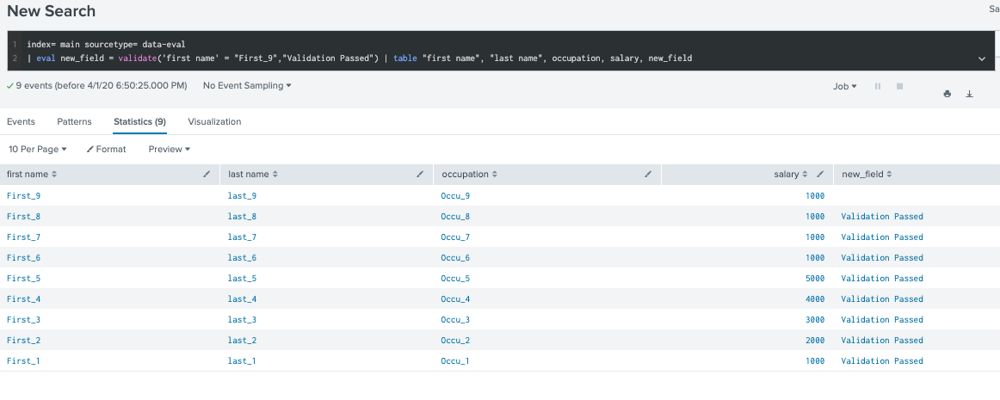

#### IF command: if ( defined condition, success_value, error)

index= main sourcetype= data-eval
| eval new_name = if('first name'="First_9","First_900",'first name') | table "first name",new_name

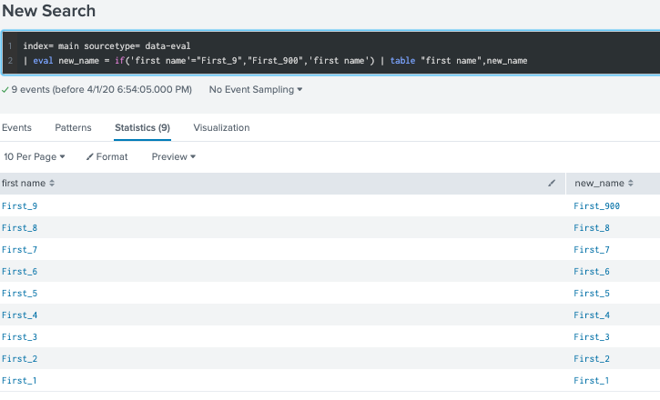

#### NESTEDIF command: if ( defined condition, success_value, if ( defined condition, success_value, error ) )

index= main sourcetype= data-eval
| eval new_name = if('first name'="First_9","First_900",if('first name'="First_8","First_800",'first name')) | table "first name",new_name

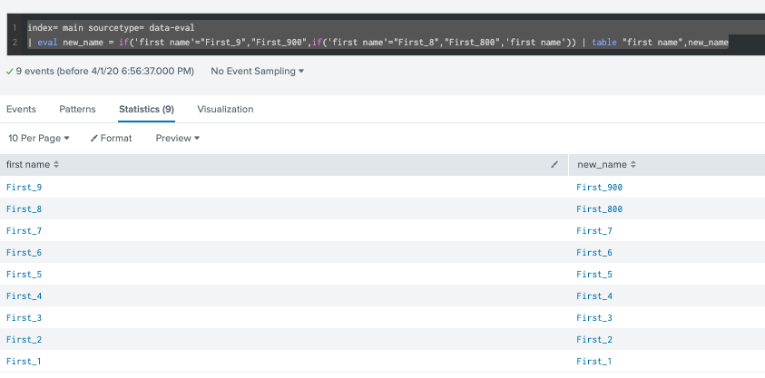

#### COALESCE command: coalesce (fieldname1, fieldname2, ... )

* fieldname1 is the most priority, fn1 > fn2 >...

index= main sourcetype= data-eval
| eval new_field = null() , new_field2 = "Sid" , new_field3 = null() , coalesce_val = coalesce(new_field,new_field2,new_field3) 
| table "first name", "last name", occupation, salary, new_field, new_field2, new_field3, coalesce_val

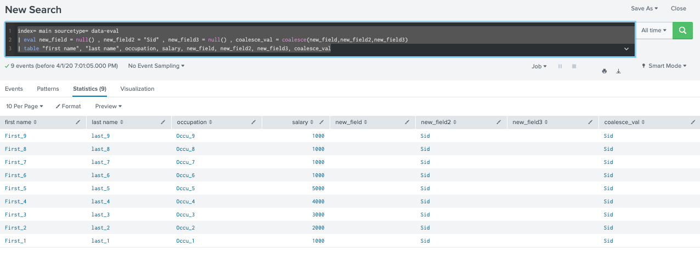

#### IN, LIKE, MATCH command:

index= main sourcetype= data-eval
| eval new_field = if('first name' in ("First_7","First_2","First_1"),"true","false") |  table "first name", "last name", occupation, salary, new_field

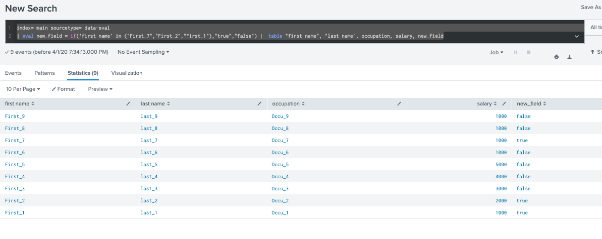

index= main sourcetype= data-eval | eval new_field = if(like('first name',"%_8%"),"true","false") |  table "first name", "last name", occupation, salary, new_field

index= main sourcetype= data-eval | eval new_field = if(match('first name',".+_8"),"true","false") |  table "first name", "last name", occupation, salary, new_field

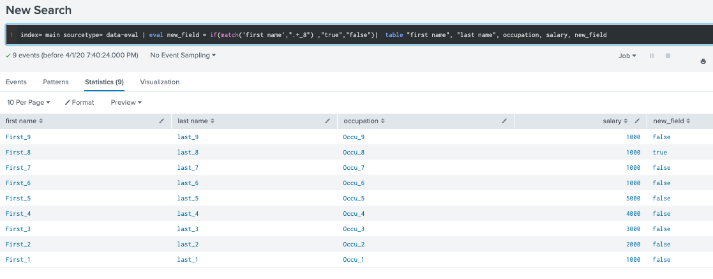

### 2. Conversion function: 

#### tonumber(fieldname)

index= main sourcetype= data-eval
| eval new_field = "3" | eval new_field_num = tonumber(new_field) | eval sum = new_field_num + 2 | table new_field,new_field_num,sum

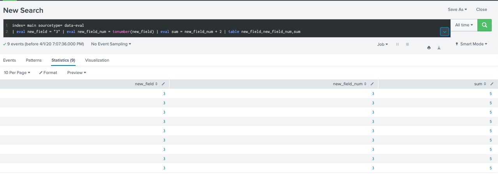

#### tostring(fielname, Y) 

* If X is a number, the second argument Y is optional and can be "hex", "commas", or "duration".

index= main sourcetype= data-eval
|  eval new_field = 123456789 | eval new_field_str = tostring('new_field',"duration") | eval sum = new_field_str + 2 | table new_field,new_field_str,sum

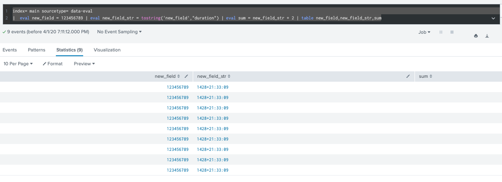

### 3.Cryto function: md5(X) sha1(X) sha256(X) sha512(X)

index=main sourcetype= data-eval | eval new_field = sha1("1234-5678-9101-1121") | table new_field

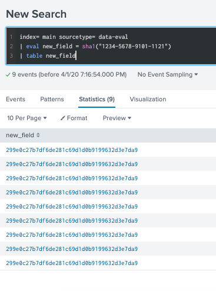

### 4.Date and Time :
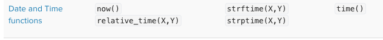

index=main sourcetype= data-eval | eval new_field = now()

index=main sourcetype= data-eval | eval new_field = time() | table "first name", "last name", occupation, salary, new_field

index=main sourcetype= data-eval | eval new_field = now() | eval current_time = strftime(new_field,"%d-%m-%Y %H:%M:%S") | eval current_time_epoc = strptime(current_time,"%d-%m-%Y %H:%M:%S") | table new_field,current_time,current_time_epoc

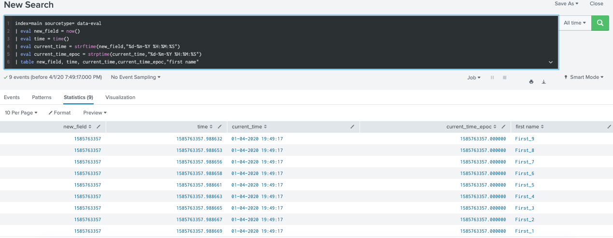

### 5.Information function:
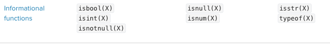

index=main sourcetype= data-eval| eval new_field = null() | eval test = tostring(isnull(new_field))

index=main sourcetype= data-eval| eval new_field = typeof(12)

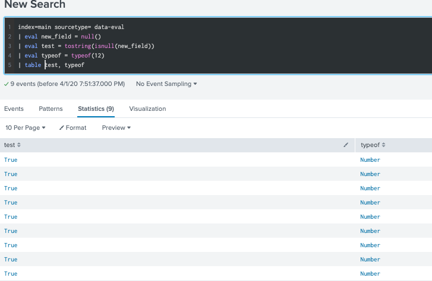

### 6.Math function: 
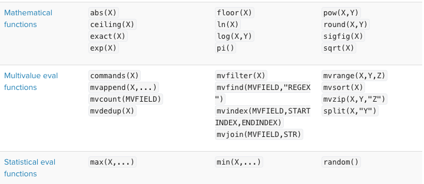

index=main sourcetype= data-eval
| eval max = max(1100,salary)
| eval min= min(2200,salary)
| eval random = random()
| table salary, max,min, random

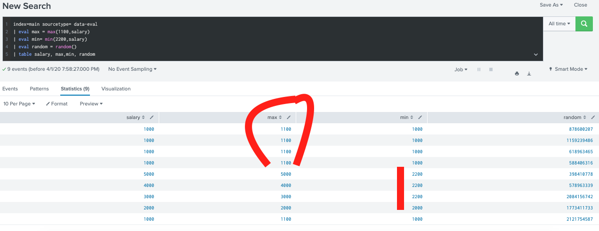

### 7.Text function:

index=main sourcetype= data-eval
| eval length = len("first name")
| eval replace = replace('first name',"_\d{1}","00") 
| eval substr = substr('first name', 1,3)
| eval url = urldecode("http%3A%2F%2Fwww.splunk.com%2Fdownload%3Fr%3Dheader")
| table "first name", length, replace, substr, url

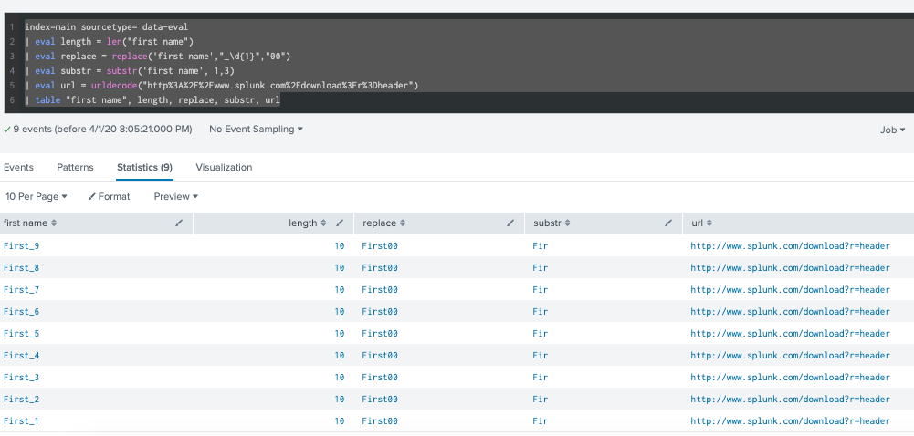

### 8.EVAL function: stats and eval 

index= main sourcetype= data-eval | table "first name", "last name", occupation, salary| stats count(eval(occupation="Occu_9" AND salary=1000)) as 9_count

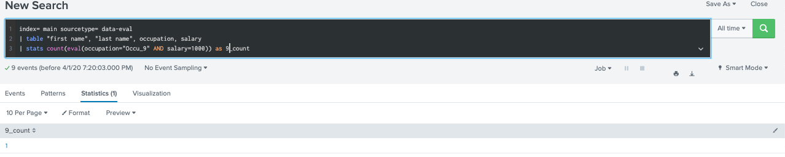

# Filter: search and where command + fillnull command

# Filter: search and where command + fillnull command

## I.search command

Example: Filter event after lockdown in France (2020-03-17)

index=coronavirus sourcetype="auto_test" maille_code= FRA
|search date >="2020-03-16"
| chart max(hospitalises) as hospitalises, max(reanimation) as reanimation , max(deces) as deces ,max(cas_confirmes) as cas_confirmes, max(gueris) as gueris by date

## II.where command

Example: Filter event after lockdown in France (2020-03-17)

index=coronavirus sourcetype="auto_test" maille_code= FRA| chart max(hospitalises) as hospitalises, max(reanimation) as reanimation , max(deces) as deces ,max(cas_confirmes) as cas_confirmes, max(gueris) as gueris by date |where date >="2020-03-16"

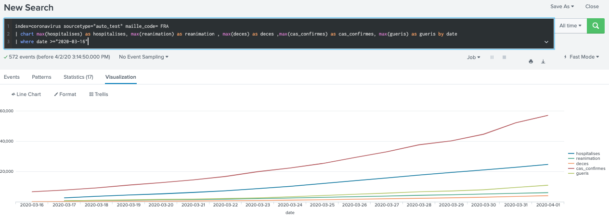

## III.fillnull command : deal with missing value

*Syntax: fillnull [value=string] [field-list] with defaut value=0

*Example: original data have missing value, we want to fill null with 1 and fill null with the closest data we have.

index=coronavirus sourcetype="auto_test" maille_code= FRA
|search date >="2020-03-16"
| fillnull value=1 hospitalises,reanimation, gueris
| chart max(hospitalises) as hospitalises, max(reanimation) as reanimation , max(deces) as deces ,max(cas_confirmes) as cas_confirmes, max(gueris) as gueris by date

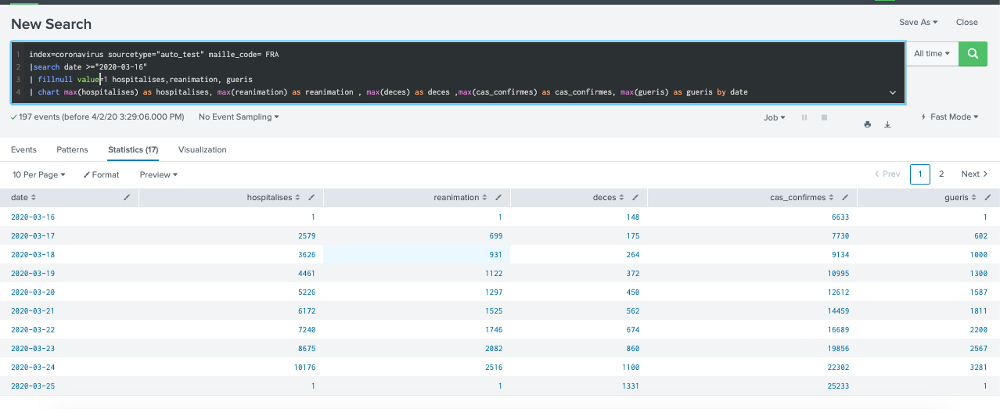

index=coronavirus sourcetype="auto_test" maille_code= FRA
|search date >="2020-03-16"
| filldown hospitalises,reanimation, gueris
| chart max(hospitalises) as hospitalises, max(reanimation) as reanimation , max(deces) as deces ,max(cas_confirmes) as cas_confirmes, max(gueris) as gueris by date

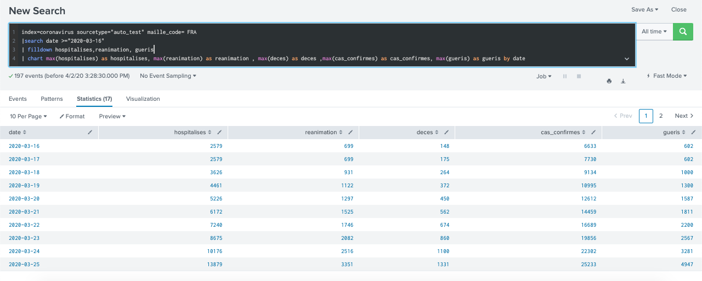

# Document

[1. eval document ](https://docs.splunk.com/Documentation/Splunk/8.0.2/SearchReference/Eval)

[2. filter search and where document ](https://docs.splunk.com/Documentation/Splunk/latest/SearchReference/Where?r=searchtip>)
