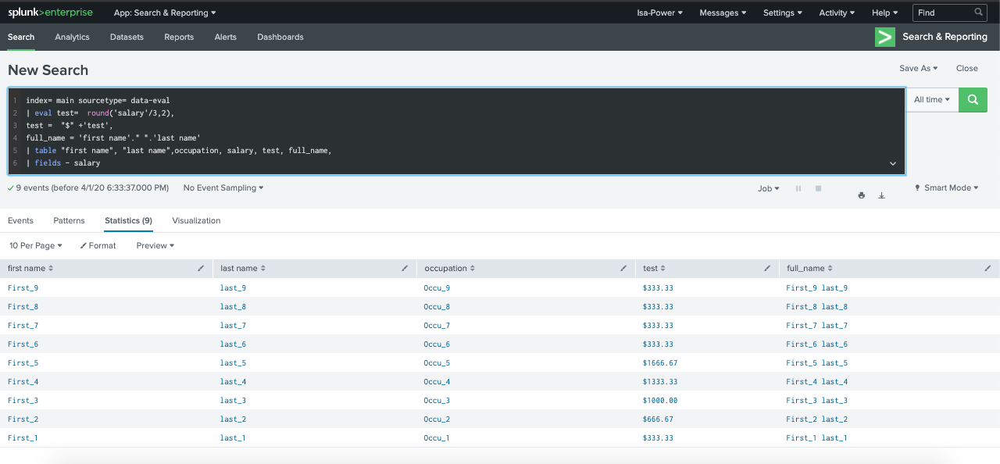
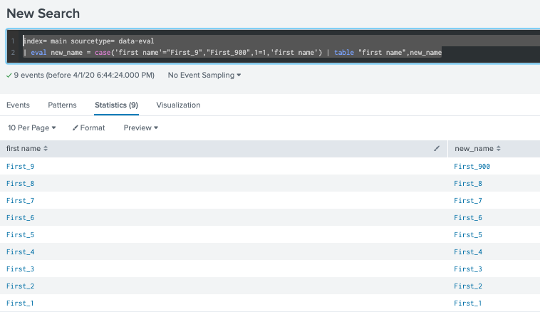

In additional to the module 5, you will find a wide application of eval command.
# Eval command : returns calculated or manipulate field values written to either new or existing fields. 

## I. Format results: viz in same example, dataset can be found at tmp.zip
* convert value : 'salary'/3
* round value : round('salary'/3,int)
* remove field : |fields - field_name
* concatenation : either + or . as 'first name'." ".'last name' 
* eval chains : define |eval one time and follow with list of action

Example: index= main sourcetype= data-eval
| eval test=  round('salary'/3,2), 
test =  "$" +'test', 
full_name = 'first name'." ".'last name' 
| table "first name", "last name",occupation, salary, test, full_name,
| fields - salary

## II. 10 types of functions:

### 1. Comparation/conditional: case, validation, if, nestedif, coalesce

#### CASE command: case(<condition>, success_value,...)
index= main sourcetype= data-eval
| eval new_name = case('first name'="First_9","First_900",1=1,'first name') | table "first name",new_name

#### VALIDATION command: validation( <unvalid condition> , success_value)

# Filter: search and where command + fillnull command

## I.search command

## II.where command

## III.fillnull command

[1. eval document ](https://docs.splunk.com/Documentation/Splunk/8.0.2/SearchReference/Eval)
[2. filter search and where document ]<https://docs.splunk.com/Documentation/Splunk/latest/SearchReference/Where?r=searchtip>
