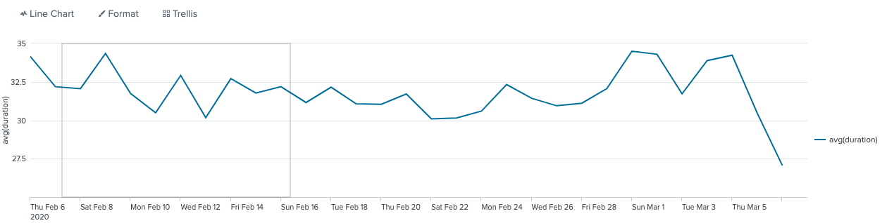

# What is a transaction?
A transaction is any group of related events that span time. 

Ex: You want to see a transaction that it is contains view - addtocart- purchase happens on your website. A statistic analysis

of total view is not sufficient to your need.

# How is this work?
Splunk-doc: https://docs.splunk.com/Documentation/Splunk/8.0.2/SearchReference/Transaction

transaction[field-list][txn_definition-options][memcontrol-options][rendering-options]

Ex.1: transaction [field-list]

index=main sourcetype=access_* |transaction clientip |highlight action

returns : groupby clientip with highlight action for better viz

Ex.2: transaction [field-list][txn_definition-options]

index=main sourcetype=access_* |transaction clientip maxspan=10m maxpause=1m startswith=view endswith=purchase

returns: with specific condition that it needs to contains view and purchase, total duration is less than 10m and each pause

between commited action is less than 1m

*others txn_options: maxevents = int(like limit by in SQL); keeporphans=true( see all invalided results as well)

Ex.3: transaction [field-list][txn_definition-options][memcontrol-options]

...(like ex.2) keepevicted=true maxopenevents=2

returns: only see 2 first transactions that it is not meet specific requirement

Ex.4: transaction [field-list][txn_definition-options][memcontrol-options][rendering-options]

...(like ex.2) mvraw=true delim="<<<<>>>"

returns: no space between events and seperated by <<<<>>>

Ex.5: transaction with search
index=main sourcetype=access_* |transaction clientip |search abc

Ex.6: report on transaction
index=main sourcetype=access_* |transaction clientip startswith=view endswith=purchase maxspan=10m maxpause=1m
|eval duration=tostring(duration,"duration")
|timechart avg(duration)maxspan=10m maxpause=1m
* maxspam: Allows setting of maximum total time between earliest and latest events
* maxspan: Allows maximum total time between events
* startswith: Allows forming transactions starting with specified terms, field values, evaluations
* endswith: Allows forming transactions ending with specified terms, field values, evaluations
* maxpause Finds groups of events where the span of time between included events does not exceed a specific value

# Transactions vs stats command? When to use what?
Use Stats to see results of a calculation, or group events on a field value. 

Use Transaction to see events correlated together, or grouped by start and end values.

Use stats rather than transaction when you have a choice. Because of stats is faster and efficient. You may use transactions:

1. You have to see raw text combined rather than analysis 

2. Some field (clientip) is not sufficients to discriminate between two transactions(you need span filter...)

# Note: Example use dataset access_combined which is avaiable at tmp.zip in this dir.
