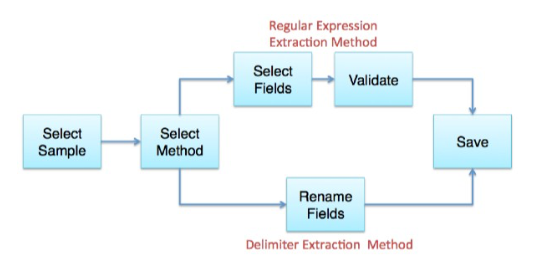
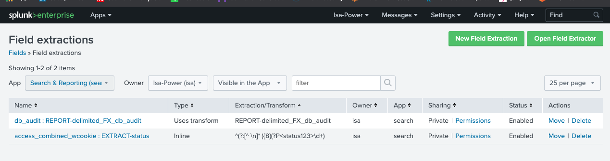

# What is Field Extractor (FX) ?
Additional to Splunk auto-extracts provides meta fields(index,source, sourcetype) and internal fields(raw, time), you also extract your own fields with the Field Extractor(FX)

# Where to open FX?
3 options to access the FX via _Settings, _Field sidebars and _Event actions menu

# How is FX method?
Basically, you have 2 method via Regex or Delimiter. Delimiter works best if events are structured. It is pretty easy to follow all the step via FX UI. Keep in mind that it is possible to use your own regular expression.

* Please refer to this document to know step by step.

[Stepbystepdocument]<https://docs.splunk.com/Documentation/Splunk/latest/Knowledge/ExtractfieldsinteractivelywithIFX>

*Viz your own fields and add to new field extraction. 

*Once you have defined, you are able to use Field Extraction Manager to modify extracted field

* Note:Other useful docs
[regularExpression]<https://docs.splunk.com/Documentation/Splunk/latest/Knowledge/AboutSplunkregularexpressions>
[props.conf]<https://docs.splunk.com/Documentation/Splunk/latest/Admin/Propsconf>
[transforms.conf]<https://docs.splunk.com/Documentation/Splunk/latest/Admin/Transformsconf>
