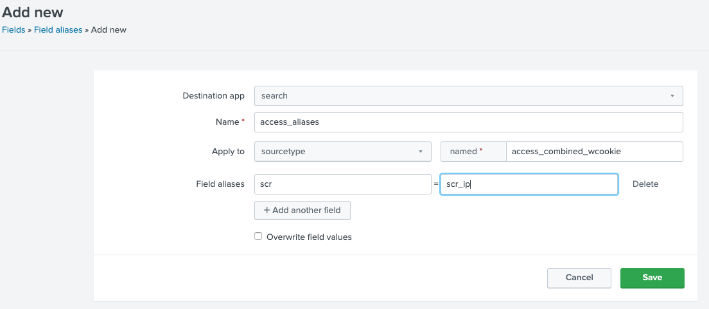
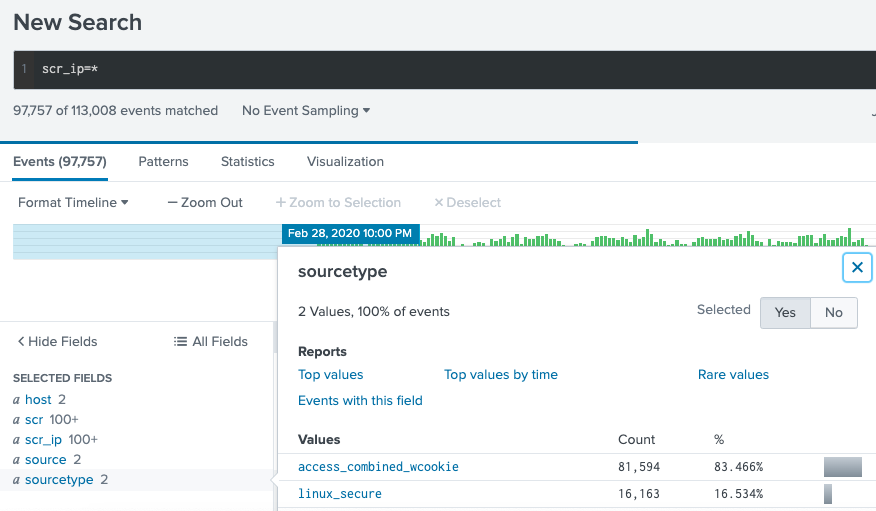
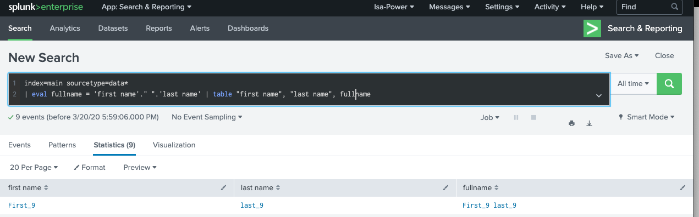
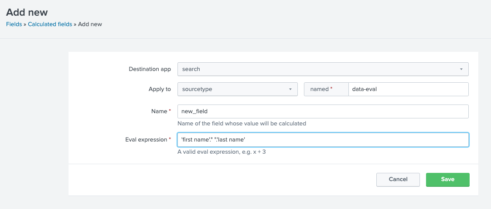
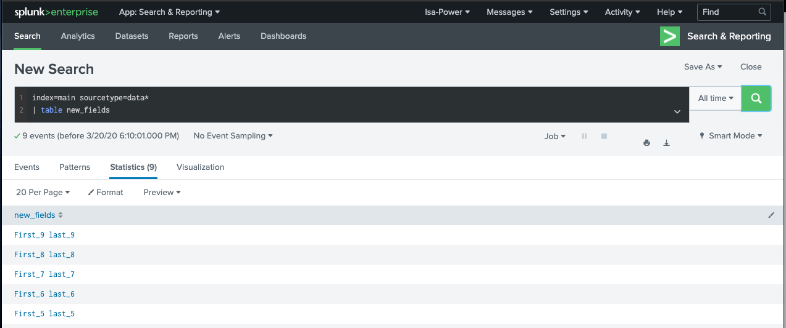

# Create and use field aliases
Fields aliases are use to normalize data. 
Multiple aliases can be applied to one field.

Example:
* Context : access_combine_wcookie contain scr field and linux_*  has scr_ip field. Use fields aliases to made data correction and searching easier, normalize the scr_ip field.

Step 1: Create field alias for scr of access_combine_wcookie to scr
Stettings > Fields > Field Aliases > Open New Field Aliases > fill in > Save

Step 2: Test by the new fields aliases

* when you create a field alias, the original is not affected
* After you have defined your field aliases, you can reference them in a lookup table like orignal fields

# Create calculated fields
It is a shortcut for performing transformation using the eval command. (Must be based on an extracted field)

Step 1: Create field alias for scr of access_combine_wcookie to scr
Stettings > Fields > Calculated Fields > Open New Calculated Fields> fill in > Save

Step 2: Test the new fields

