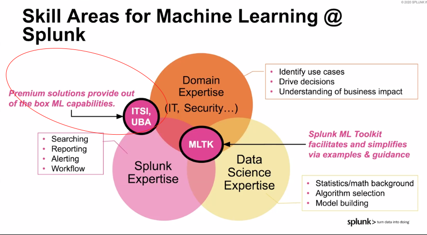
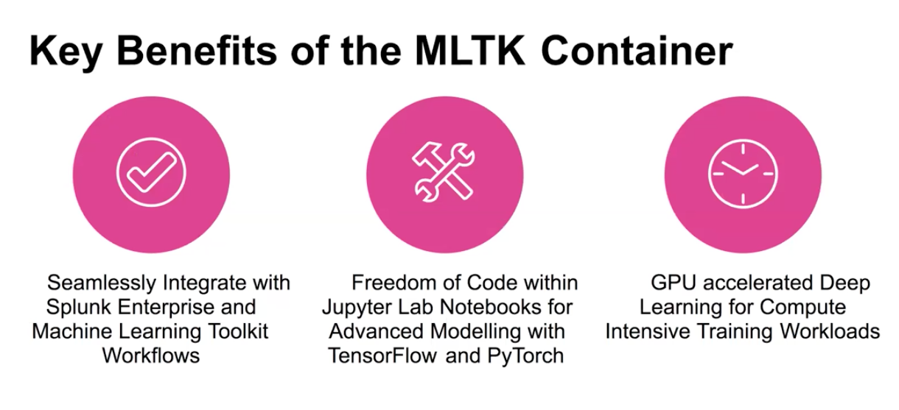

* This is my summary for the recored seminar conf19. 
See [video](https://www.splunk.com/en_us/form/splunk-artificial-intelligence-and-machine-learning)
# Agenda

    1. Introduction to AI and ML Features in Splunk
    2. Customer Use Cases
    3. Live Demo of Machine Learning Toolkit, with examples of:
        Methods for Anomaly Detection
        Predictive Analytics and Forecasting
        Clustering
    4. Custom Machine Learning, incl.:
        Expansion with MLSPL API
        Advanced Containerization
#  1. Introduction to AI and ML Features in Splunk
ML usecase example

Skills set

MLTK

# 2. Customer Use Cases
Check their full PPT or video on [ this page ](https://conf.splunk.com/watch/conf-online.html?#/)

Both are using anomalie detection fit density function. 

# 3. Live Demo of Machine Learning Toolkit, with examples of: Methods for Anomaly Detection, Predictive Analytics and Forecasting, Clustering
Nothing to special to highlight. He runs through builed in experiment with small/ clean data set.

# 4. Custom Machine Learning, incl.: Expansion with MLSPL API, Advanced Containerization
See doc [Add custom ML to MLTK](https://docs.splunk.com/Documentation/MLApp/5.1.0/API/Overview)

See [video](https://www.youtube.com/watch?v=p5PK2nuq5EI&list=PLSr58-DJdRyalgKiMaqyrGvpmgKs3mhhQ&index=7)

You can use DLTK to run your algrs on a GPU or use JupyterNB to experiment your old code. 

* New algrs on Splunk [ unbounded learning on stream](https://conf.splunk.com/files/2019/slides/DEV1139.pdf)
